# Hasil

## Grafik

```mermaid
%%{init: {"pie": {"textPosition": 0.5}, "themeVariables": {"pieOuterStrokeWidth": "5px"}} }%%
pie showData
    "1" : 72
    "2" : 71
    "3" : 22
```

## Tabel

| No.    | Nama Paslon    | Suara | Suara (raw) | Persentase |
|:------ |:-------------- | -----:| -----------:| ----------:|
| 100025 | ANIES MUHAIMIN | 72    | [72][p-1]   | 43,64      |
| 100026 | PRABOWO GIBRAN | 71    | [71][p-2]   | 43,03      |
| 100027 | GANJAR MAHFUD  | 22    | [22][p-3]   | 13,33      |

[p-1]: https://github.com/gigit-pemilu/pemilu-2024/blob/main/pilpres/hitung-suara/sub/31-dki-jakarta/sub/74-jakarta-selatan/sub/06-cilandak/sub/1003-pondok-labu/sub/023-tps/sub/paslon-1.txt
[p-2]: https://github.com/gigit-pemilu/pemilu-2024/blob/main/pilpres/hitung-suara/sub/31-dki-jakarta/sub/74-jakarta-selatan/sub/06-cilandak/sub/1003-pondok-labu/sub/023-tps/sub/paslon-2.txt
[p-3]: https://github.com/gigit-pemilu/pemilu-2024/blob/main/pilpres/hitung-suara/sub/31-dki-jakarta/sub/74-jakarta-selatan/sub/06-cilandak/sub/1003-pondok-labu/sub/023-tps/sub/paslon-3.txt

## Foto C Plano

https://sirekap-obj-formc.kpu.go.id/68ba/pemilu/ppwp/31/74/06/10/03/3174061003023-20240214-155529--1d1b02fd-6c81-4390-aa0a-cb757e977d80.jpg

https://sirekap-obj-formc.kpu.go.id/68ba/pemilu/ppwp/31/74/06/10/03/3174061003023-20240214-155042--5af3498b-5cdd-4356-bc05-9709aa3fdf64.jpg

https://sirekap-obj-formc.kpu.go.id/68ba/pemilu/ppwp/31/74/06/10/03/3174061003023-20240214-160104--50476c2e-c627-41ea-87f5-0df186553142.jpg

## Metadata

| Key        | Value               |
| ---------- | ------------------- |
| Time Stamp | 2024-02-24 22:31:28 |

