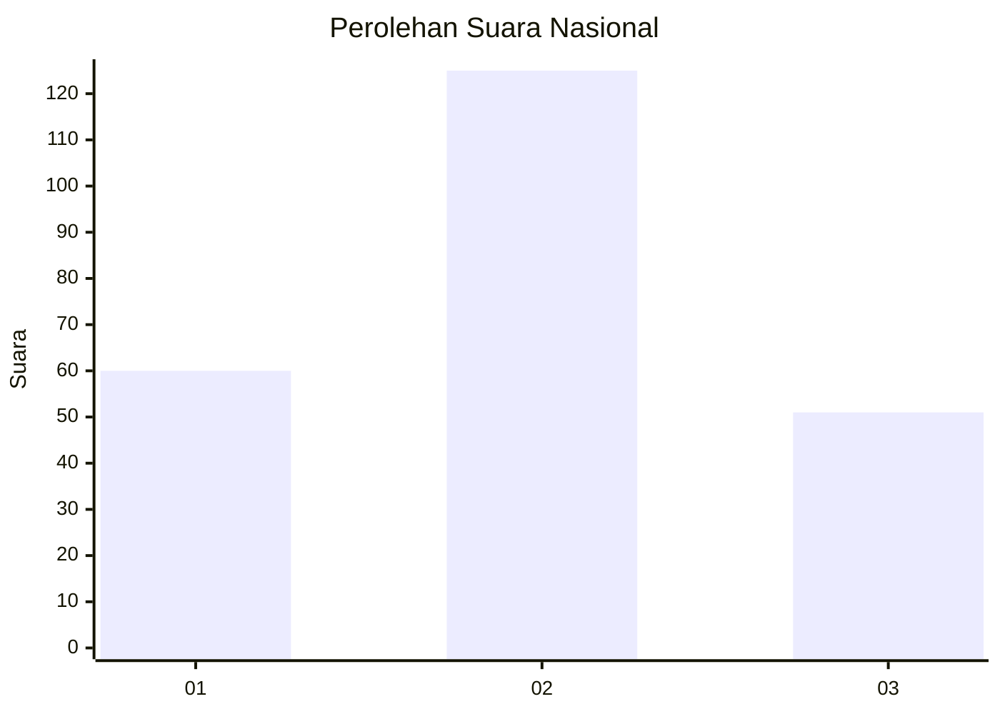
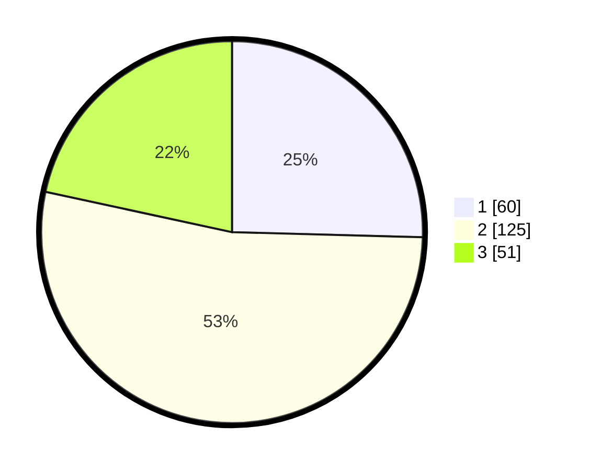

# Hasil

## Grafik

## Tabel

| No.    | Nama Paslon    | Suara | Suara (raw) | Persentase |
|:------ |:-------------- | -----:| -----------:| ----------:|
| 100025 | ANIES MUHAIMIN | 60    | [60][p-1]   | 25,42      |
| 100026 | PRABOWO GIBRAN | 125   | [125][p-2]  | 52,97      |
| 100027 | GANJAR MAHFUD  | 51    | [51][p-3]   | 21,61      |

[p-1]: https://github.com/gigit-pemilu/pemilu-2024/blob/main/pilpres/hitung-suara/sub/31-dki-jakarta/sub/74-jakarta-selatan/sub/06-cilandak/sub/1003-pondok-labu/sub/029-tps/sub/paslon-1.txt
[p-2]: https://github.com/gigit-pemilu/pemilu-2024/blob/main/pilpres/hitung-suara/sub/31-dki-jakarta/sub/74-jakarta-selatan/sub/06-cilandak/sub/1003-pondok-labu/sub/029-tps/sub/paslon-2.txt
[p-3]: https://github.com/gigit-pemilu/pemilu-2024/blob/main/pilpres/hitung-suara/sub/31-dki-jakarta/sub/74-jakarta-selatan/sub/06-cilandak/sub/1003-pondok-labu/sub/029-tps/sub/paslon-3.txt

## Foto C Plano

https://sirekap-obj-formc.kpu.go.id/7eb6/pemilu/ppwp/31/74/06/10/03/3174061003029-20240215-040939--d572d7bd-2c97-41dc-bc9f-50b447dfbd01.jpg

https://sirekap-obj-formc.kpu.go.id/7eb6/pemilu/ppwp/31/74/06/10/03/3174061003029-20240215-044720--6d964722-be4b-47e1-a455-9601eb598f2d.jpg

https://sirekap-obj-formc.kpu.go.id/7eb6/pemilu/ppwp/31/74/06/10/03/3174061003029-20240215-044804--f2c825bb-3b8a-4971-a397-029326b36da5.jpg

## Metadata

| Key        | Value               |
| ---------- | ------------------- |
| Time Stamp | 2024-02-24 22:31:28 |

