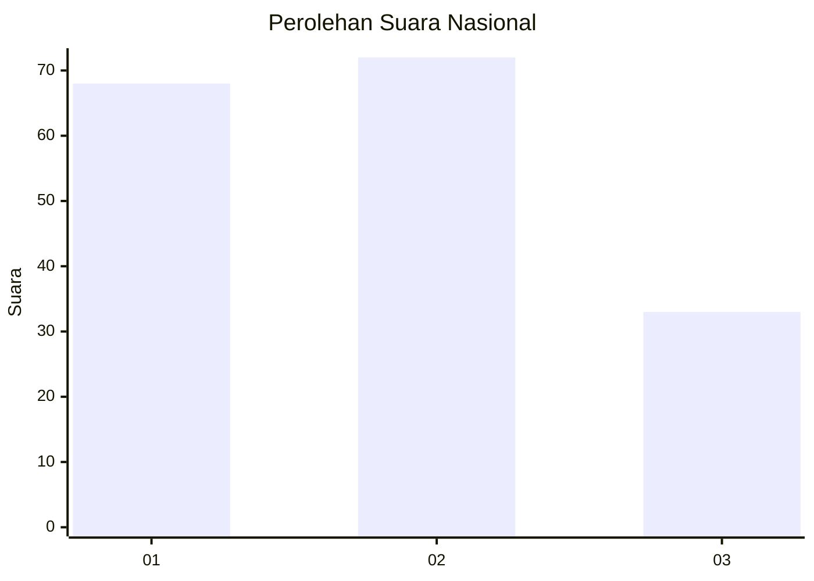
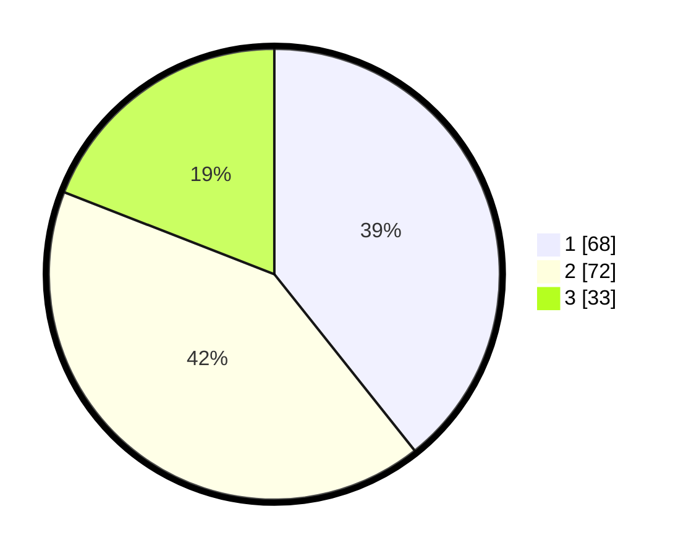

# Hasil

## Grafik

## Tabel

| No.    | Nama Paslon    | Suara | Suara (raw) | Persentase |
|:------ |:-------------- | -----:| -----------:| ----------:|
| 100025 | ANIES MUHAIMIN | 68    | [68][p-1]   | 39,31      |
| 100026 | PRABOWO GIBRAN | 72    | [72][p-2]   | 41,62      |
| 100027 | GANJAR MAHFUD  | 33    | [33][p-3]   | 19,08      |

[p-1]: https://github.com/gigit-pemilu/pemilu-2024/blob/main/pilpres/hitung-suara/sub/31-dki-jakarta/sub/74-jakarta-selatan/sub/06-cilandak/sub/1003-pondok-labu/sub/034-tps/sub/paslon-1.txt
[p-2]: https://github.com/gigit-pemilu/pemilu-2024/blob/main/pilpres/hitung-suara/sub/31-dki-jakarta/sub/74-jakarta-selatan/sub/06-cilandak/sub/1003-pondok-labu/sub/034-tps/sub/paslon-2.txt
[p-3]: https://github.com/gigit-pemilu/pemilu-2024/blob/main/pilpres/hitung-suara/sub/31-dki-jakarta/sub/74-jakarta-selatan/sub/06-cilandak/sub/1003-pondok-labu/sub/034-tps/sub/paslon-3.txt

## Foto C Plano

https://sirekap-obj-formc.kpu.go.id/8c9a/pemilu/ppwp/31/74/06/10/03/3174061003034-20240215-063449--81b0304b-9d08-45d5-a016-ee5e92a992ee.jpg

https://sirekap-obj-formc.kpu.go.id/8c9a/pemilu/ppwp/31/74/06/10/03/3174061003034-20240215-063046--11e51066-4539-4ed2-a87e-b14e3a28e125.jpg

https://sirekap-obj-formc.kpu.go.id/8c9a/pemilu/ppwp/31/74/06/10/03/3174061003034-20240215-063805--08afe2d3-c197-4051-85ee-b047a2216527.jpg

## Metadata

| Key        | Value               |
| ---------- | ------------------- |
| Time Stamp | 2024-02-24 22:31:28 |

