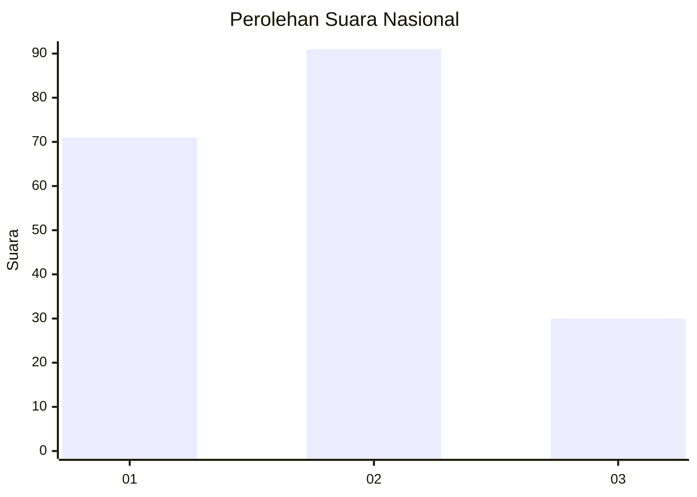
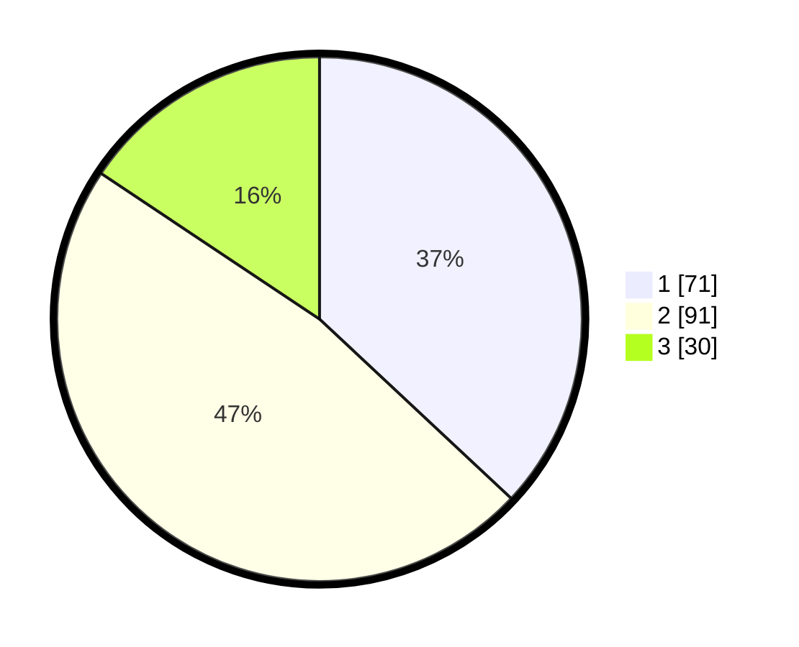

# Hasil

## Grafik

## Tabel

| No.    | Nama Paslon    | Suara | Suara (raw) | Persentase |
|:------ |:-------------- | -----:| -----------:| ----------:|
| 100025 | ANIES MUHAIMIN | 71    | [71][p-1]   | 36,98      |
| 100026 | PRABOWO GIBRAN | 91    | [91][p-2]   | 47,40      |
| 100027 | GANJAR MAHFUD  | 30    | [30][p-3]   | 15,63      |

[p-1]: https://github.com/gigit-pemilu/pemilu-2024/blob/main/pilpres/hitung-suara/sub/31-dki-jakarta/sub/74-jakarta-selatan/sub/06-cilandak/sub/1003-pondok-labu/sub/041-tps/sub/paslon-1.txt
[p-2]: https://github.com/gigit-pemilu/pemilu-2024/blob/main/pilpres/hitung-suara/sub/31-dki-jakarta/sub/74-jakarta-selatan/sub/06-cilandak/sub/1003-pondok-labu/sub/041-tps/sub/paslon-2.txt
[p-3]: https://github.com/gigit-pemilu/pemilu-2024/blob/main/pilpres/hitung-suara/sub/31-dki-jakarta/sub/74-jakarta-selatan/sub/06-cilandak/sub/1003-pondok-labu/sub/041-tps/sub/paslon-3.txt

## Foto C Plano

https://sirekap-obj-formc.kpu.go.id/1d4d/pemilu/ppwp/31/74/06/10/03/3174061003041-20240215-000709--0da63791-0293-4c57-a1b5-d846bf0bcecd.jpg

https://sirekap-obj-formc.kpu.go.id/1d4d/pemilu/ppwp/31/74/06/10/03/3174061003041-20240215-000806--2f775d6d-f003-4384-94bd-f811a382d4aa.jpg

https://sirekap-obj-formc.kpu.go.id/1d4d/pemilu/ppwp/31/74/06/10/03/3174061003041-20240215-025842--bb013cc6-6c26-4e2b-8bb5-bd37e1839142.jpg

## Metadata

| Key        | Value               |
| ---------- | ------------------- |
| Time Stamp | 2024-02-24 23:00:00 |

