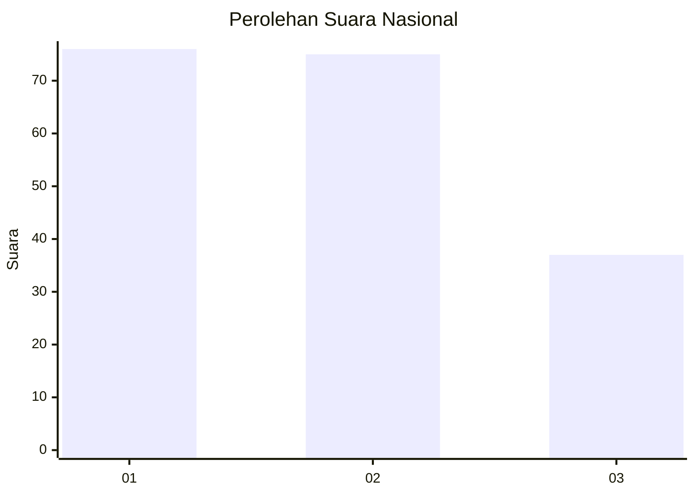
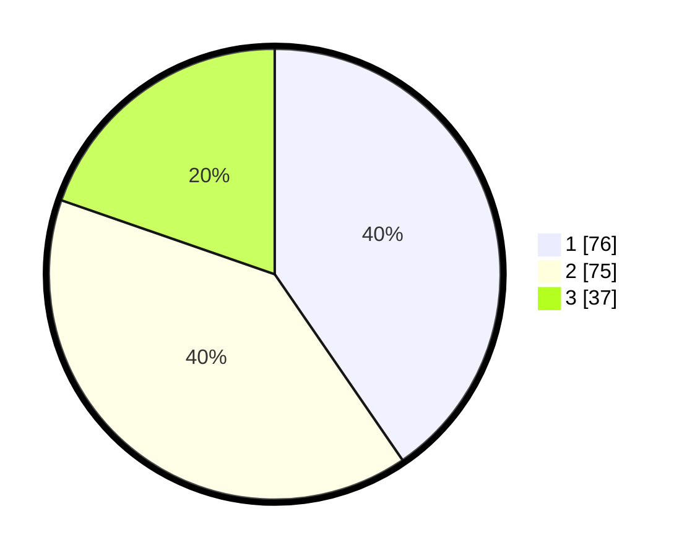

# Hasil

## Grafik

## Tabel

| No.    | Nama Paslon    | Suara | Suara (raw) | Persentase |
|:------ |:-------------- | -----:| -----------:| ----------:|
| 100025 | ANIES MUHAIMIN | 76    | [76][p-1]   | 40,43      |
| 100026 | PRABOWO GIBRAN | 75    | [75][p-2]   | 39,89      |
| 100027 | GANJAR MAHFUD  | 37    | [37][p-3]   | 19,68      |

[p-1]: https://github.com/gigit-pemilu/pemilu-2024/blob/main/pilpres/hitung-suara/sub/31-dki-jakarta/sub/74-jakarta-selatan/sub/06-cilandak/sub/1003-pondok-labu/sub/056-tps/sub/paslon-1.txt
[p-2]: https://github.com/gigit-pemilu/pemilu-2024/blob/main/pilpres/hitung-suara/sub/31-dki-jakarta/sub/74-jakarta-selatan/sub/06-cilandak/sub/1003-pondok-labu/sub/056-tps/sub/paslon-2.txt
[p-3]: https://github.com/gigit-pemilu/pemilu-2024/blob/main/pilpres/hitung-suara/sub/31-dki-jakarta/sub/74-jakarta-selatan/sub/06-cilandak/sub/1003-pondok-labu/sub/056-tps/sub/paslon-3.txt

## Foto C Plano

https://sirekap-obj-formc.kpu.go.id/138e/pemilu/ppwp/31/74/06/10/03/3174061003056-20240215-003657--3f1125aa-4fe1-48f6-8fa2-650784fd3deb.jpg

https://sirekap-obj-formc.kpu.go.id/138e/pemilu/ppwp/31/74/06/10/03/3174061003056-20240215-003905--a2462072-bd6d-42c8-993e-d5ce7f91831d.jpg

https://sirekap-obj-formc.kpu.go.id/138e/pemilu/ppwp/31/74/06/10/03/3174061003056-20240215-004052--ece5263a-6762-4fcc-8a00-1452d283c84c.jpg

## Metadata

| Key        | Value               |
| ---------- | ------------------- |
| Time Stamp | 2024-02-24 22:31:28 |

