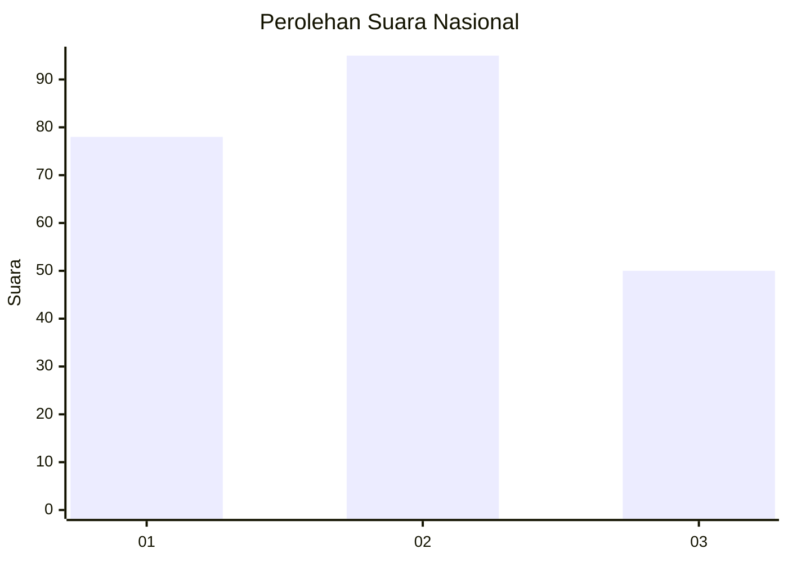
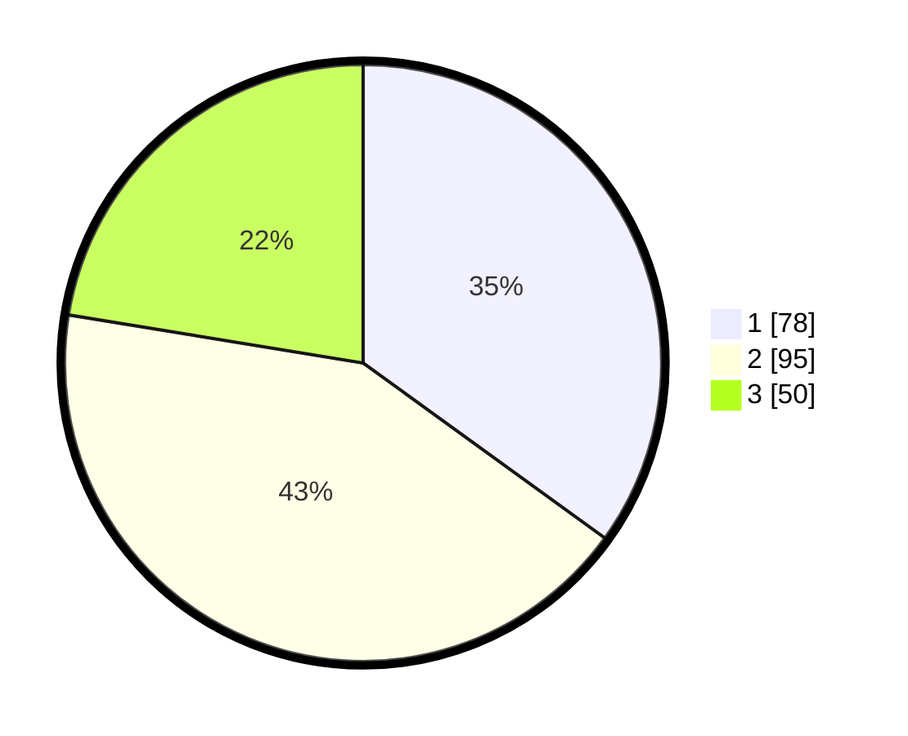

# Hasil

## Grafik

## Tabel

| No.    | Nama Paslon    | Suara | Suara (raw) | Persentase |
|:------ |:-------------- | -----:| -----------:| ----------:|
| 100025 | ANIES MUHAIMIN | 78    | [78][p-1]   | 34,98      |
| 100026 | PRABOWO GIBRAN | 95    | [95][p-2]   | 42,60      |
| 100027 | GANJAR MAHFUD  | 50    | [50][p-3]   | 22,42      |

[p-1]: https://github.com/gigit-pemilu/pemilu-2024/blob/main/pilpres/hitung-suara/sub/31-dki-jakarta/sub/74-jakarta-selatan/sub/06-cilandak/sub/1003-pondok-labu/sub/060-tps/sub/paslon-1.txt
[p-2]: https://github.com/gigit-pemilu/pemilu-2024/blob/main/pilpres/hitung-suara/sub/31-dki-jakarta/sub/74-jakarta-selatan/sub/06-cilandak/sub/1003-pondok-labu/sub/060-tps/sub/paslon-2.txt
[p-3]: https://github.com/gigit-pemilu/pemilu-2024/blob/main/pilpres/hitung-suara/sub/31-dki-jakarta/sub/74-jakarta-selatan/sub/06-cilandak/sub/1003-pondok-labu/sub/060-tps/sub/paslon-3.txt

## Foto C Plano

https://sirekap-obj-formc.kpu.go.id/9602/pemilu/ppwp/31/74/06/10/03/3174061003060-20240215-103000--b61cd5dd-1834-4eab-836c-bc5ec9bff803.jpg

https://sirekap-obj-formc.kpu.go.id/9602/pemilu/ppwp/31/74/06/10/03/3174061003060-20240215-103237--4d404996-3793-4acf-9f38-489cfa5922d0.jpg

https://sirekap-obj-formc.kpu.go.id/9602/pemilu/ppwp/31/74/06/10/03/3174061003060-20240215-103354--268609f3-9082-4bea-9884-87dd3f6162b5.jpg

## Metadata

| Key        | Value               |
| ---------- | ------------------- |
| Time Stamp | 2024-02-24 22:31:28 |

