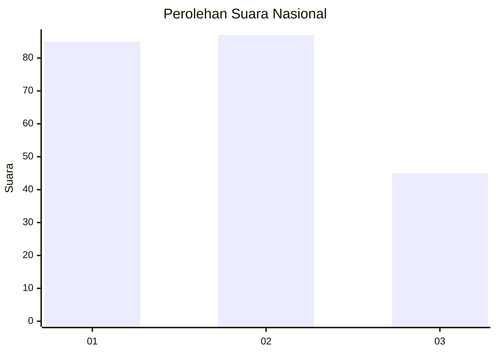
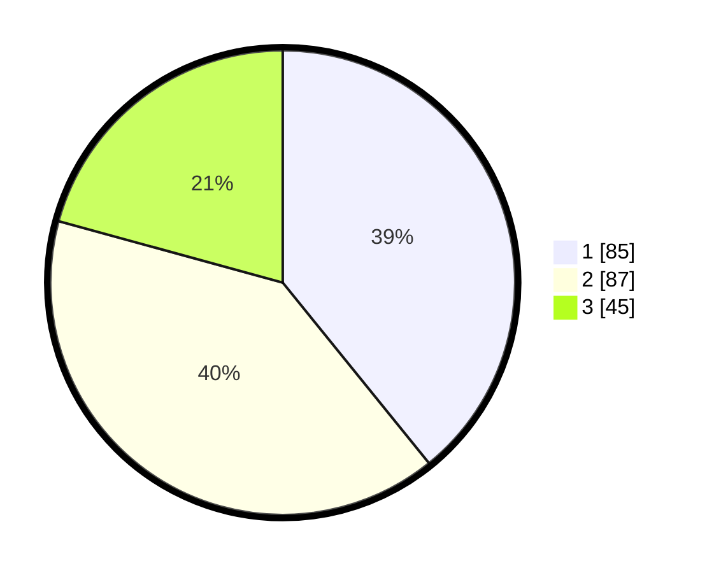

# Hasil

## Grafik

## Tabel

| No.    | Nama Paslon    | Suara | Suara (raw) | Persentase |
|:------ |:-------------- | -----:| -----------:| ----------:|
| 100025 | ANIES MUHAIMIN | 85    | [85][p-1]   | 39,17      |
| 100026 | PRABOWO GIBRAN | 87    | [87][p-2]   | 40,09      |
| 100027 | GANJAR MAHFUD  | 45    | [45][p-3]   | 20,74      |

[p-1]: https://github.com/gigit-pemilu/pemilu-2024/blob/main/pilpres/hitung-suara/sub/31-dki-jakarta/sub/74-jakarta-selatan/sub/06-cilandak/sub/1003-pondok-labu/sub/064-tps/sub/paslon-1.txt
[p-2]: https://github.com/gigit-pemilu/pemilu-2024/blob/main/pilpres/hitung-suara/sub/31-dki-jakarta/sub/74-jakarta-selatan/sub/06-cilandak/sub/1003-pondok-labu/sub/064-tps/sub/paslon-2.txt
[p-3]: https://github.com/gigit-pemilu/pemilu-2024/blob/main/pilpres/hitung-suara/sub/31-dki-jakarta/sub/74-jakarta-selatan/sub/06-cilandak/sub/1003-pondok-labu/sub/064-tps/sub/paslon-3.txt

## Foto C Plano

https://sirekap-obj-formc.kpu.go.id/06b3/pemilu/ppwp/31/74/06/10/03/3174061003064-20240214-190926--9b999363-9d58-4905-afc4-47b2e634d404.jpg

https://sirekap-obj-formc.kpu.go.id/06b3/pemilu/ppwp/31/74/06/10/03/3174061003064-20240214-190819--2a2f1daa-72c9-4133-8c05-9d4ad27987f9.jpg

https://sirekap-obj-formc.kpu.go.id/06b3/pemilu/ppwp/31/74/06/10/03/3174061003064-20240214-190941--7c7de955-8665-41c6-a71f-70bb7bbc45da.jpg

## Metadata

| Key        | Value               |
| ---------- | ------------------- |
| Time Stamp | 2024-02-24 22:31:28 |

