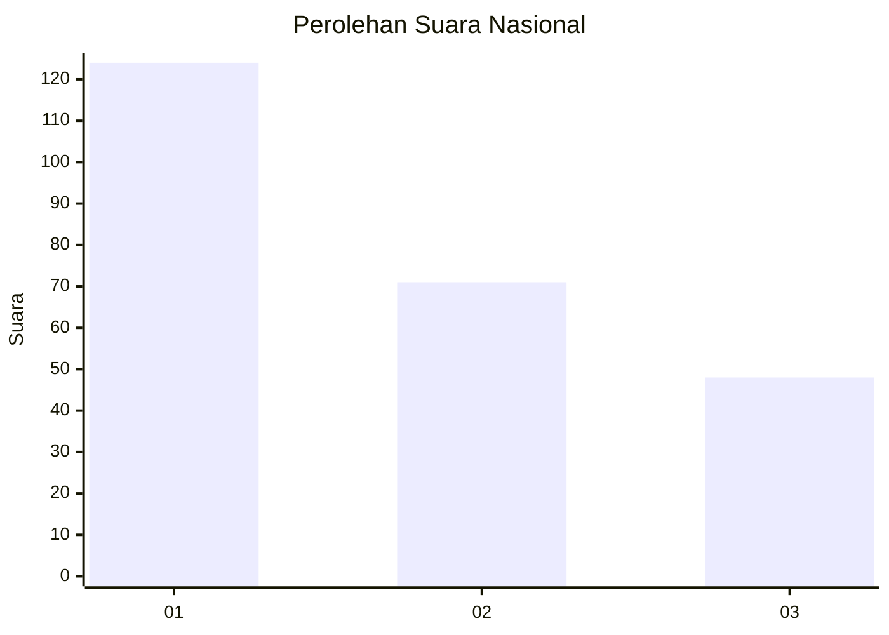
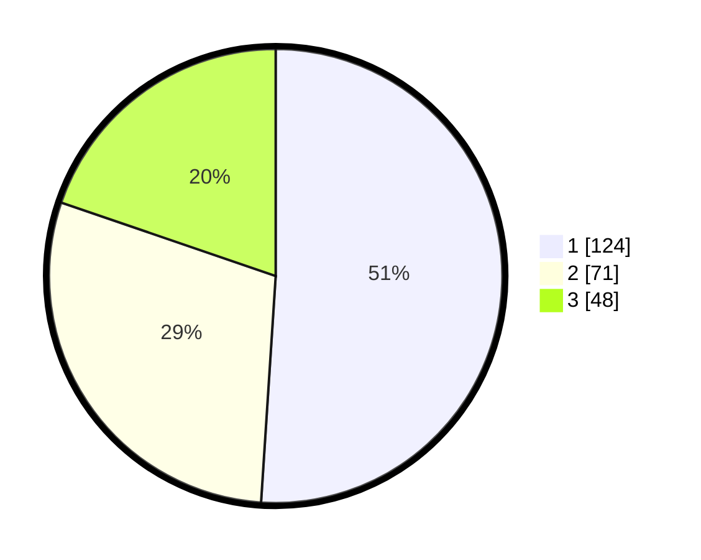

# Hasil

## Grafik

## Tabel

| No. | Nama Paslon    | Suara | Suara (raw) | Persentase |
|:--- |:-------------- | -----:| -----------:| ----------:|
| 1   | ANIES MUHAIMIN | 124   | [124][p-1]  | 51,03      |
| 2   | PRABOWO GIBRAN | 71    | [71][p-2]   | 29,22      |
| 3   | GANJAR MAHFUD  | 48    | [48][p-3]   | 19,75      |

[p-1]: https://github.com/gigit-pemilu/pemilu-2024/blob/main/pilpres/hitung-suara/sub/31-dki-jakarta/sub/74-jakarta-selatan/sub/06-cilandak/sub/1003-pondok-labu/sub/070-tps/sub/paslon-1.txt
[p-2]: https://github.com/gigit-pemilu/pemilu-2024/blob/main/pilpres/hitung-suara/sub/31-dki-jakarta/sub/74-jakarta-selatan/sub/06-cilandak/sub/1003-pondok-labu/sub/070-tps/sub/paslon-2.txt
[p-3]: https://github.com/gigit-pemilu/pemilu-2024/blob/main/pilpres/hitung-suara/sub/31-dki-jakarta/sub/74-jakarta-selatan/sub/06-cilandak/sub/1003-pondok-labu/sub/070-tps/sub/paslon-3.txt

## Foto C Plano

https://sirekap-obj-formc.kpu.go.id/1bae/pemilu/ppwp/31/74/06/10/03/3174061003070-20240218-135412--233a6528-53cf-49da-87f2-29c1f293195d.jpg

https://sirekap-obj-formc.kpu.go.id/1bae/pemilu/ppwp/31/74/06/10/03/3174061003070-20240218-135501--0771ced6-4417-4e56-8bfe-3fa358be30f4.jpg

https://sirekap-obj-formc.kpu.go.id/1bae/pemilu/ppwp/31/74/06/10/03/3174061003070-20240218-135536--133179d3-b200-4fe9-8cdd-29c36d64c54a.jpg

## Metadata

| Key        | Value               |
| ---------- | ------------------- |
| Time Stamp | 2024-02-24 22:31:28 |

