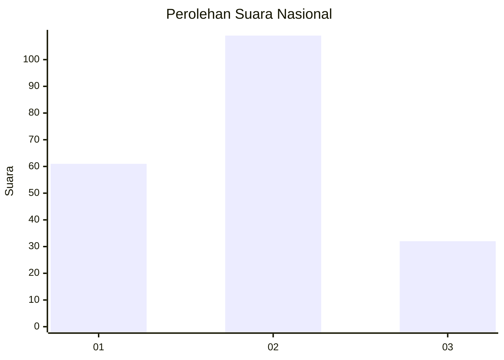
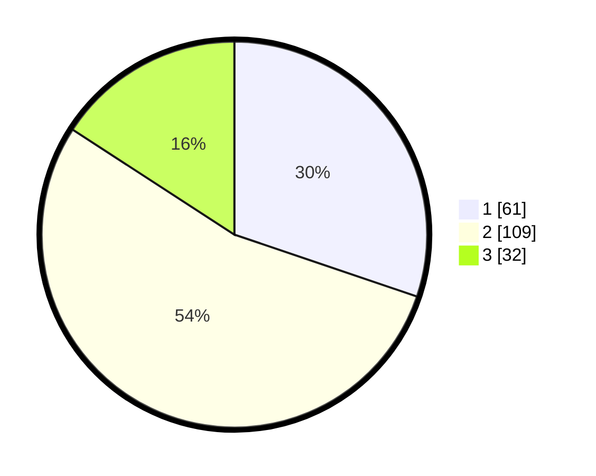

# Hasil

## Grafik

## Tabel

| No.    | Nama Paslon    | Suara | Suara (raw) | Persentase |
|:------ |:-------------- | -----:| -----------:| ----------:|
| 100025 | ANIES MUHAIMIN | 61    | [61][p-1]   | 30,20      |
| 100026 | PRABOWO GIBRAN | 109   | [109][p-2]  | 53,96      |
| 100027 | GANJAR MAHFUD  | 32    | [32][p-3]   | 15,84      |

[p-1]: https://github.com/gigit-pemilu/pemilu-2024/blob/main/pilpres/hitung-suara/sub/31-dki-jakarta/sub/74-jakarta-selatan/sub/06-cilandak/sub/1003-pondok-labu/sub/071-tps/sub/paslon-1.txt
[p-2]: https://github.com/gigit-pemilu/pemilu-2024/blob/main/pilpres/hitung-suara/sub/31-dki-jakarta/sub/74-jakarta-selatan/sub/06-cilandak/sub/1003-pondok-labu/sub/071-tps/sub/paslon-2.txt
[p-3]: https://github.com/gigit-pemilu/pemilu-2024/blob/main/pilpres/hitung-suara/sub/31-dki-jakarta/sub/74-jakarta-selatan/sub/06-cilandak/sub/1003-pondok-labu/sub/071-tps/sub/paslon-3.txt

## Foto C Plano

https://sirekap-obj-formc.kpu.go.id/2818/pemilu/ppwp/31/74/06/10/03/3174061003071-20240218-140348--f56406bc-9558-4447-8cb1-5403fd85cfdf.jpg

https://sirekap-obj-formc.kpu.go.id/2818/pemilu/ppwp/31/74/06/10/03/3174061003071-20240218-140418--8be8b2fb-3f05-498f-8676-84d364a61106.jpg

https://sirekap-obj-formc.kpu.go.id/2818/pemilu/ppwp/31/74/06/10/03/3174061003071-20240218-140448--d8364f0d-286f-4e7b-935d-ba75807147e4.jpg

## Metadata

| Key        | Value               |
| ---------- | ------------------- |
| Time Stamp | 2024-02-24 22:31:28 |

