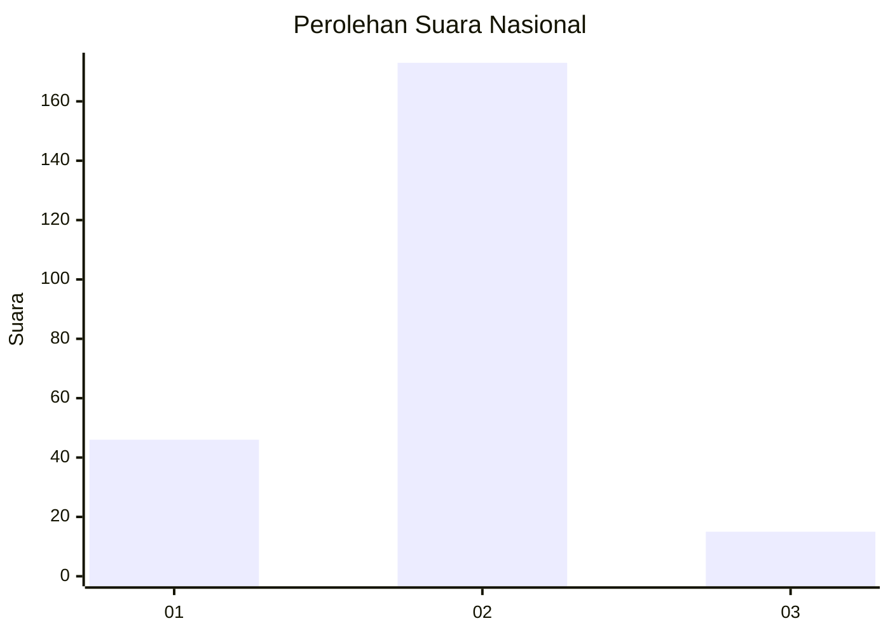
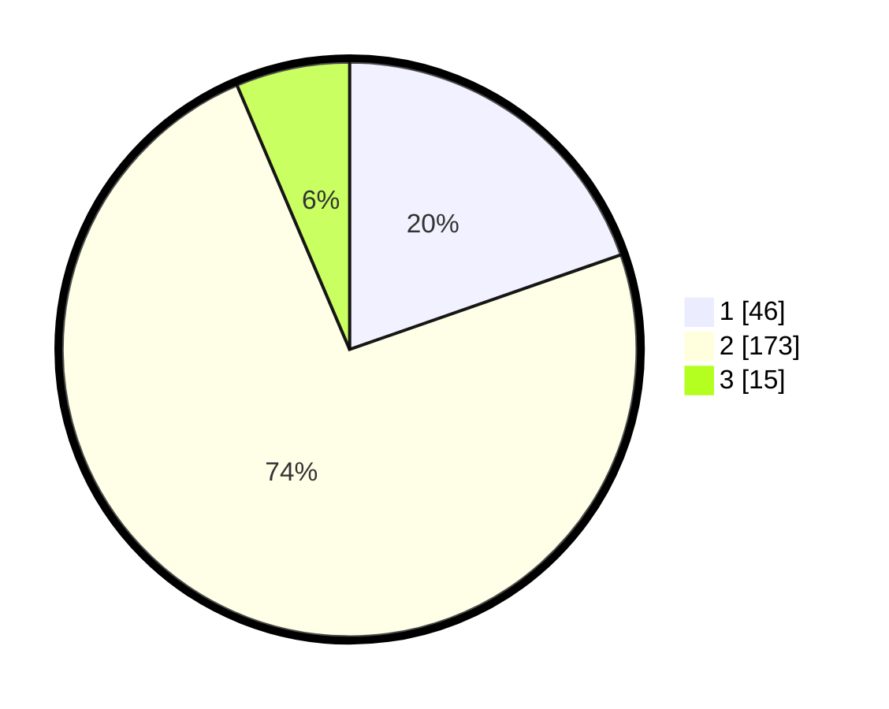

# Hasil

## Grafik

## Tabel

| No.    | Nama Paslon    | Suara | Suara (raw) | Persentase |
|:------ |:-------------- | -----:| -----------:| ----------:|
| 100025 | ANIES MUHAIMIN | 46    | [46][p-1]   | 19,66      |
| 100026 | PRABOWO GIBRAN | 173   | [173][p-2]  | 73,93      |
| 100027 | GANJAR MAHFUD  | 15    | [15][p-3]   | 6,41       |

[p-1]: https://github.com/gigit-pemilu/pemilu-2024/blob/main/pilpres/hitung-suara/sub/31-dki-jakarta/sub/74-jakarta-selatan/sub/06-cilandak/sub/1003-pondok-labu/sub/083-tps/sub/paslon-1.txt
[p-2]: https://github.com/gigit-pemilu/pemilu-2024/blob/main/pilpres/hitung-suara/sub/31-dki-jakarta/sub/74-jakarta-selatan/sub/06-cilandak/sub/1003-pondok-labu/sub/083-tps/sub/paslon-2.txt
[p-3]: https://github.com/gigit-pemilu/pemilu-2024/blob/main/pilpres/hitung-suara/sub/31-dki-jakarta/sub/74-jakarta-selatan/sub/06-cilandak/sub/1003-pondok-labu/sub/083-tps/sub/paslon-3.txt

## Foto C Plano

https://sirekap-obj-formc.kpu.go.id/6a52/pemilu/ppwp/31/74/06/10/03/3174061003083-20240218-143918--1651cfe2-fef0-47db-ba57-508c198b29cd.jpg

https://sirekap-obj-formc.kpu.go.id/6a52/pemilu/ppwp/31/74/06/10/03/3174061003083-20240218-221630--99cc728a-626a-44e6-aaf0-f377533812c8.jpg

https://sirekap-obj-formc.kpu.go.id/6a52/pemilu/ppwp/31/74/06/10/03/3174061003083-20240218-143958--17d57a77-d90c-4992-a8f1-ca04ed999131.jpg

## Metadata

| Key        | Value               |
| ---------- | ------------------- |
| Time Stamp | 2024-02-26 09:00:00 |

