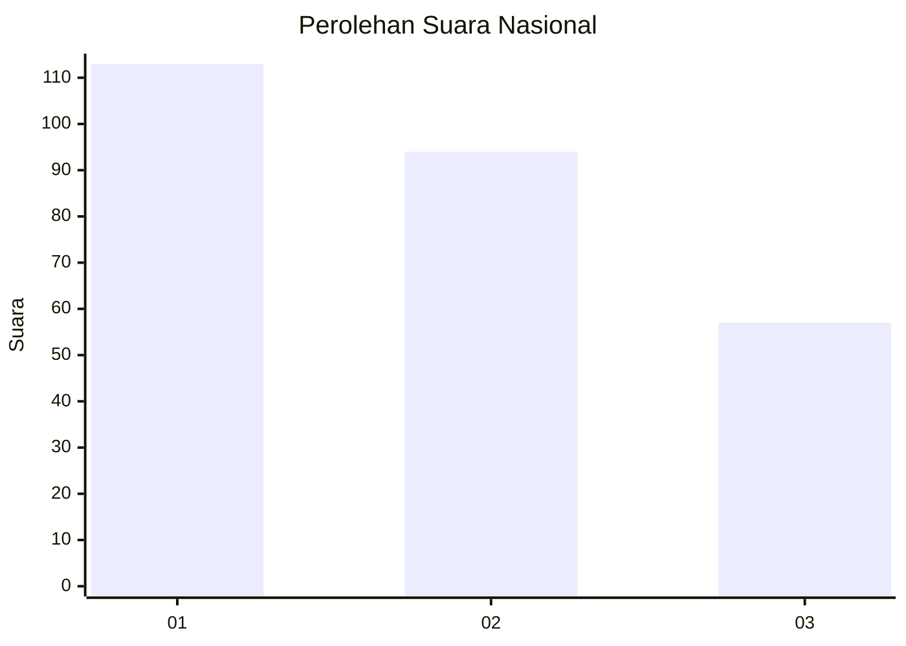
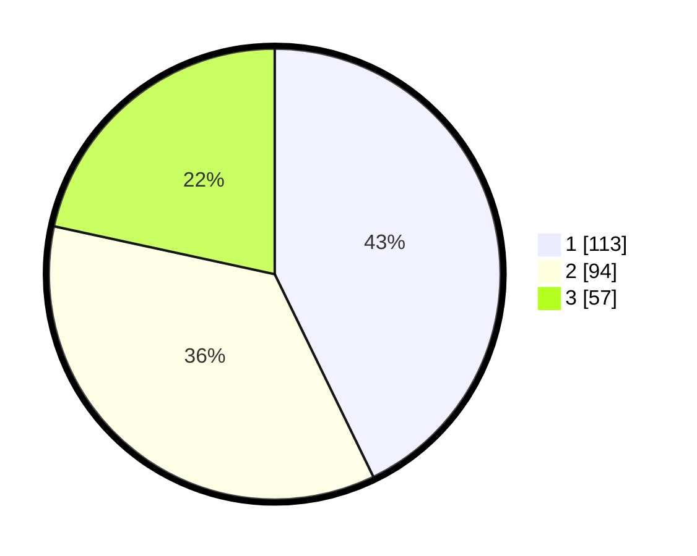

# Hasil

## Grafik

## Tabel

| No. | Nama Paslon    | Suara | Suara (raw) | Persentase |
|:--- |:-------------- | -----:| -----------:| ----------:|
| 1   | ANIES MUHAIMIN | 113   | [113][p-1]  | 42,80      |
| 2   | PRABOWO GIBRAN | 94    | [94][p-2]   | 35,61      |
| 3   | GANJAR MAHFUD  | 57    | [57][p-3]   | 21,59      |

[p-1]: https://github.com/gigit-pemilu/pemilu-2024/blob/main/pilpres/hitung-suara/sub/31-dki-jakarta/sub/74-jakarta-selatan/sub/06-cilandak/sub/1003-pondok-labu/sub/086-tps/sub/paslon-1.txt
[p-2]: https://github.com/gigit-pemilu/pemilu-2024/blob/main/pilpres/hitung-suara/sub/31-dki-jakarta/sub/74-jakarta-selatan/sub/06-cilandak/sub/1003-pondok-labu/sub/086-tps/sub/paslon-2.txt
[p-3]: https://github.com/gigit-pemilu/pemilu-2024/blob/main/pilpres/hitung-suara/sub/31-dki-jakarta/sub/74-jakarta-selatan/sub/06-cilandak/sub/1003-pondok-labu/sub/086-tps/sub/paslon-3.txt

## Foto C Plano

https://sirekap-obj-formc.kpu.go.id/c0f1/pemilu/ppwp/31/74/06/10/03/3174061003086-20240218-144558--9ed13815-0705-4bc1-81b0-5bde7e321a30.jpg

https://sirekap-obj-formc.kpu.go.id/c0f1/pemilu/ppwp/31/74/06/10/03/3174061003086-20240218-144618--608413e6-2edf-4a66-ac4b-4c82cf14902f.jpg

https://sirekap-obj-formc.kpu.go.id/c0f1/pemilu/ppwp/31/74/06/10/03/3174061003086-20240218-144637--0927fd63-a6a6-490f-bef4-ef373fcbae11.jpg

## Metadata

| Key        | Value               |
| ---------- | ------------------- |
| Time Stamp | 2024-02-24 22:31:28 |

