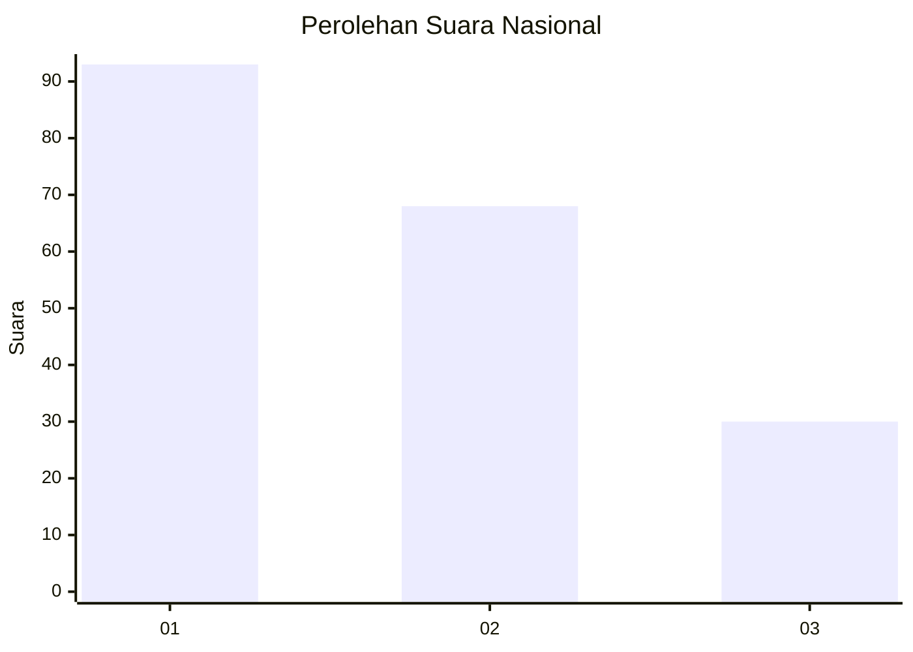
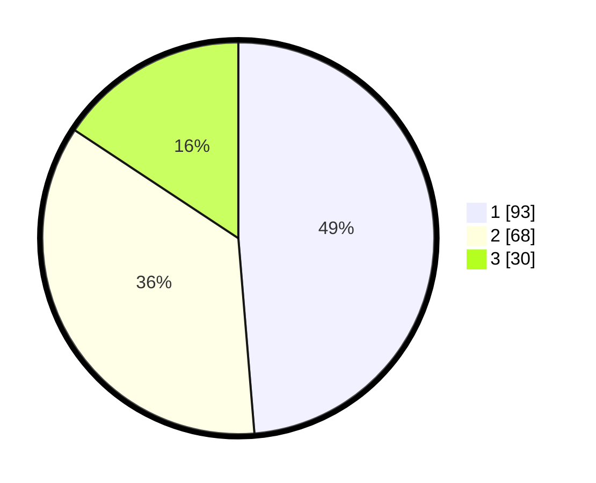

# Hasil

## Grafik

## Tabel

| No.    | Nama Paslon    | Suara | Suara (raw) | Persentase |
|:------ |:-------------- | -----:| -----------:| ----------:|
| 100025 | ANIES MUHAIMIN | 93    | [93][p-1]   | 48,69      |
| 100026 | PRABOWO GIBRAN | 68    | [68][p-2]   | 35,60      |
| 100027 | GANJAR MAHFUD  | 30    | [30][p-3]   | 15,71      |

[p-1]: https://github.com/gigit-pemilu/pemilu-2024/blob/main/pilpres/hitung-suara/sub/31-dki-jakarta/sub/74-jakarta-selatan/sub/06-cilandak/sub/1003-pondok-labu/sub/097-tps/sub/paslon-1.txt
[p-2]: https://github.com/gigit-pemilu/pemilu-2024/blob/main/pilpres/hitung-suara/sub/31-dki-jakarta/sub/74-jakarta-selatan/sub/06-cilandak/sub/1003-pondok-labu/sub/097-tps/sub/paslon-2.txt
[p-3]: https://github.com/gigit-pemilu/pemilu-2024/blob/main/pilpres/hitung-suara/sub/31-dki-jakarta/sub/74-jakarta-selatan/sub/06-cilandak/sub/1003-pondok-labu/sub/097-tps/sub/paslon-3.txt

## Foto C Plano

https://sirekap-obj-formc.kpu.go.id/22e6/pemilu/ppwp/31/74/06/10/03/3174061003097-20240214-234217--92395874-0263-4c8a-bbb8-312058c68f1a.jpg

https://sirekap-obj-formc.kpu.go.id/22e6/pemilu/ppwp/31/74/06/10/03/3174061003097-20240214-160140--e289c6d0-2f55-4229-84b1-c609e27fa0ec.jpg

https://sirekap-obj-formc.kpu.go.id/22e6/pemilu/ppwp/31/74/06/10/03/3174061003097-20240214-234208--87b5810c-2b02-4cc2-9ccb-19cb558faf1e.jpg

## Metadata

| Key        | Value               |
| ---------- | ------------------- |
| Time Stamp | 2024-02-15 03:06:03 |

