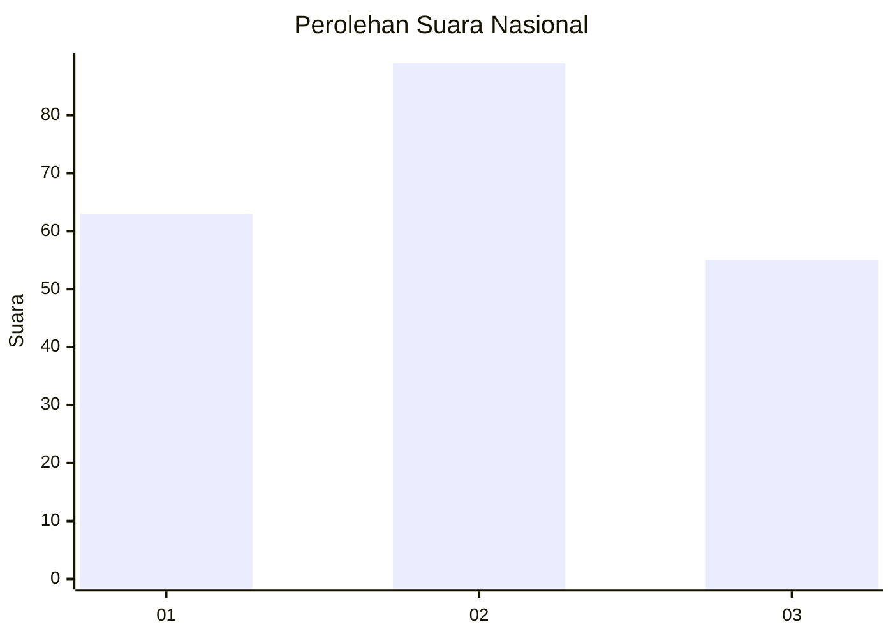
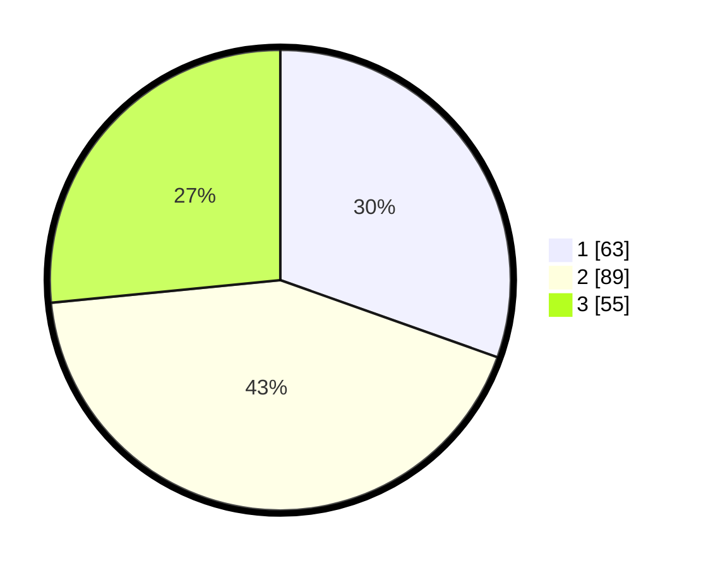

# Hasil

## Grafik

## Tabel

| No.    | Nama Paslon    | Suara | Suara (raw) | Persentase |
|:------ |:-------------- | -----:| -----------:| ----------:|
| 100025 | ANIES MUHAIMIN | 63    | [63][p-1]   | 30,43      |
| 100026 | PRABOWO GIBRAN | 89    | [89][p-2]   | 43,00      |
| 100027 | GANJAR MAHFUD  | 55    | [55][p-3]   | 26,57      |

[p-1]: https://github.com/gigit-pemilu/pemilu-2024/blob/main/pilpres/hitung-suara/sub/31-dki-jakarta/sub/74-jakarta-selatan/sub/06-cilandak/sub/1003-pondok-labu/sub/099-tps/sub/paslon-1.txt
[p-2]: https://github.com/gigit-pemilu/pemilu-2024/blob/main/pilpres/hitung-suara/sub/31-dki-jakarta/sub/74-jakarta-selatan/sub/06-cilandak/sub/1003-pondok-labu/sub/099-tps/sub/paslon-2.txt
[p-3]: https://github.com/gigit-pemilu/pemilu-2024/blob/main/pilpres/hitung-suara/sub/31-dki-jakarta/sub/74-jakarta-selatan/sub/06-cilandak/sub/1003-pondok-labu/sub/099-tps/sub/paslon-3.txt

## Foto C Plano

https://sirekap-obj-formc.kpu.go.id/11b5/pemilu/ppwp/31/74/06/10/03/3174061003099-20240215-034408--3cae335d-7a2f-4f78-9953-0b994ef64297.jpg

https://sirekap-obj-formc.kpu.go.id/11b5/pemilu/ppwp/31/74/06/10/03/3174061003099-20240215-034456--4c41aec5-e6df-4b3a-ad02-a5c5a48cabac.jpg

https://sirekap-obj-formc.kpu.go.id/11b5/pemilu/ppwp/31/74/06/10/03/3174061003099-20240215-034531--2274f4a8-fef2-4466-9c84-152e035e701c.jpg

## Metadata

| Key        | Value               |
| ---------- | ------------------- |
| Time Stamp | 2024-02-24 22:31:28 |

