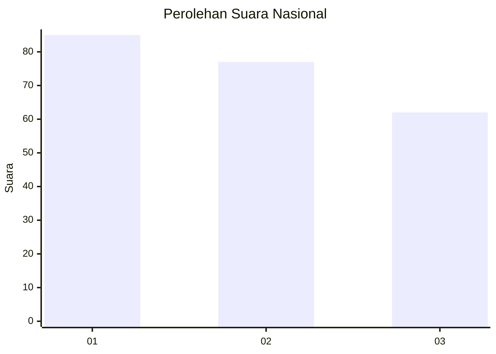
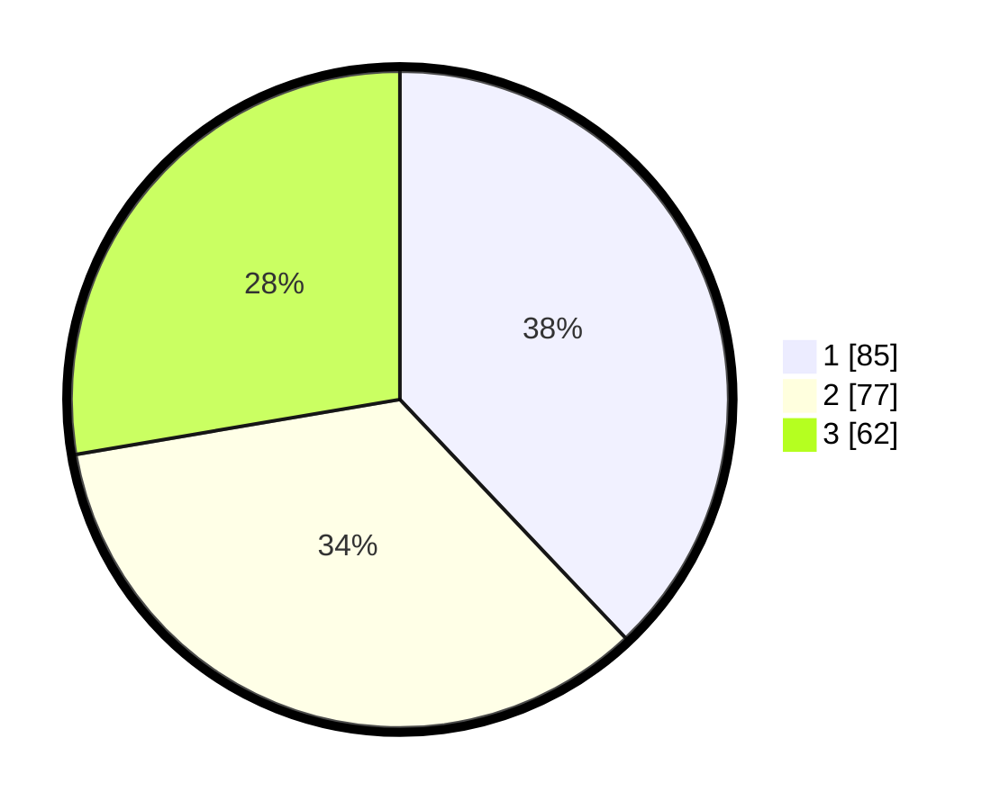

# Hasil

## Grafik

## Tabel

| No.    | Nama Paslon    | Suara | Suara (raw) | Persentase |
|:------ |:-------------- | -----:| -----------:| ----------:|
| 100025 | ANIES MUHAIMIN | 85    | [85][p-1]   | 37,95      |
| 100026 | PRABOWO GIBRAN | 77    | [77][p-2]   | 34,38      |
| 100027 | GANJAR MAHFUD  | 62    | [62][p-3]   | 27,68      |

[p-1]: https://github.com/gigit-pemilu/pemilu-2024/blob/main/pilpres/hitung-suara/sub/31-dki-jakarta/sub/74-jakarta-selatan/sub/06-cilandak/sub/1003-pondok-labu/sub/107-tps/sub/paslon-1.txt
[p-2]: https://github.com/gigit-pemilu/pemilu-2024/blob/main/pilpres/hitung-suara/sub/31-dki-jakarta/sub/74-jakarta-selatan/sub/06-cilandak/sub/1003-pondok-labu/sub/107-tps/sub/paslon-2.txt
[p-3]: https://github.com/gigit-pemilu/pemilu-2024/blob/main/pilpres/hitung-suara/sub/31-dki-jakarta/sub/74-jakarta-selatan/sub/06-cilandak/sub/1003-pondok-labu/sub/107-tps/sub/paslon-3.txt

## Foto C Plano

https://sirekap-obj-formc.kpu.go.id/3227/pemilu/ppwp/31/74/06/10/03/3174061003107-20240218-163547--d04da136-4124-45e2-86ab-a7da285e957a.jpg

https://sirekap-obj-formc.kpu.go.id/3227/pemilu/ppwp/31/74/06/10/03/3174061003107-20240218-163715--5a34db99-729d-499d-83fc-d2f611551570.jpg

https://sirekap-obj-formc.kpu.go.id/3227/pemilu/ppwp/31/74/06/10/03/3174061003107-20240218-163747--69387cb1-4295-4d1c-90ed-8c91dd4a772e.jpg

## Metadata

| Key        | Value               |
| ---------- | ------------------- |
| Time Stamp | 2024-02-25 12:00:00 |

