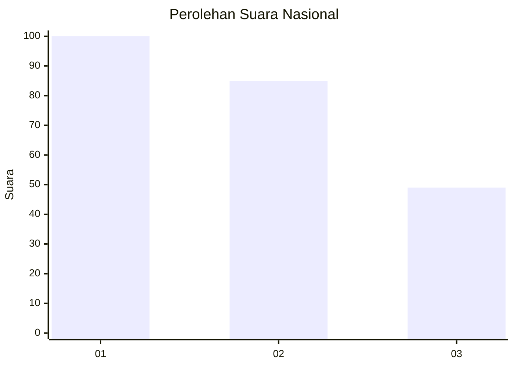
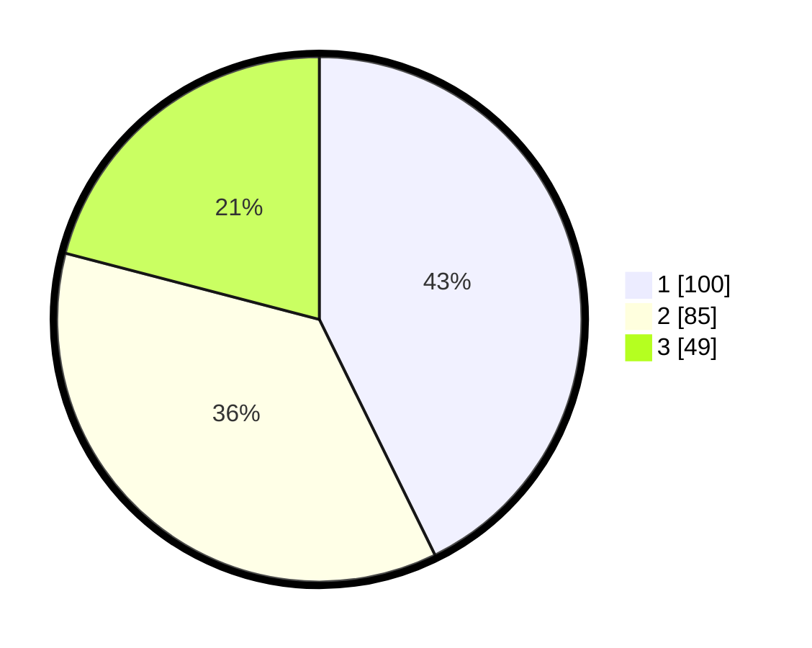

# Hasil

## Grafik

## Tabel

| No.    | Nama Paslon    | Suara | Suara (raw) | Persentase |
|:------ |:-------------- | -----:| -----------:| ----------:|
| 100025 | ANIES MUHAIMIN | 100   | [100][p-1]  | 42,74      |
| 100026 | PRABOWO GIBRAN | 85    | [85][p-2]   | 36,32      |
| 100027 | GANJAR MAHFUD  | 49    | [49][p-3]   | 20,94      |

[p-1]: https://github.com/gigit-pemilu/pemilu-2024/blob/main/pilpres/hitung-suara/sub/31-dki-jakarta/sub/74-jakarta-selatan/sub/06-cilandak/sub/1003-pondok-labu/sub/109-tps/sub/paslon-1.txt
[p-2]: https://github.com/gigit-pemilu/pemilu-2024/blob/main/pilpres/hitung-suara/sub/31-dki-jakarta/sub/74-jakarta-selatan/sub/06-cilandak/sub/1003-pondok-labu/sub/109-tps/sub/paslon-2.txt
[p-3]: https://github.com/gigit-pemilu/pemilu-2024/blob/main/pilpres/hitung-suara/sub/31-dki-jakarta/sub/74-jakarta-selatan/sub/06-cilandak/sub/1003-pondok-labu/sub/109-tps/sub/paslon-3.txt

## Foto C Plano

https://sirekap-obj-formc.kpu.go.id/d895/pemilu/ppwp/31/74/06/10/03/3174061003109-20240218-164421--56ab0cfb-634e-4b11-b412-255c596f40bb.jpg

https://sirekap-obj-formc.kpu.go.id/d895/pemilu/ppwp/31/74/06/10/03/3174061003109-20240218-164257--842c3bb1-76c2-4026-9cae-4b9bcbac652c.jpg

https://sirekap-obj-formc.kpu.go.id/d895/pemilu/ppwp/31/74/06/10/03/3174061003109-20240218-164327--3ac0bf38-71a9-4096-a7ee-310c32b9dbea.jpg

## Metadata

| Key        | Value               |
| ---------- | ------------------- |
| Time Stamp | 2024-02-24 22:31:28 |

