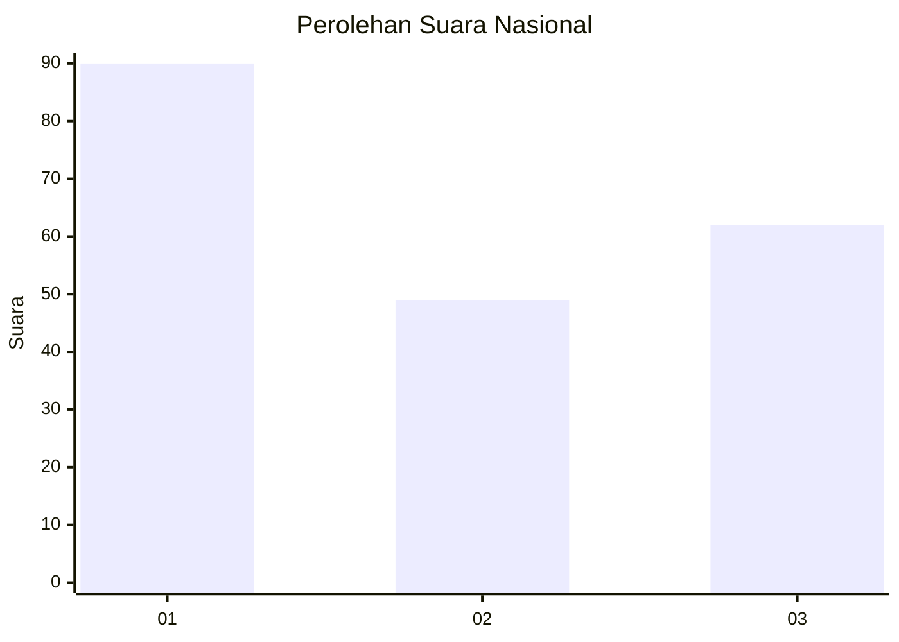
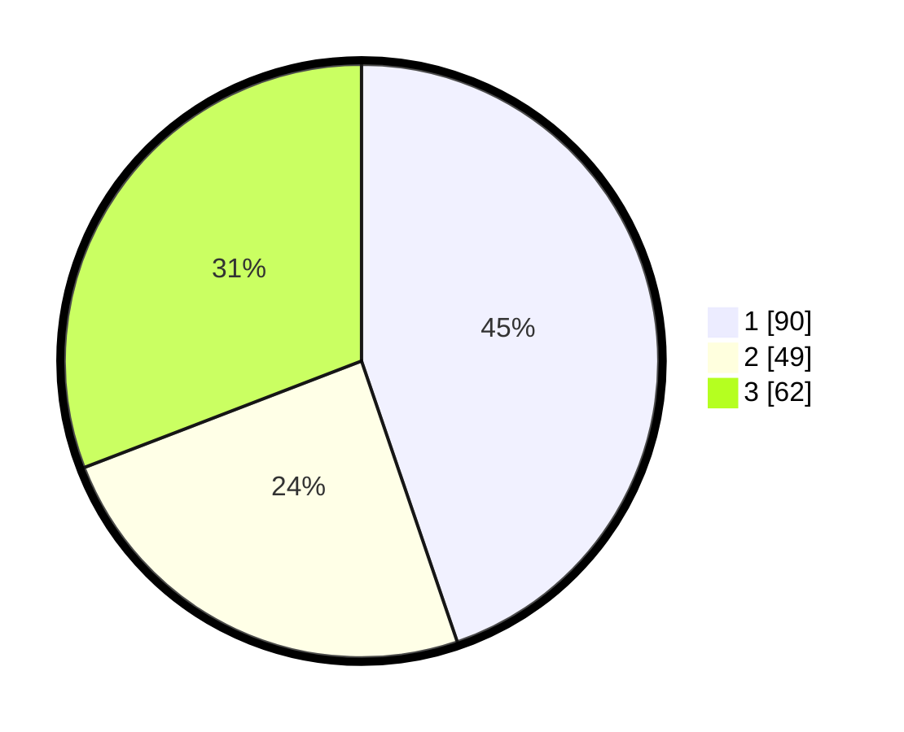

# Hasil

## Grafik

## Tabel

| No.    | Nama Paslon    | Suara | Suara (raw) | Persentase |
|:------ |:-------------- | -----:| -----------:| ----------:|
| 100025 | ANIES MUHAIMIN | 90    | [90][p-1]   | 44,78      |
| 100026 | PRABOWO GIBRAN | 49    | [49][p-2]   | 24,38      |
| 100027 | GANJAR MAHFUD  | 62    | [62][p-3]   | 30,85      |

[p-1]: https://github.com/gigit-pemilu/pemilu-2024/blob/main/pilpres/hitung-suara/sub/31-dki-jakarta/sub/74-jakarta-selatan/sub/06-cilandak/sub/1003-pondok-labu/sub/112-tps/sub/paslon-1.txt
[p-2]: https://github.com/gigit-pemilu/pemilu-2024/blob/main/pilpres/hitung-suara/sub/31-dki-jakarta/sub/74-jakarta-selatan/sub/06-cilandak/sub/1003-pondok-labu/sub/112-tps/sub/paslon-2.txt
[p-3]: https://github.com/gigit-pemilu/pemilu-2024/blob/main/pilpres/hitung-suara/sub/31-dki-jakarta/sub/74-jakarta-selatan/sub/06-cilandak/sub/1003-pondok-labu/sub/112-tps/sub/paslon-3.txt

## Foto C Plano

https://sirekap-obj-formc.kpu.go.id/339a/pemilu/ppwp/31/74/06/10/03/3174061003112-20240218-165150--783c0709-5834-49e3-ae0a-435d80dc63cc.jpg

https://sirekap-obj-formc.kpu.go.id/339a/pemilu/ppwp/31/74/06/10/03/3174061003112-20240218-165407--0b4bc04f-d552-4ce7-a0f7-a902fe7dc9e0.jpg

https://sirekap-obj-formc.kpu.go.id/339a/pemilu/ppwp/31/74/06/10/03/3174061003112-20240218-165308--4ac2985c-d183-4fe5-b597-14d857100fc6.jpg

## Metadata

| Key        | Value               |
| ---------- | ------------------- |
| Time Stamp | 2024-02-24 22:31:28 |

