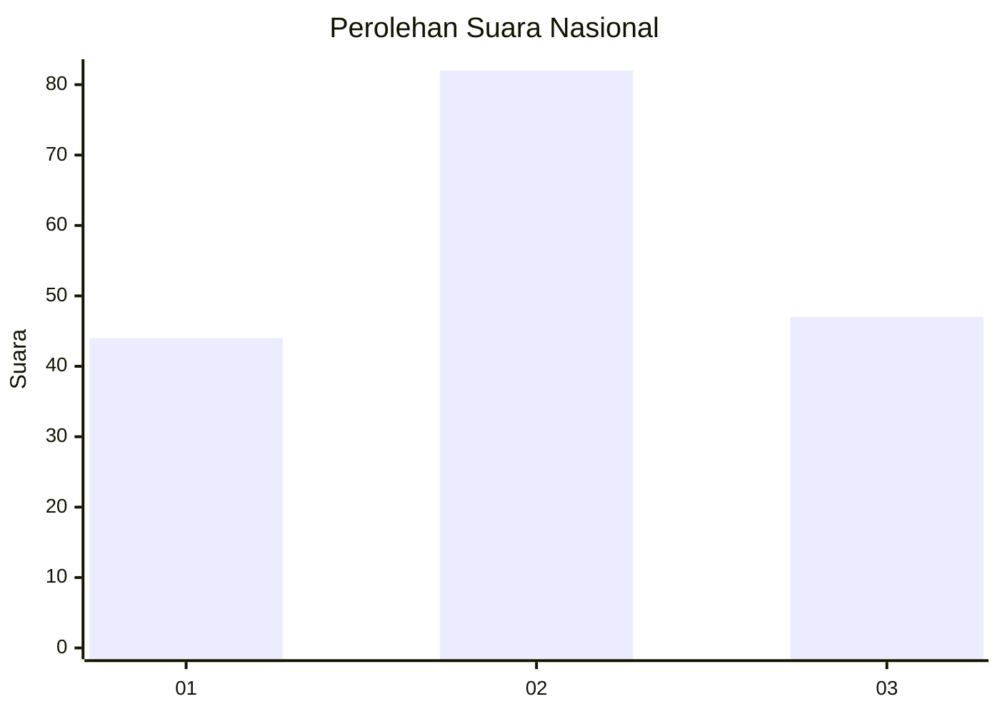
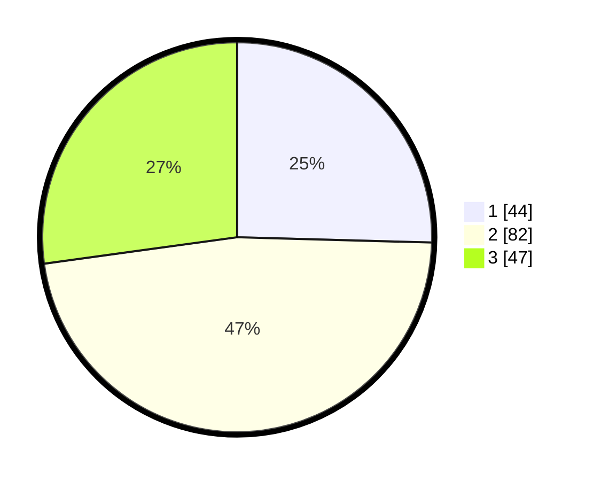

# Hasil

## Grafik

## Tabel

| No.    | Nama Paslon    | Suara | Suara (raw) | Persentase |
|:------ |:-------------- | -----:| -----------:| ----------:|
| 100025 | ANIES MUHAIMIN | 44    | [44][p-1]   | 25,43      |
| 100026 | PRABOWO GIBRAN | 82    | [82][p-2]   | 47,40      |
| 100027 | GANJAR MAHFUD  | 47    | [47][p-3]   | 27,17      |

[p-1]: https://github.com/gigit-pemilu/pemilu-2024/blob/main/pilpres/hitung-suara/sub/31-dki-jakarta/sub/74-jakarta-selatan/sub/06-cilandak/sub/1003-pondok-labu/sub/113-tps/sub/paslon-1.txt
[p-2]: https://github.com/gigit-pemilu/pemilu-2024/blob/main/pilpres/hitung-suara/sub/31-dki-jakarta/sub/74-jakarta-selatan/sub/06-cilandak/sub/1003-pondok-labu/sub/113-tps/sub/paslon-2.txt
[p-3]: https://github.com/gigit-pemilu/pemilu-2024/blob/main/pilpres/hitung-suara/sub/31-dki-jakarta/sub/74-jakarta-selatan/sub/06-cilandak/sub/1003-pondok-labu/sub/113-tps/sub/paslon-3.txt

## Foto C Plano

https://sirekap-obj-formc.kpu.go.id/5ccf/pemilu/ppwp/31/74/06/10/03/3174061003113-20240218-165505--fcb61e5a-e03b-46f5-94cc-f5732b14ffc3.jpg

https://sirekap-obj-formc.kpu.go.id/5ccf/pemilu/ppwp/31/74/06/10/03/3174061003113-20240218-165710--e147905d-77eb-4c1c-9d79-65874b0ef8fe.jpg

https://sirekap-obj-formc.kpu.go.id/5ccf/pemilu/ppwp/31/74/06/10/03/3174061003113-20240218-165543--b2a51d55-a2f7-4169-8e31-bb8cc4d25d49.jpg

## Metadata

| Key        | Value               |
| ---------- | ------------------- |
| Time Stamp | 2024-02-24 22:31:28 |

