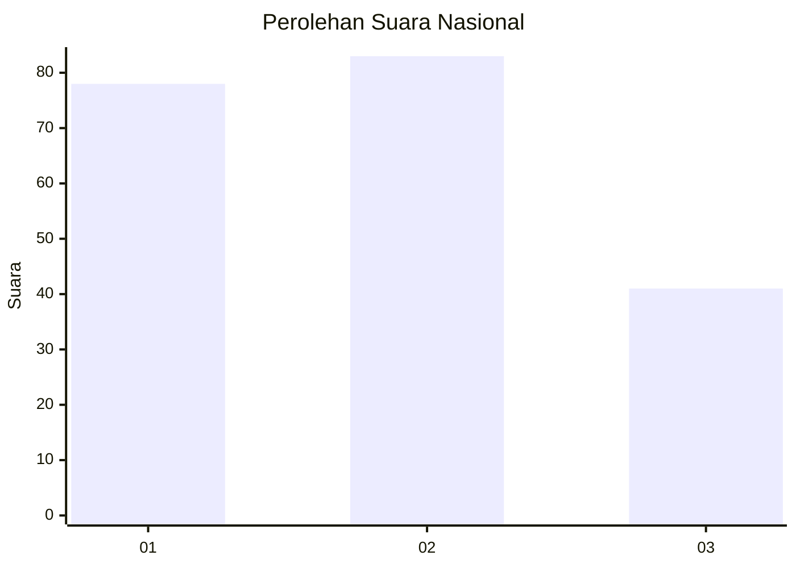
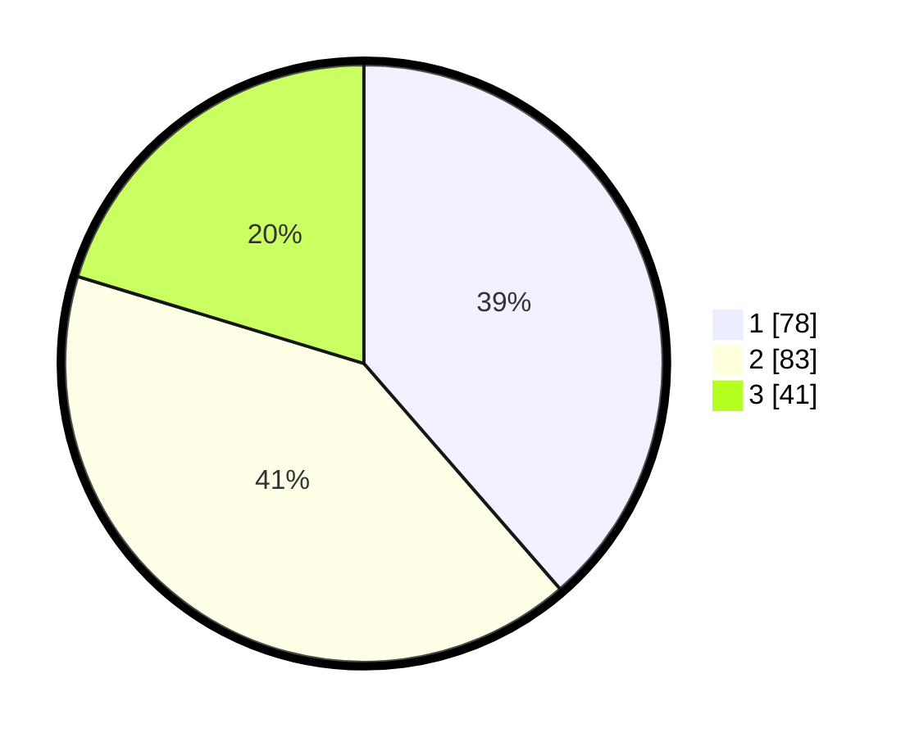

# Hasil

## Grafik

## Tabel

| No.    | Nama Paslon    | Suara | Suara (raw) | Persentase |
|:------ |:-------------- | -----:| -----------:| ----------:|
| 100025 | ANIES MUHAIMIN | 78    | [78][p-1]   | 38,61      |
| 100026 | PRABOWO GIBRAN | 83    | [83][p-2]   | 41,09      |
| 100027 | GANJAR MAHFUD  | 41    | [41][p-3]   | 20,30      |

[p-1]: https://github.com/gigit-pemilu/pemilu-2024/blob/main/pilpres/hitung-suara/sub/31-dki-jakarta/sub/74-jakarta-selatan/sub/06-cilandak/sub/1003-pondok-labu/sub/126-tps/sub/paslon-1.txt
[p-2]: https://github.com/gigit-pemilu/pemilu-2024/blob/main/pilpres/hitung-suara/sub/31-dki-jakarta/sub/74-jakarta-selatan/sub/06-cilandak/sub/1003-pondok-labu/sub/126-tps/sub/paslon-2.txt
[p-3]: https://github.com/gigit-pemilu/pemilu-2024/blob/main/pilpres/hitung-suara/sub/31-dki-jakarta/sub/74-jakarta-selatan/sub/06-cilandak/sub/1003-pondok-labu/sub/126-tps/sub/paslon-3.txt

## Foto C Plano

https://sirekap-obj-formc.kpu.go.id/dc5b/pemilu/ppwp/31/74/06/10/03/3174061003126-20240218-172029--4a96dc07-d08c-4359-b260-e21134f526c4.jpg

https://sirekap-obj-formc.kpu.go.id/dc5b/pemilu/ppwp/31/74/06/10/03/3174061003126-20240218-172118--82ef5585-0a0a-401e-9fe2-b5b3681358f7.jpg

https://sirekap-obj-formc.kpu.go.id/dc5b/pemilu/ppwp/31/74/06/10/03/3174061003126-20240218-172143--ec094800-ef6a-4e8b-969d-6ec2b278ec48.jpg

## Metadata

| Key        | Value               |
| ---------- | ------------------- |
| Time Stamp | 2024-02-24 22:31:28 |

