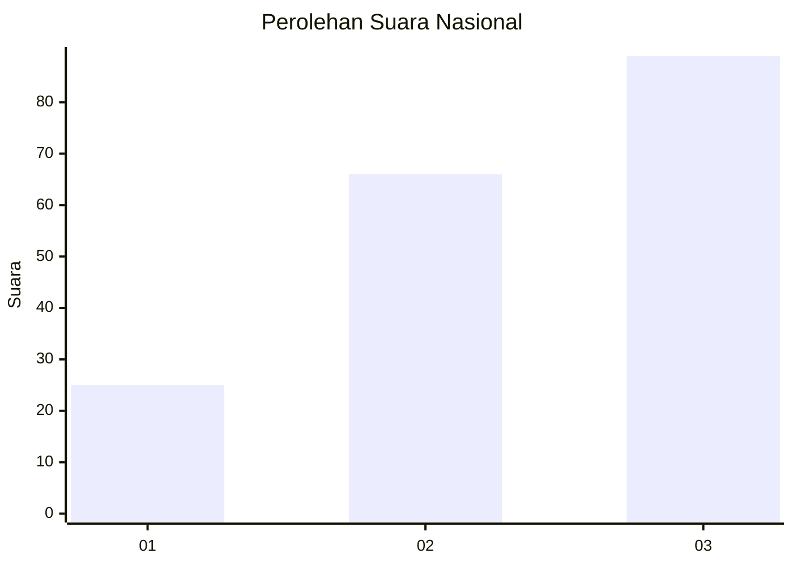
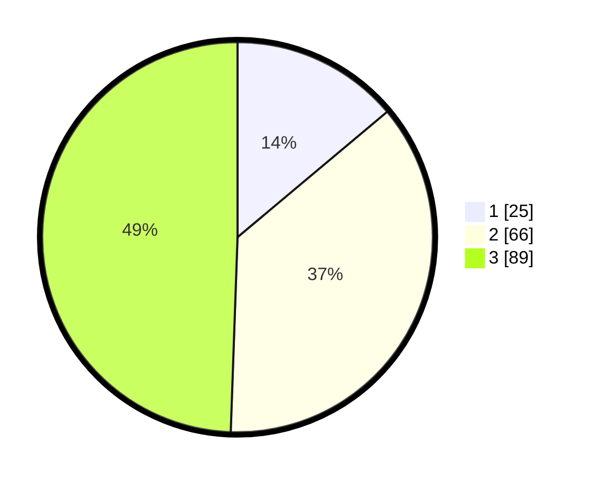

# Hasil

## Grafik

## Tabel

| No.    | Nama Paslon    | Suara | Suara (raw) | Persentase |
|:------ |:-------------- | -----:| -----------:| ----------:|
| 100025 | ANIES MUHAIMIN | 25    | [25][p-1]   | 13,89      |
| 100026 | PRABOWO GIBRAN | 66    | [66][p-2]   | 36,67      |
| 100027 | GANJAR MAHFUD  | 89    | [89][p-3]   | 49,44      |

[p-1]: https://github.com/gigit-pemilu/pemilu-2024/blob/main/pilpres/hitung-suara/sub/31-dki-jakarta/sub/74-jakarta-selatan/sub/06-cilandak/sub/1003-pondok-labu/sub/131-tps/sub/paslon-1.txt
[p-2]: https://github.com/gigit-pemilu/pemilu-2024/blob/main/pilpres/hitung-suara/sub/31-dki-jakarta/sub/74-jakarta-selatan/sub/06-cilandak/sub/1003-pondok-labu/sub/131-tps/sub/paslon-2.txt
[p-3]: https://github.com/gigit-pemilu/pemilu-2024/blob/main/pilpres/hitung-suara/sub/31-dki-jakarta/sub/74-jakarta-selatan/sub/06-cilandak/sub/1003-pondok-labu/sub/131-tps/sub/paslon-3.txt

## Foto C Plano

https://sirekap-obj-formc.kpu.go.id/9931/pemilu/ppwp/31/74/06/10/03/3174061003131-20240218-172935--81ec702e-99a2-414f-9318-66ad563bbbba.jpg

https://sirekap-obj-formc.kpu.go.id/9931/pemilu/ppwp/31/74/06/10/03/3174061003131-20240218-173002--9ac536f3-3ed4-45e1-9845-48324b2a4d2c.jpg

https://sirekap-obj-formc.kpu.go.id/9931/pemilu/ppwp/31/74/06/10/03/3174061003131-20240218-173033--393dd27a-e8ef-46ca-a020-ce7fff8b1e12.jpg

## Metadata

| Key        | Value               |
| ---------- | ------------------- |
| Time Stamp | 2024-02-24 22:31:28 |

