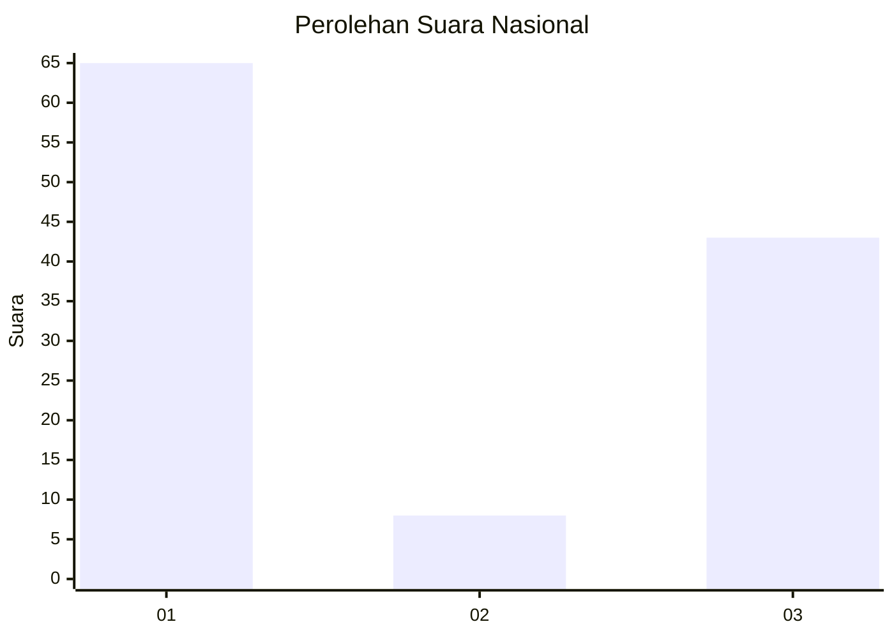
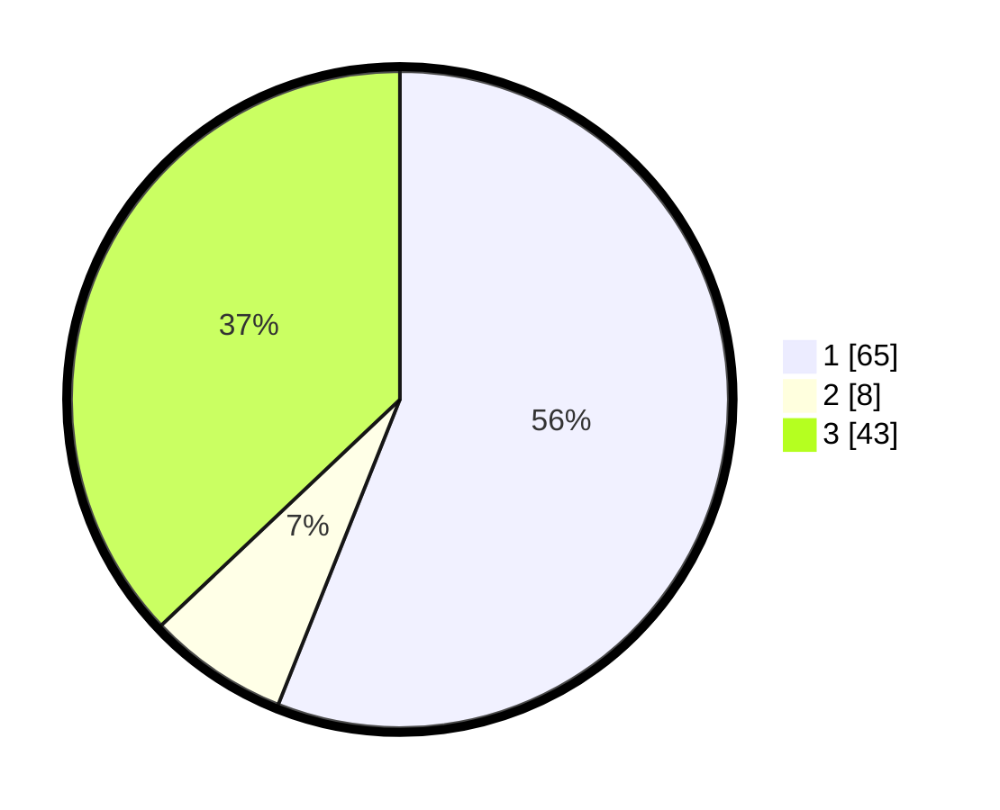

# Hasil

## Grafik

## Tabel

| No.    | Nama Paslon    | Suara | Suara (raw) | Persentase |
|:------ |:-------------- | -----:| -----------:| ----------:|
| 100025 | ANIES MUHAIMIN | 65    | [65][p-1]   | 56,03      |
| 100026 | PRABOWO GIBRAN | 8     | [8][p-2]    | 6,90       |
| 100027 | GANJAR MAHFUD  | 43    | [43][p-3]   | 37,07      |

[p-1]: https://github.com/gigit-pemilu/pemilu-2024/blob/main/pilpres/hitung-suara/sub/31-dki-jakarta/sub/74-jakarta-selatan/sub/06-cilandak/sub/1003-pondok-labu/sub/138-tps/sub/paslon-1.txt
[p-2]: https://github.com/gigit-pemilu/pemilu-2024/blob/main/pilpres/hitung-suara/sub/31-dki-jakarta/sub/74-jakarta-selatan/sub/06-cilandak/sub/1003-pondok-labu/sub/138-tps/sub/paslon-2.txt
[p-3]: https://github.com/gigit-pemilu/pemilu-2024/blob/main/pilpres/hitung-suara/sub/31-dki-jakarta/sub/74-jakarta-selatan/sub/06-cilandak/sub/1003-pondok-labu/sub/138-tps/sub/paslon-3.txt

## Foto C Plano

https://sirekap-obj-formc.kpu.go.id/382b/pemilu/ppwp/31/74/06/10/03/3174061003138-20240218-174807--61bd39c5-e445-470c-8abd-3d562857eb5b.jpg

https://sirekap-obj-formc.kpu.go.id/382b/pemilu/ppwp/31/74/06/10/03/3174061003138-20240218-174838--e7c39858-1fa3-401a-8c78-bda18932fea4.jpg

https://sirekap-obj-formc.kpu.go.id/382b/pemilu/ppwp/31/74/06/10/03/3174061003138-20240218-174917--99e47223-4eba-455c-b727-ea5d5b97daef.jpg

## Metadata

| Key        | Value               |
| ---------- | ------------------- |
| Time Stamp | 2024-02-25 12:00:00 |

