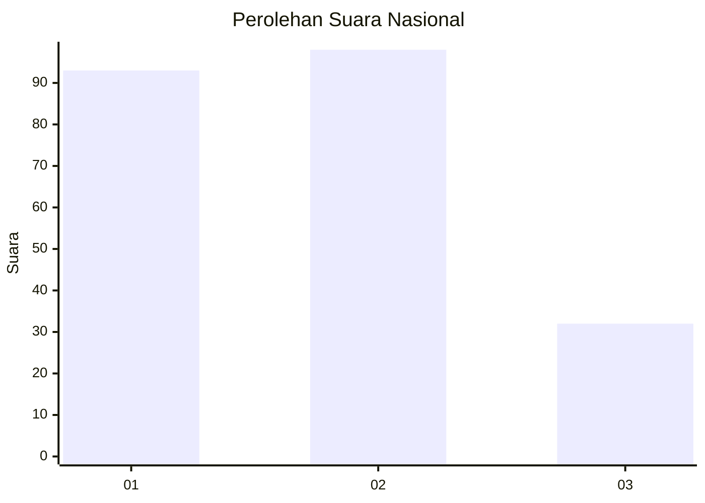
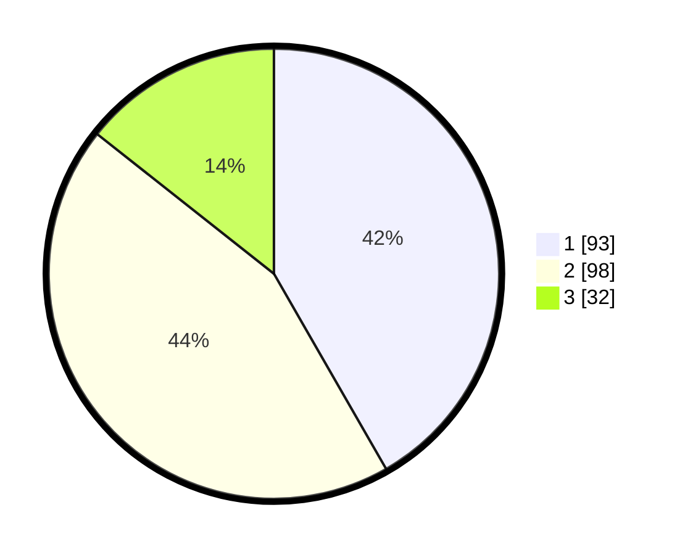

# Hasil

## Grafik

## Tabel

| No.    | Nama Paslon    | Suara | Suara (raw) | Persentase |
|:------ |:-------------- | -----:| -----------:| ----------:|
| 100025 | ANIES MUHAIMIN | 93    | [93][p-1]   | 41,70      |
| 100026 | PRABOWO GIBRAN | 98    | [98][p-2]   | 43,95      |
| 100027 | GANJAR MAHFUD  | 32    | [32][p-3]   | 14,35      |

[p-1]: https://github.com/gigit-pemilu/pemilu-2024/blob/main/pilpres/hitung-suara/sub/31-dki-jakarta/sub/74-jakarta-selatan/sub/06-cilandak/sub/1003-pondok-labu/sub/139-tps/sub/paslon-1.txt
[p-2]: https://github.com/gigit-pemilu/pemilu-2024/blob/main/pilpres/hitung-suara/sub/31-dki-jakarta/sub/74-jakarta-selatan/sub/06-cilandak/sub/1003-pondok-labu/sub/139-tps/sub/paslon-2.txt
[p-3]: https://github.com/gigit-pemilu/pemilu-2024/blob/main/pilpres/hitung-suara/sub/31-dki-jakarta/sub/74-jakarta-selatan/sub/06-cilandak/sub/1003-pondok-labu/sub/139-tps/sub/paslon-3.txt

## Foto C Plano

https://sirekap-obj-formc.kpu.go.id/f08b/pemilu/ppwp/31/74/06/10/03/3174061003139-20240214-221016--56974e53-bc64-4d76-b74f-f63127f8f189.jpg

https://sirekap-obj-formc.kpu.go.id/f08b/pemilu/ppwp/31/74/06/10/03/3174061003139-20240214-221234--8cf98a27-bd23-43a4-a9af-82af6d509cbd.jpg

https://sirekap-obj-formc.kpu.go.id/f08b/pemilu/ppwp/31/74/06/10/03/3174061003139-20240214-221405--124d27d1-dc9a-4dbc-9ec3-6778f522b587.jpg

## Metadata

| Key        | Value               |
| ---------- | ------------------- |
| Time Stamp | 2024-02-24 22:31:28 |

