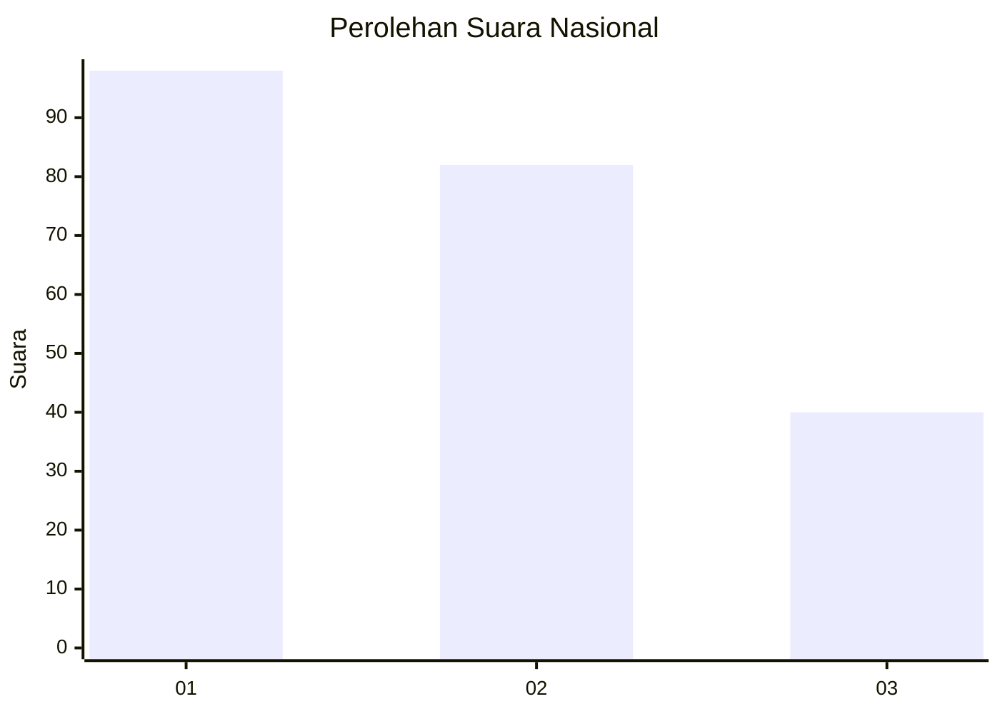
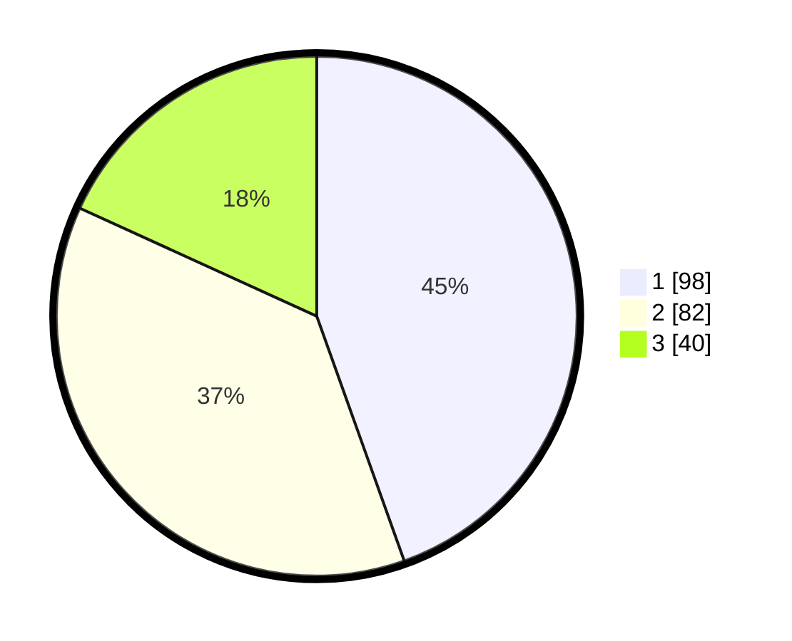

# Hasil

## Grafik

## Tabel

| No.    | Nama Paslon    | Suara | Suara (raw) | Persentase |
|:------ |:-------------- | -----:| -----------:| ----------:|
| 100025 | ANIES MUHAIMIN | 98    | [98][p-1]   | 44,55      |
| 100026 | PRABOWO GIBRAN | 82    | [82][p-2]   | 37,27      |
| 100027 | GANJAR MAHFUD  | 40    | [40][p-3]   | 18,18      |

[p-1]: https://github.com/gigit-pemilu/pemilu-2024/blob/main/pilpres/hitung-suara/sub/31-dki-jakarta/sub/74-jakarta-selatan/sub/06-cilandak/sub/1003-pondok-labu/sub/147-tps/sub/paslon-1.txt
[p-2]: https://github.com/gigit-pemilu/pemilu-2024/blob/main/pilpres/hitung-suara/sub/31-dki-jakarta/sub/74-jakarta-selatan/sub/06-cilandak/sub/1003-pondok-labu/sub/147-tps/sub/paslon-2.txt
[p-3]: https://github.com/gigit-pemilu/pemilu-2024/blob/main/pilpres/hitung-suara/sub/31-dki-jakarta/sub/74-jakarta-selatan/sub/06-cilandak/sub/1003-pondok-labu/sub/147-tps/sub/paslon-3.txt

## Foto C Plano

https://sirekap-obj-formc.kpu.go.id/47ac/pemilu/ppwp/31/74/06/10/03/3174061003147-20240218-181023--d37a07c9-2ecf-4c7a-b64b-f8b16ccd976f.jpg

https://sirekap-obj-formc.kpu.go.id/47ac/pemilu/ppwp/31/74/06/10/03/3174061003147-20240218-181130--f179c323-306e-4468-b5d6-a7765a6fe412.jpg

https://sirekap-obj-formc.kpu.go.id/47ac/pemilu/ppwp/31/74/06/10/03/3174061003147-20240218-181150--d70bedf4-9c84-41f8-a1d3-65c9a26f5f05.jpg

## Metadata

| Key        | Value               |
| ---------- | ------------------- |
| Time Stamp | 2024-02-24 22:31:28 |

