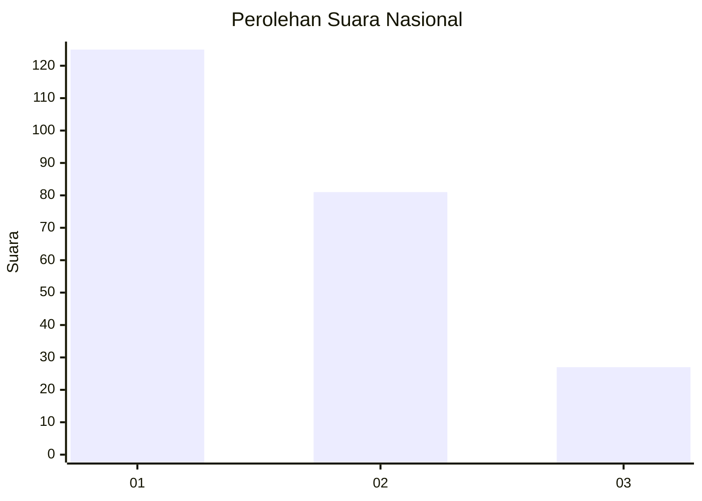
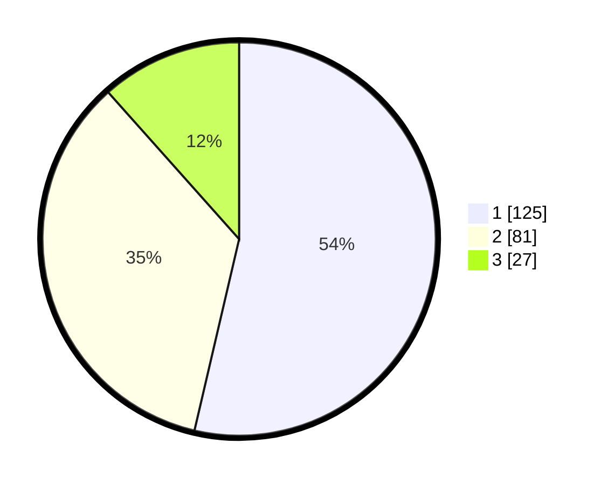

# Hasil

## Grafik

## Tabel

| No.    | Nama Paslon    | Suara | Suara (raw) | Persentase |
|:------ |:-------------- | -----:| -----------:| ----------:|
| 100025 | ANIES MUHAIMIN | 125   | [125][p-1]  | 53,65      |
| 100026 | PRABOWO GIBRAN | 81    | [81][p-2]   | 34,76      |
| 100027 | GANJAR MAHFUD  | 27    | [27][p-3]   | 11,59      |

[p-1]: https://github.com/gigit-pemilu/pemilu-2024/blob/main/pilpres/hitung-suara/sub/31-dki-jakarta/sub/74-jakarta-selatan/sub/06-cilandak/sub/1003-pondok-labu/sub/159-tps/sub/paslon-1.txt
[p-2]: https://github.com/gigit-pemilu/pemilu-2024/blob/main/pilpres/hitung-suara/sub/31-dki-jakarta/sub/74-jakarta-selatan/sub/06-cilandak/sub/1003-pondok-labu/sub/159-tps/sub/paslon-2.txt
[p-3]: https://github.com/gigit-pemilu/pemilu-2024/blob/main/pilpres/hitung-suara/sub/31-dki-jakarta/sub/74-jakarta-selatan/sub/06-cilandak/sub/1003-pondok-labu/sub/159-tps/sub/paslon-3.txt

## Foto C Plano

https://sirekap-obj-formc.kpu.go.id/d5b4/pemilu/ppwp/31/74/06/10/03/3174061003159-20240218-193436--d1558018-cfe0-446a-b7fc-51a2a63e3660.jpg

https://sirekap-obj-formc.kpu.go.id/d5b4/pemilu/ppwp/31/74/06/10/03/3174061003159-20240218-193522--83e1b70a-5871-4856-ab88-84794f773687.jpg

https://sirekap-obj-formc.kpu.go.id/d5b4/pemilu/ppwp/31/74/06/10/03/3174061003159-20240218-193543--21bdab70-8128-45b1-8326-1ee4665ff118.jpg

## Metadata

| Key        | Value               |
| ---------- | ------------------- |
| Time Stamp | 2024-02-25 12:00:00 |

