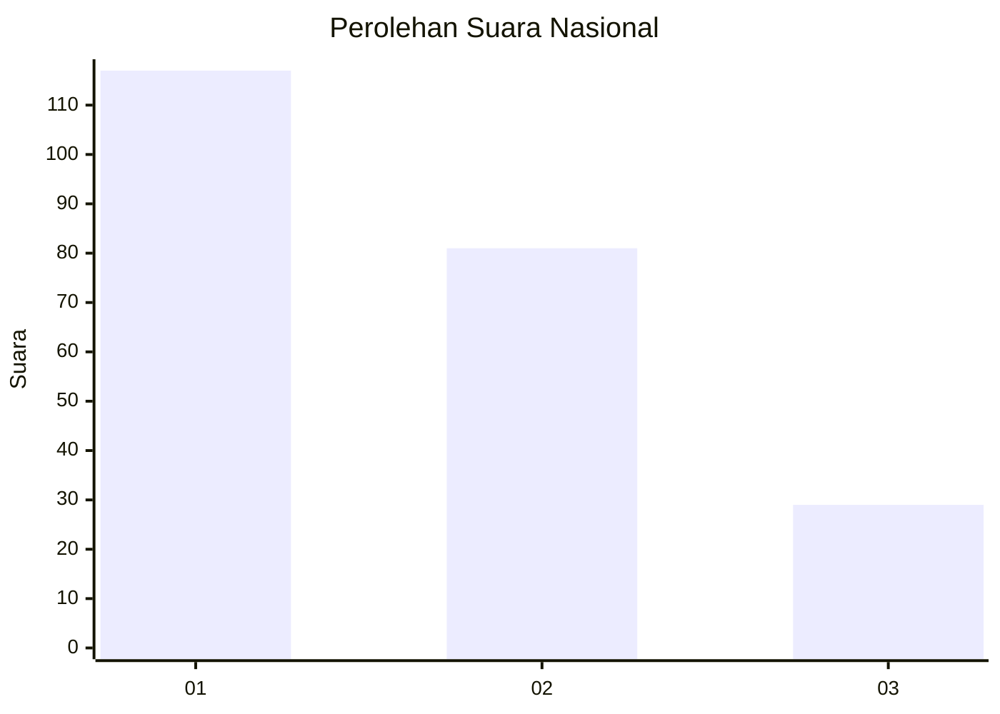
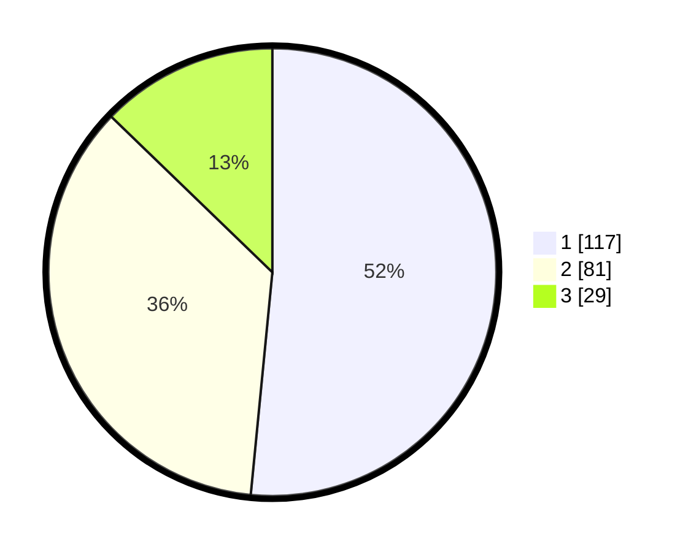

# Hasil

## Grafik

## Tabel

| No.    | Nama Paslon    | Suara | Suara (raw) | Persentase |
|:------ |:-------------- | -----:| -----------:| ----------:|
| 100025 | ANIES MUHAIMIN | 117   | [117][p-1]  | 51,54      |
| 100026 | PRABOWO GIBRAN | 81    | [81][p-2]   | 35,68      |
| 100027 | GANJAR MAHFUD  | 29    | [29][p-3]   | 12,78      |

[p-1]: https://github.com/gigit-pemilu/pemilu-2024/blob/main/pilpres/hitung-suara/sub/31-dki-jakarta/sub/74-jakarta-selatan/sub/06-cilandak/sub/1003-pondok-labu/sub/164-tps/sub/paslon-1.txt
[p-2]: https://github.com/gigit-pemilu/pemilu-2024/blob/main/pilpres/hitung-suara/sub/31-dki-jakarta/sub/74-jakarta-selatan/sub/06-cilandak/sub/1003-pondok-labu/sub/164-tps/sub/paslon-2.txt
[p-3]: https://github.com/gigit-pemilu/pemilu-2024/blob/main/pilpres/hitung-suara/sub/31-dki-jakarta/sub/74-jakarta-selatan/sub/06-cilandak/sub/1003-pondok-labu/sub/164-tps/sub/paslon-3.txt

## Foto C Plano

https://sirekap-obj-formc.kpu.go.id/1709/pemilu/ppwp/31/74/06/10/03/3174061003164-20240218-194132--228183ee-95ad-4ecb-bc78-9e243d38e9f4.jpg

https://sirekap-obj-formc.kpu.go.id/1709/pemilu/ppwp/31/74/06/10/03/3174061003164-20240218-194205--c330ba92-90a7-4f51-9100-702ec213643d.jpg

https://sirekap-obj-formc.kpu.go.id/1709/pemilu/ppwp/31/74/06/10/03/3174061003164-20240218-194237--016848c5-d694-4d0b-aa24-416eca45a0c1.jpg

## Metadata

| Key        | Value               |
| ---------- | ------------------- |
| Time Stamp | 2024-02-24 22:31:28 |

