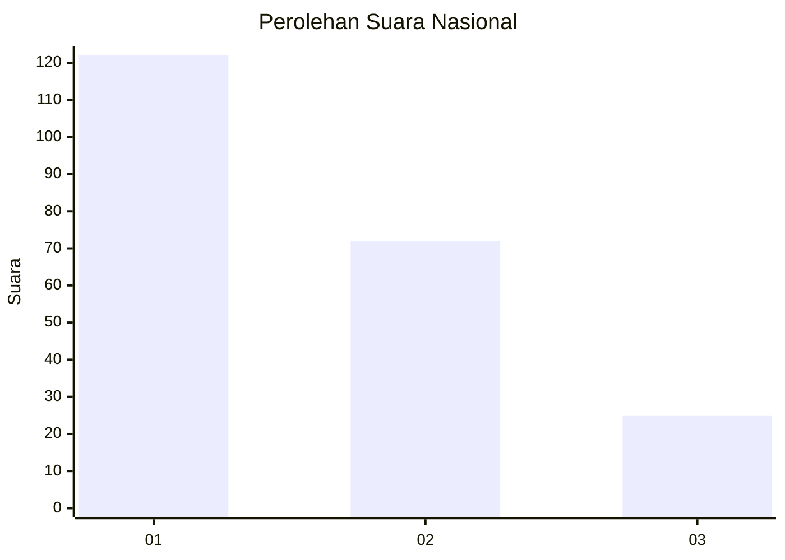
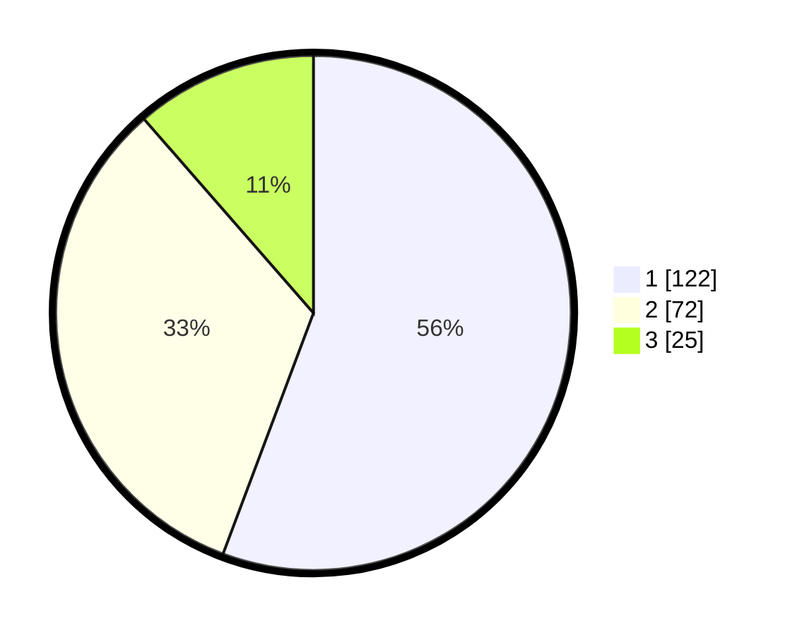

# Hasil

## Grafik

## Tabel

| No.    | Nama Paslon    | Suara | Suara (raw) | Persentase |
|:------ |:-------------- | -----:| -----------:| ----------:|
| 100025 | ANIES MUHAIMIN | 122   | [122][p-1]  | 55,71      |
| 100026 | PRABOWO GIBRAN | 72    | [72][p-2]   | 32,88      |
| 100027 | GANJAR MAHFUD  | 25    | [25][p-3]   | 11,42      |

[p-1]: https://github.com/gigit-pemilu/pemilu-2024/blob/main/pilpres/hitung-suara/sub/31-dki-jakarta/sub/74-jakarta-selatan/sub/06-cilandak/sub/1003-pondok-labu/sub/165-tps/sub/paslon-1.txt
[p-2]: https://github.com/gigit-pemilu/pemilu-2024/blob/main/pilpres/hitung-suara/sub/31-dki-jakarta/sub/74-jakarta-selatan/sub/06-cilandak/sub/1003-pondok-labu/sub/165-tps/sub/paslon-2.txt
[p-3]: https://github.com/gigit-pemilu/pemilu-2024/blob/main/pilpres/hitung-suara/sub/31-dki-jakarta/sub/74-jakarta-selatan/sub/06-cilandak/sub/1003-pondok-labu/sub/165-tps/sub/paslon-3.txt

## Foto C Plano

https://sirekap-obj-formc.kpu.go.id/bbdb/pemilu/ppwp/31/74/06/10/03/3174061003165-20240218-194501--6b867faf-06e6-4266-94bc-45d40760fe75.jpg

https://sirekap-obj-formc.kpu.go.id/bbdb/pemilu/ppwp/31/74/06/10/03/3174061003165-20240218-194546--b66df4ff-bc20-4376-b730-7e970412db94.jpg

https://sirekap-obj-formc.kpu.go.id/bbdb/pemilu/ppwp/31/74/06/10/03/3174061003165-20240218-194602--897755b6-88a8-481d-a78b-ad73cae794df.jpg

## Metadata

| Key        | Value               |
| ---------- | ------------------- |
| Time Stamp | 2024-02-24 22:31:28 |

