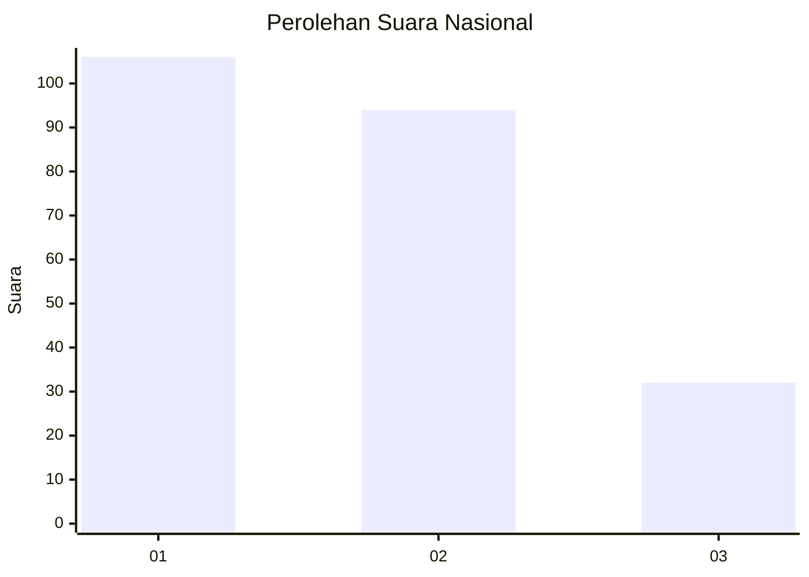
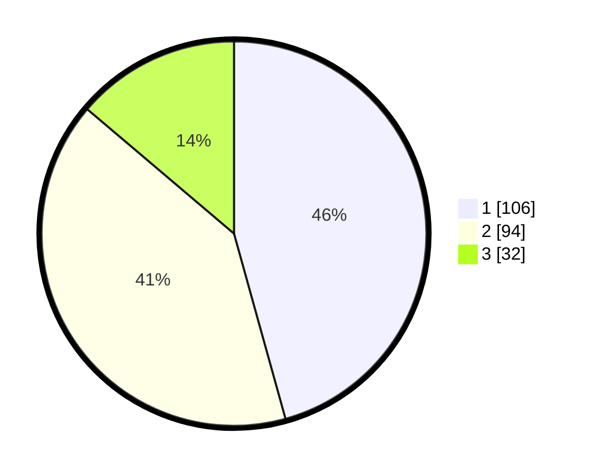

# Hasil

## Grafik

## Tabel

| No.    | Nama Paslon    | Suara | Suara (raw) | Persentase |
|:------ |:-------------- | -----:| -----------:| ----------:|
| 100025 | ANIES MUHAIMIN | 106   | [106][p-1]  | 45,69      |
| 100026 | PRABOWO GIBRAN | 94    | [94][p-2]   | 40,52      |
| 100027 | GANJAR MAHFUD  | 32    | [32][p-3]   | 13,79      |

[p-1]: https://github.com/gigit-pemilu/pemilu-2024/blob/main/pilpres/hitung-suara/sub/31-dki-jakarta/sub/74-jakarta-selatan/sub/06-cilandak/sub/1003-pondok-labu/sub/167-tps/sub/paslon-1.txt
[p-2]: https://github.com/gigit-pemilu/pemilu-2024/blob/main/pilpres/hitung-suara/sub/31-dki-jakarta/sub/74-jakarta-selatan/sub/06-cilandak/sub/1003-pondok-labu/sub/167-tps/sub/paslon-2.txt
[p-3]: https://github.com/gigit-pemilu/pemilu-2024/blob/main/pilpres/hitung-suara/sub/31-dki-jakarta/sub/74-jakarta-selatan/sub/06-cilandak/sub/1003-pondok-labu/sub/167-tps/sub/paslon-3.txt

## Foto C Plano

https://sirekap-obj-formc.kpu.go.id/966e/pemilu/ppwp/31/74/06/10/03/3174061003167-20240218-200937--10791042-b3db-4fb9-8989-7c58ca778ad1.jpg

https://sirekap-obj-formc.kpu.go.id/966e/pemilu/ppwp/31/74/06/10/03/3174061003167-20240218-201026--c050b02e-1347-4a3b-b0ea-dcb34d4e24f8.jpg

https://sirekap-obj-formc.kpu.go.id/966e/pemilu/ppwp/31/74/06/10/03/3174061003167-20240218-201053--b674e976-74fc-46f8-837d-01385d1a4573.jpg

## Metadata

| Key        | Value               |
| ---------- | ------------------- |
| Time Stamp | 2024-02-25 15:00:00 |

