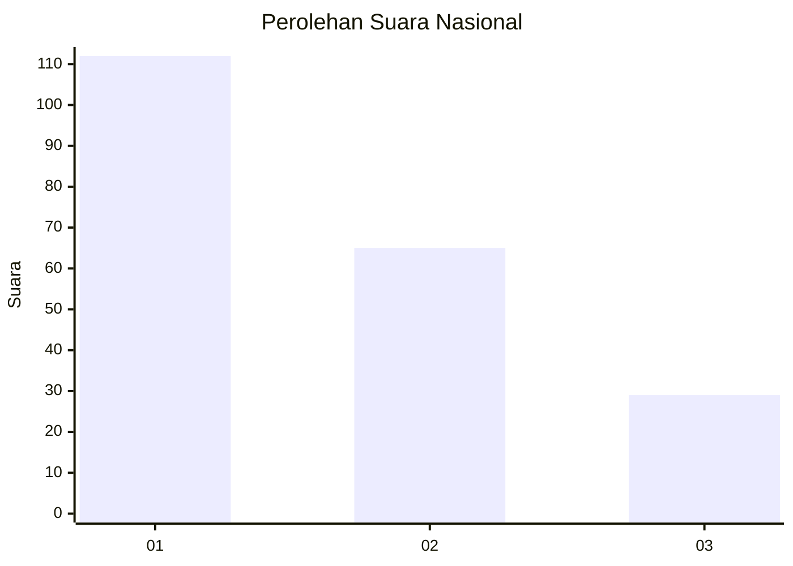
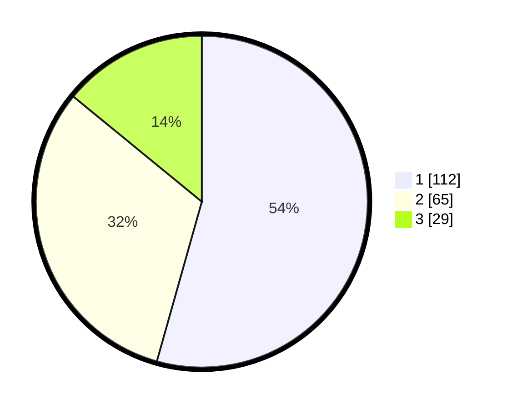

# Hasil

## Grafik

## Tabel

| No.    | Nama Paslon    | Suara | Suara (raw) | Persentase |
|:------ |:-------------- | -----:| -----------:| ----------:|
| 100025 | ANIES MUHAIMIN | 112   | [112][p-1]  | 54,37      |
| 100026 | PRABOWO GIBRAN | 65    | [65][p-2]   | 31,55      |
| 100027 | GANJAR MAHFUD  | 29    | [29][p-3]   | 14,08      |

[p-1]: https://github.com/gigit-pemilu/pemilu-2024/blob/main/pilpres/hitung-suara/sub/31-dki-jakarta/sub/74-jakarta-selatan/sub/06-cilandak/sub/1004-gandaria-selatan/sub/002-tps/sub/paslon-1.txt
[p-2]: https://github.com/gigit-pemilu/pemilu-2024/blob/main/pilpres/hitung-suara/sub/31-dki-jakarta/sub/74-jakarta-selatan/sub/06-cilandak/sub/1004-gandaria-selatan/sub/002-tps/sub/paslon-2.txt
[p-3]: https://github.com/gigit-pemilu/pemilu-2024/blob/main/pilpres/hitung-suara/sub/31-dki-jakarta/sub/74-jakarta-selatan/sub/06-cilandak/sub/1004-gandaria-selatan/sub/002-tps/sub/paslon-3.txt

## Foto C Plano

https://sirekap-obj-formc.kpu.go.id/9e03/pemilu/ppwp/31/74/06/10/04/3174061004002-20240217-100028--5b7cc785-323b-4b85-b9d0-2fc20b518096.jpg

https://sirekap-obj-formc.kpu.go.id/9e03/pemilu/ppwp/31/74/06/10/04/3174061004002-20240217-100056--193213c4-0f91-4bcf-a410-2e899d749906.jpg

https://sirekap-obj-formc.kpu.go.id/9e03/pemilu/ppwp/31/74/06/10/04/3174061004002-20240217-100135--5c9899e9-62a7-48fd-84eb-aee17a35cfa5.jpg

## Metadata

| Key        | Value               |
| ---------- | ------------------- |
| Time Stamp | 2024-02-24 22:31:28 |

