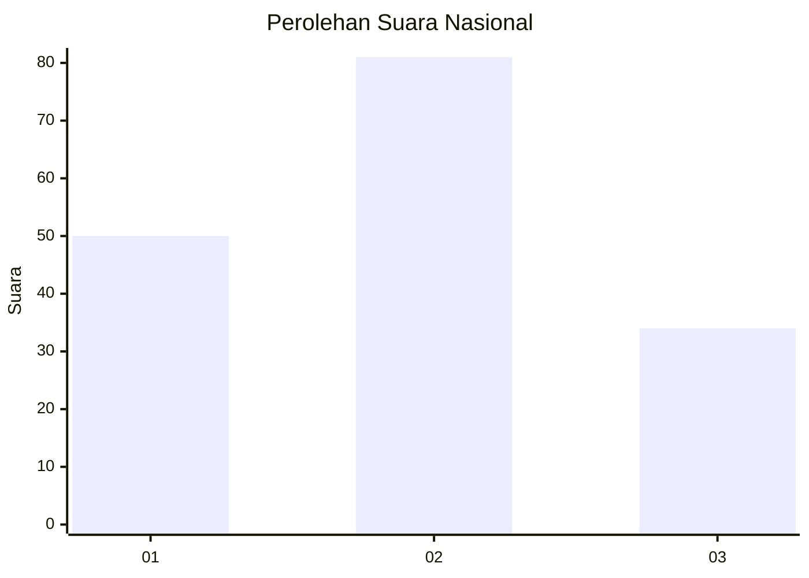
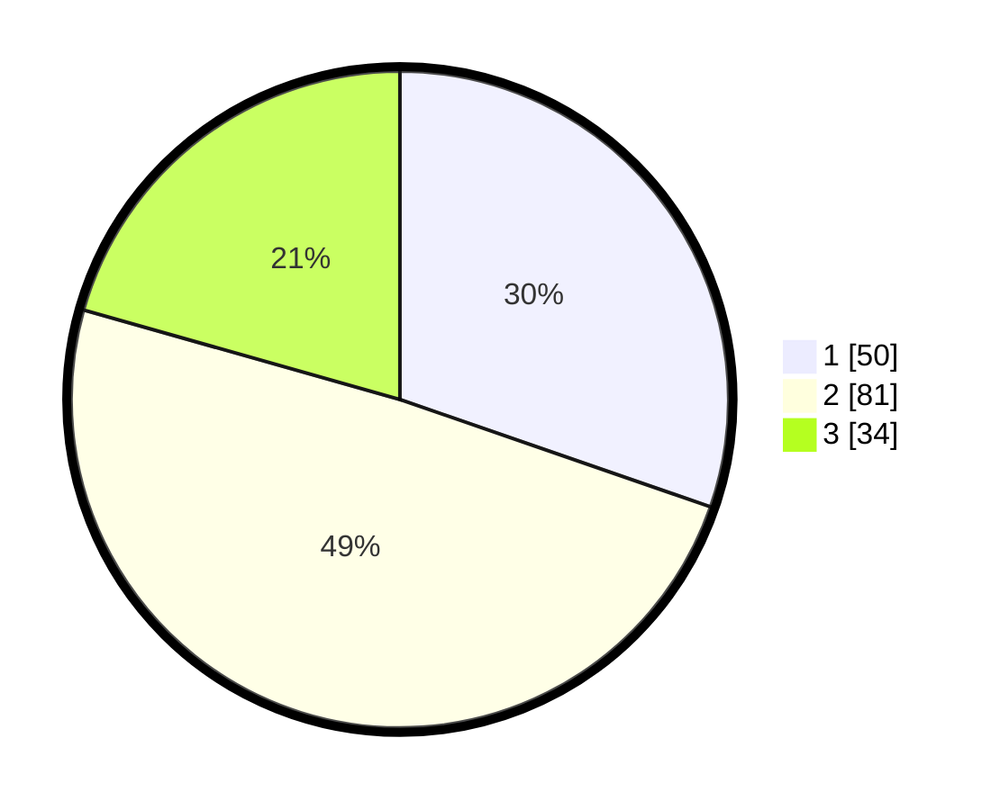

# Hasil

## Grafik

## Tabel

| No.    | Nama Paslon    | Suara | Suara (raw) | Persentase |
|:------ |:-------------- | -----:| -----------:| ----------:|
| 100025 | ANIES MUHAIMIN | 50    | [50][p-1]   | 30,30      |
| 100026 | PRABOWO GIBRAN | 81    | [81][p-2]   | 49,09      |
| 100027 | GANJAR MAHFUD  | 34    | [34][p-3]   | 20,61      |

[p-1]: https://github.com/gigit-pemilu/pemilu-2024/blob/main/pilpres/hitung-suara/sub/31-dki-jakarta/sub/74-jakarta-selatan/sub/06-cilandak/sub/1004-gandaria-selatan/sub/006-tps/sub/paslon-1.txt
[p-2]: https://github.com/gigit-pemilu/pemilu-2024/blob/main/pilpres/hitung-suara/sub/31-dki-jakarta/sub/74-jakarta-selatan/sub/06-cilandak/sub/1004-gandaria-selatan/sub/006-tps/sub/paslon-2.txt
[p-3]: https://github.com/gigit-pemilu/pemilu-2024/blob/main/pilpres/hitung-suara/sub/31-dki-jakarta/sub/74-jakarta-selatan/sub/06-cilandak/sub/1004-gandaria-selatan/sub/006-tps/sub/paslon-3.txt

## Foto C Plano

https://sirekap-obj-formc.kpu.go.id/b2e0/pemilu/ppwp/31/74/06/10/04/3174061004006-20240217-101138--ac706eed-c2c6-4834-880a-aa0146770cf4.jpg

https://sirekap-obj-formc.kpu.go.id/b2e0/pemilu/ppwp/31/74/06/10/04/3174061004006-20240217-101204--9508f465-23f9-4a77-b178-e2037e2b0afc.jpg

https://sirekap-obj-formc.kpu.go.id/b2e0/pemilu/ppwp/31/74/06/10/04/3174061004006-20240217-101331--ae3337a7-bbfb-4208-87c6-182e2221fcaf.jpg

## Metadata

| Key        | Value               |
| ---------- | ------------------- |
| Time Stamp | 2024-02-25 12:00:00 |

