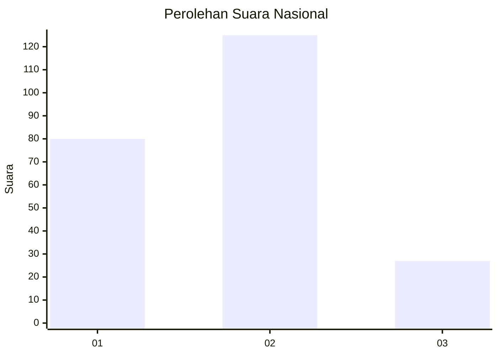
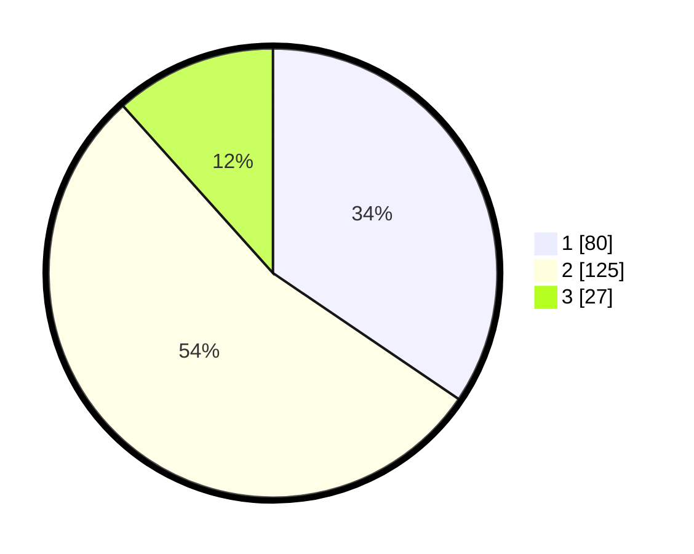

# Hasil

## Grafik

## Tabel

| No.    | Nama Paslon    | Suara | Suara (raw) | Persentase |
|:------ |:-------------- | -----:| -----------:| ----------:|
| 100025 | ANIES MUHAIMIN | 80    | [80][p-1]   | 34,48      |
| 100026 | PRABOWO GIBRAN | 125   | [125][p-2]  | 53,88      |
| 100027 | GANJAR MAHFUD  | 27    | [27][p-3]   | 11,64      |

[p-1]: https://github.com/gigit-pemilu/pemilu-2024/blob/main/pilpres/hitung-suara/sub/31-dki-jakarta/sub/74-jakarta-selatan/sub/06-cilandak/sub/1004-gandaria-selatan/sub/010-tps/sub/paslon-1.txt
[p-2]: https://github.com/gigit-pemilu/pemilu-2024/blob/main/pilpres/hitung-suara/sub/31-dki-jakarta/sub/74-jakarta-selatan/sub/06-cilandak/sub/1004-gandaria-selatan/sub/010-tps/sub/paslon-2.txt
[p-3]: https://github.com/gigit-pemilu/pemilu-2024/blob/main/pilpres/hitung-suara/sub/31-dki-jakarta/sub/74-jakarta-selatan/sub/06-cilandak/sub/1004-gandaria-selatan/sub/010-tps/sub/paslon-3.txt

## Foto C Plano

https://sirekap-obj-formc.kpu.go.id/2fbf/pemilu/ppwp/31/74/06/10/04/3174061004010-20240217-103416--90a5dc5a-3404-4685-b61c-ede43686ce68.jpg

https://sirekap-obj-formc.kpu.go.id/2fbf/pemilu/ppwp/31/74/06/10/04/3174061004010-20240217-103449--e1ac2538-03f3-4e03-8691-373ca404c474.jpg

https://sirekap-obj-formc.kpu.go.id/2fbf/pemilu/ppwp/31/74/06/10/04/3174061004010-20240217-103507--291749bb-ad33-4ed8-b0e4-b93ab43eab0a.jpg

## Metadata

| Key        | Value               |
| ---------- | ------------------- |
| Time Stamp | 2024-02-24 22:31:28 |

