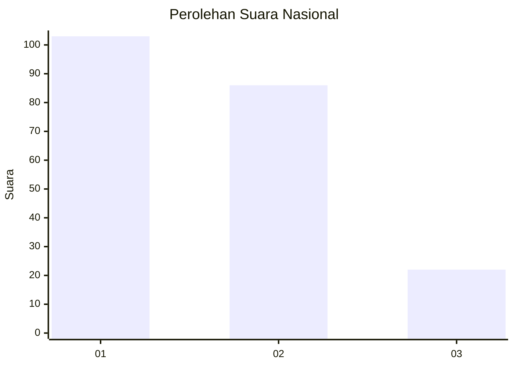
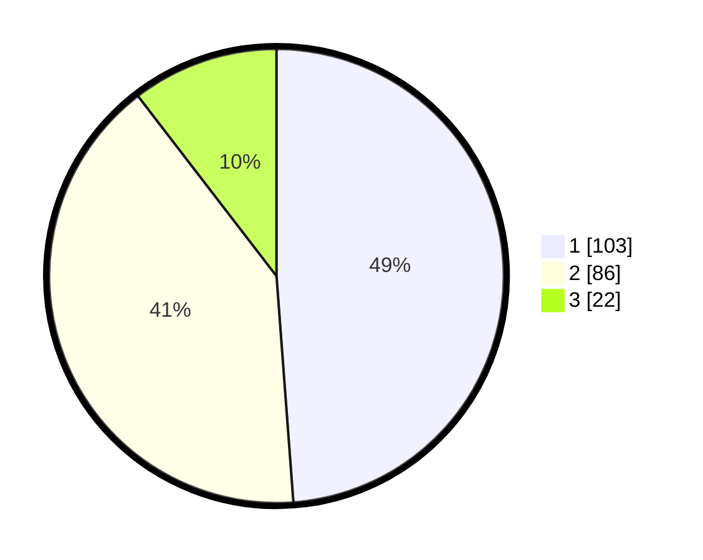

# Hasil

## Grafik

## Tabel

| No.    | Nama Paslon    | Suara | Suara (raw) | Persentase |
|:------ |:-------------- | -----:| -----------:| ----------:|
| 100025 | ANIES MUHAIMIN | 103   | [103][p-1]  | 48,82      |
| 100026 | PRABOWO GIBRAN | 86    | [86][p-2]   | 40,76      |
| 100027 | GANJAR MAHFUD  | 22    | [22][p-3]   | 10,43      |

[p-1]: https://github.com/gigit-pemilu/pemilu-2024/blob/main/pilpres/hitung-suara/sub/31-dki-jakarta/sub/74-jakarta-selatan/sub/06-cilandak/sub/1004-gandaria-selatan/sub/012-tps/sub/paslon-1.txt
[p-2]: https://github.com/gigit-pemilu/pemilu-2024/blob/main/pilpres/hitung-suara/sub/31-dki-jakarta/sub/74-jakarta-selatan/sub/06-cilandak/sub/1004-gandaria-selatan/sub/012-tps/sub/paslon-2.txt
[p-3]: https://github.com/gigit-pemilu/pemilu-2024/blob/main/pilpres/hitung-suara/sub/31-dki-jakarta/sub/74-jakarta-selatan/sub/06-cilandak/sub/1004-gandaria-selatan/sub/012-tps/sub/paslon-3.txt

## Foto C Plano

https://sirekap-obj-formc.kpu.go.id/94ec/pemilu/ppwp/31/74/06/10/04/3174061004012-20240217-104151--ce879095-f825-4f83-980b-a2cfeef594ff.jpg

https://sirekap-obj-formc.kpu.go.id/94ec/pemilu/ppwp/31/74/06/10/04/3174061004012-20240217-104226--3dff4bd4-d1c6-430e-9b7f-ff25be3e5b19.jpg

https://sirekap-obj-formc.kpu.go.id/94ec/pemilu/ppwp/31/74/06/10/04/3174061004012-20240217-104245--4f193dc1-aa30-4c27-a486-e05ecbaa036b.jpg

## Metadata

| Key        | Value               |
| ---------- | ------------------- |
| Time Stamp | 2024-02-25 10:00:00 |

