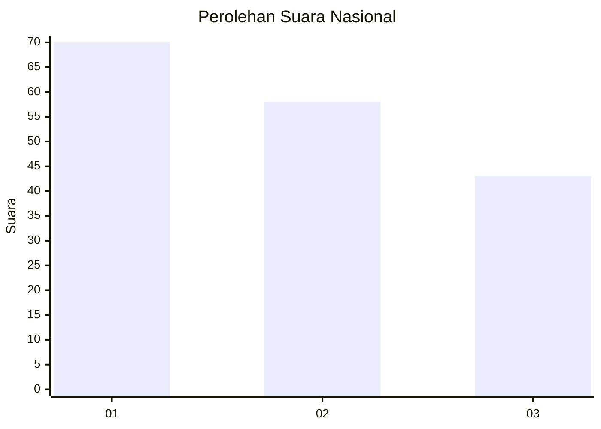
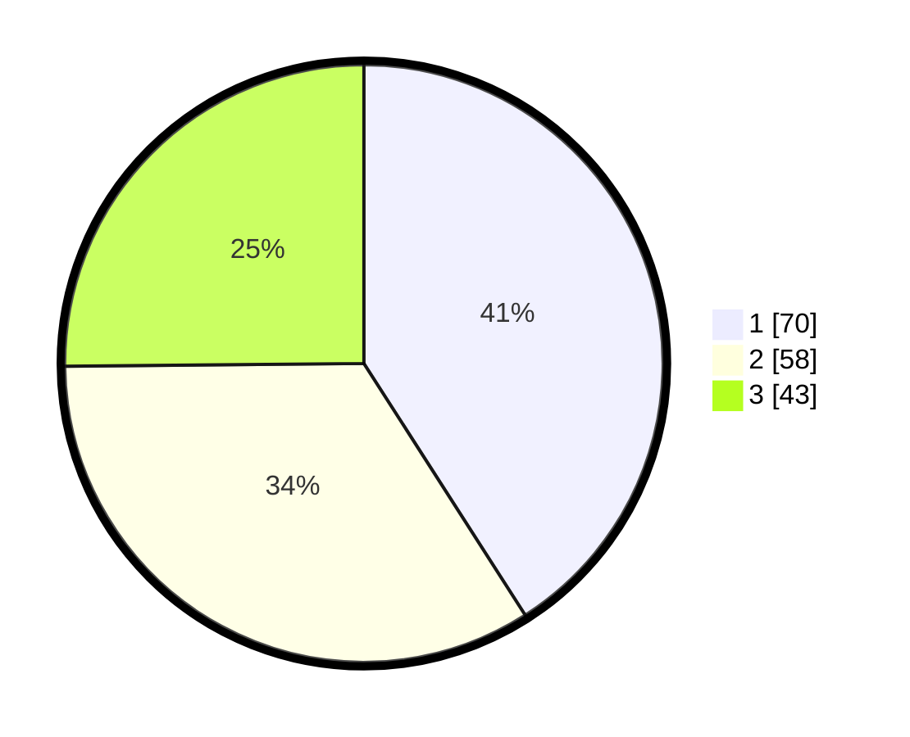

# Hasil

## Grafik

## Tabel

| No.    | Nama Paslon    | Suara | Suara (raw) | Persentase |
|:------ |:-------------- | -----:| -----------:| ----------:|
| 100025 | ANIES MUHAIMIN | 70    | [70][p-1]   | 40,94      |
| 100026 | PRABOWO GIBRAN | 58    | [58][p-2]   | 33,92      |
| 100027 | GANJAR MAHFUD  | 43    | [43][p-3]   | 25,15      |

[p-1]: https://github.com/gigit-pemilu/pemilu-2024/blob/main/pilpres/hitung-suara/sub/31-dki-jakarta/sub/74-jakarta-selatan/sub/06-cilandak/sub/1004-gandaria-selatan/sub/015-tps/sub/paslon-1.txt
[p-2]: https://github.com/gigit-pemilu/pemilu-2024/blob/main/pilpres/hitung-suara/sub/31-dki-jakarta/sub/74-jakarta-selatan/sub/06-cilandak/sub/1004-gandaria-selatan/sub/015-tps/sub/paslon-2.txt
[p-3]: https://github.com/gigit-pemilu/pemilu-2024/blob/main/pilpres/hitung-suara/sub/31-dki-jakarta/sub/74-jakarta-selatan/sub/06-cilandak/sub/1004-gandaria-selatan/sub/015-tps/sub/paslon-3.txt

## Foto C Plano

https://sirekap-obj-formc.kpu.go.id/d96a/pemilu/ppwp/31/74/06/10/04/3174061004015-20240217-104951--1b9d3046-99cf-49b8-9a56-277aab45e9a0.jpg

https://sirekap-obj-formc.kpu.go.id/d96a/pemilu/ppwp/31/74/06/10/04/3174061004015-20240217-105022--702818f9-22ab-4a33-b8de-6c5eebe0c372.jpg

https://sirekap-obj-formc.kpu.go.id/d96a/pemilu/ppwp/31/74/06/10/04/3174061004015-20240217-105109--a960480a-02e9-442b-b1b0-fe705c67e194.jpg

## Metadata

| Key        | Value               |
| ---------- | ------------------- |
| Time Stamp | 2024-02-24 22:31:28 |

