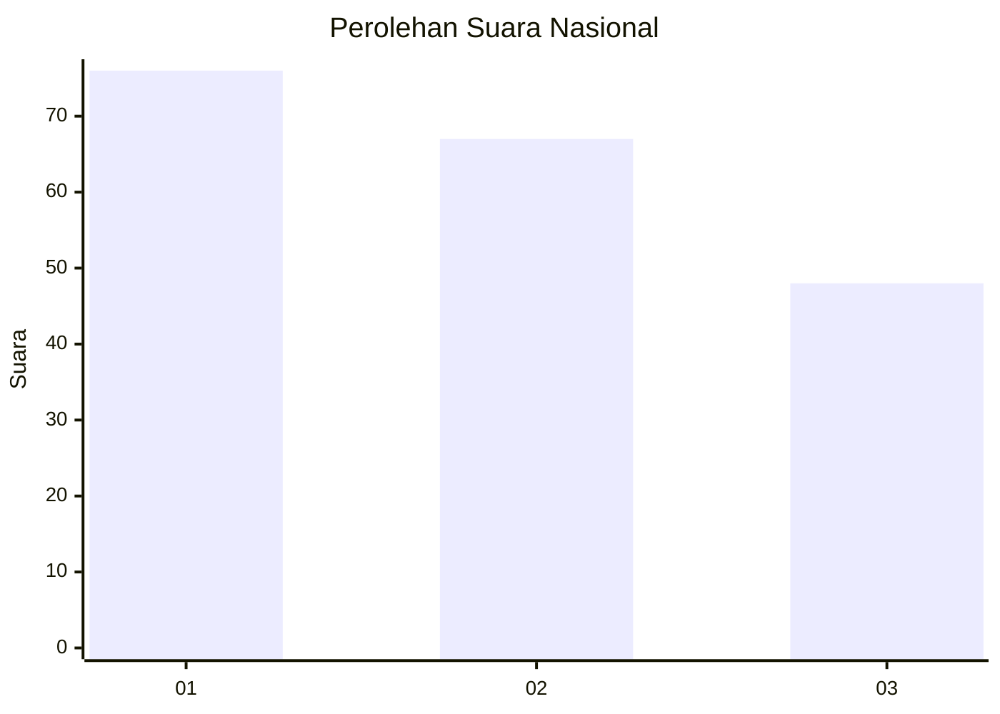
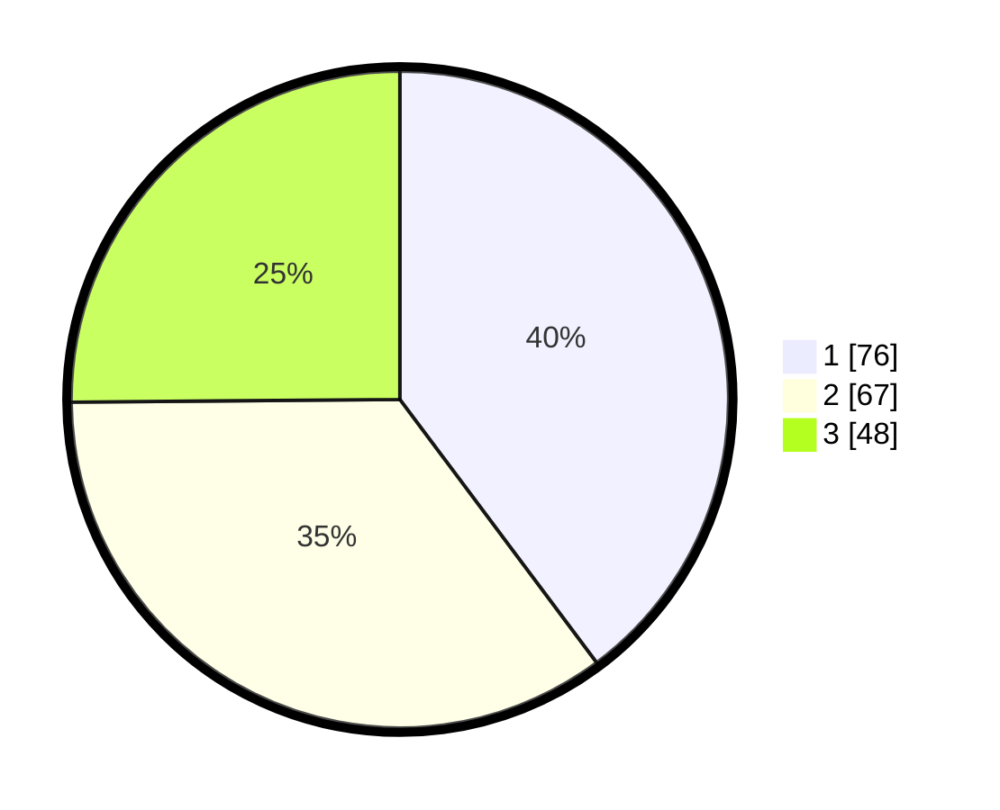

# Hasil

## Grafik

## Tabel

| No.    | Nama Paslon    | Suara | Suara (raw) | Persentase |
|:------ |:-------------- | -----:| -----------:| ----------:|
| 100025 | ANIES MUHAIMIN | 76    | [76][p-1]   | 39,79      |
| 100026 | PRABOWO GIBRAN | 67    | [67][p-2]   | 35,08      |
| 100027 | GANJAR MAHFUD  | 48    | [48][p-3]   | 25,13      |

[p-1]: https://github.com/gigit-pemilu/pemilu-2024/blob/main/pilpres/hitung-suara/sub/31-dki-jakarta/sub/74-jakarta-selatan/sub/06-cilandak/sub/1004-gandaria-selatan/sub/018-tps/sub/paslon-1.txt
[p-2]: https://github.com/gigit-pemilu/pemilu-2024/blob/main/pilpres/hitung-suara/sub/31-dki-jakarta/sub/74-jakarta-selatan/sub/06-cilandak/sub/1004-gandaria-selatan/sub/018-tps/sub/paslon-2.txt
[p-3]: https://github.com/gigit-pemilu/pemilu-2024/blob/main/pilpres/hitung-suara/sub/31-dki-jakarta/sub/74-jakarta-selatan/sub/06-cilandak/sub/1004-gandaria-selatan/sub/018-tps/sub/paslon-3.txt

## Foto C Plano

https://sirekap-obj-formc.kpu.go.id/d4a1/pemilu/ppwp/31/74/06/10/04/3174061004018-20240217-105817--24fb37cd-0898-4f35-b8db-e98ff7e3e3df.jpg

https://sirekap-obj-formc.kpu.go.id/d4a1/pemilu/ppwp/31/74/06/10/04/3174061004018-20240217-105850--e12d1fd6-19bc-4bba-8f90-d42b4be09767.jpg

https://sirekap-obj-formc.kpu.go.id/d4a1/pemilu/ppwp/31/74/06/10/04/3174061004018-20240217-105916--e66ac549-67a6-43fb-a42b-06ec55e36b61.jpg

## Metadata

| Key        | Value               |
| ---------- | ------------------- |
| Time Stamp | 2024-02-24 22:31:28 |

