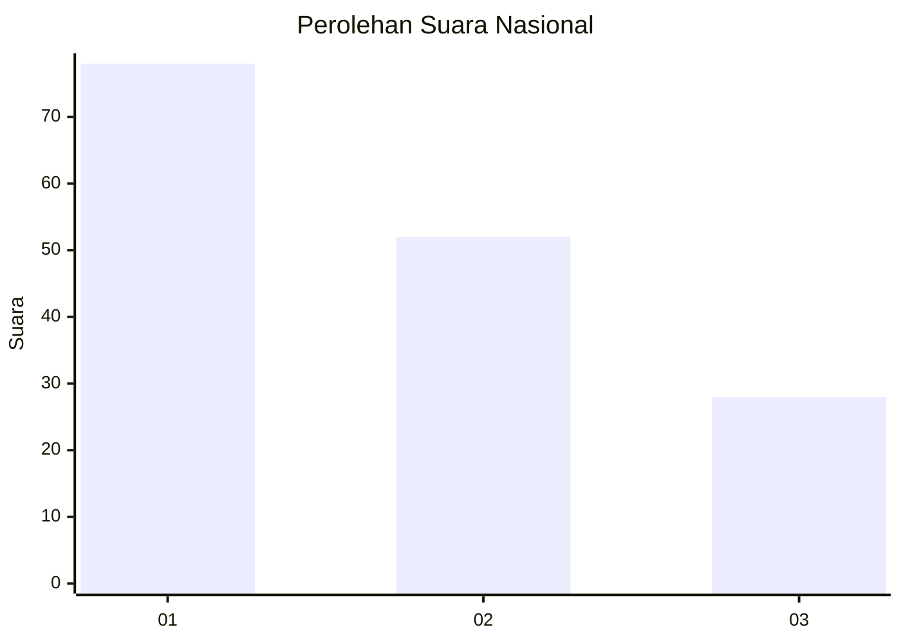
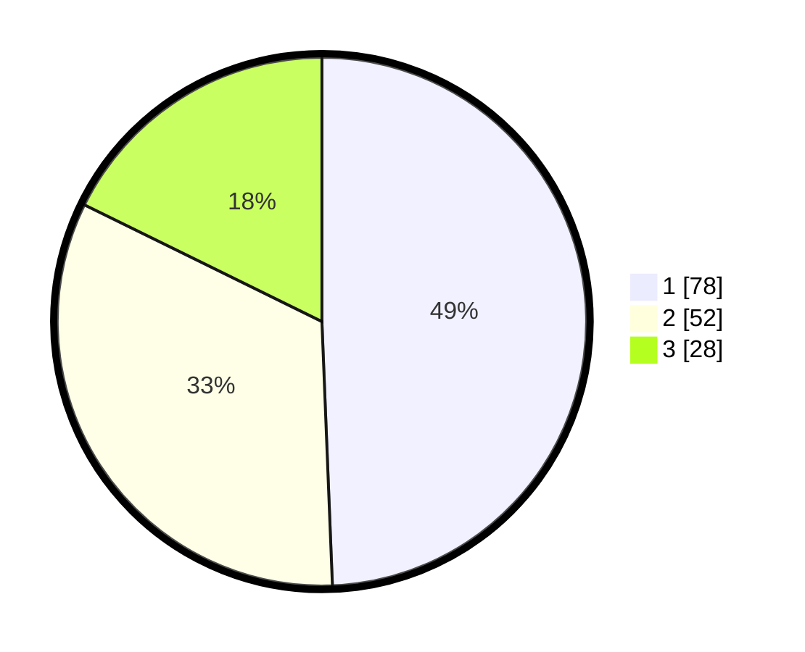

# Hasil

## Grafik

## Tabel

| No.    | Nama Paslon    | Suara | Suara (raw) | Persentase |
|:------ |:-------------- | -----:| -----------:| ----------:|
| 100025 | ANIES MUHAIMIN | 78    | [78][p-1]   | 49,37      |
| 100026 | PRABOWO GIBRAN | 52    | [52][p-2]   | 32,91      |
| 100027 | GANJAR MAHFUD  | 28    | [28][p-3]   | 17,72      |

[p-1]: https://github.com/gigit-pemilu/pemilu-2024/blob/main/pilpres/hitung-suara/sub/31-dki-jakarta/sub/74-jakarta-selatan/sub/06-cilandak/sub/1004-gandaria-selatan/sub/020-tps/sub/paslon-1.txt
[p-2]: https://github.com/gigit-pemilu/pemilu-2024/blob/main/pilpres/hitung-suara/sub/31-dki-jakarta/sub/74-jakarta-selatan/sub/06-cilandak/sub/1004-gandaria-selatan/sub/020-tps/sub/paslon-2.txt
[p-3]: https://github.com/gigit-pemilu/pemilu-2024/blob/main/pilpres/hitung-suara/sub/31-dki-jakarta/sub/74-jakarta-selatan/sub/06-cilandak/sub/1004-gandaria-selatan/sub/020-tps/sub/paslon-3.txt

## Foto C Plano

https://sirekap-obj-formc.kpu.go.id/ad28/pemilu/ppwp/31/74/06/10/04/3174061004020-20240217-110607--02608803-dfa3-44b0-a3c5-d9edc691768d.jpg

https://sirekap-obj-formc.kpu.go.id/ad28/pemilu/ppwp/31/74/06/10/04/3174061004020-20240217-110643--dd0337ec-8581-44f5-aa70-29da407333bf.jpg

https://sirekap-obj-formc.kpu.go.id/ad28/pemilu/ppwp/31/74/06/10/04/3174061004020-20240217-110710--d09a8ba4-642c-437e-985c-dfbfe45c831b.jpg

## Metadata

| Key        | Value               |
| ---------- | ------------------- |
| Time Stamp | 2024-02-25 11:00:00 |

