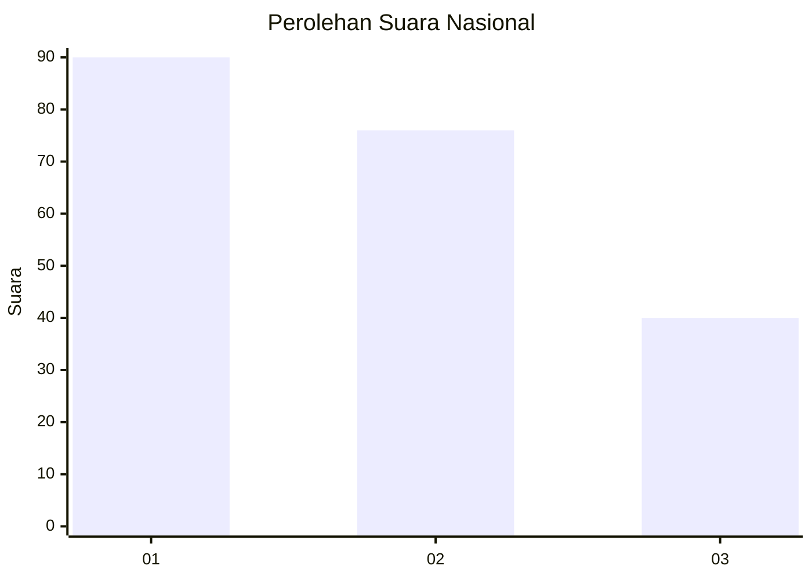
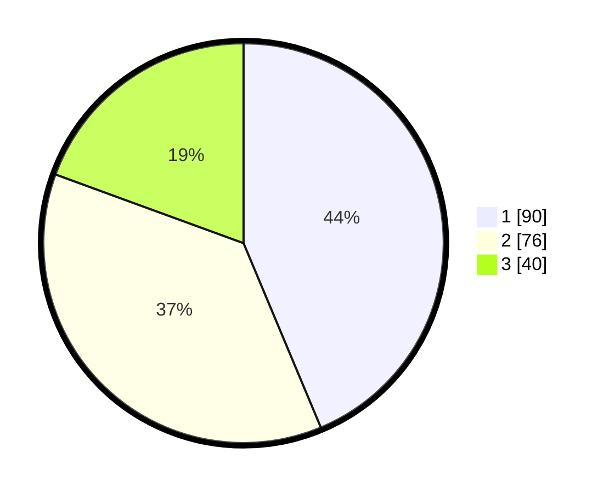

# Hasil

## Grafik

## Tabel

| No.    | Nama Paslon    | Suara | Suara (raw) | Persentase |
|:------ |:-------------- | -----:| -----------:| ----------:|
| 100025 | ANIES MUHAIMIN | 90    | [90][p-1]   | 43,69      |
| 100026 | PRABOWO GIBRAN | 76    | [76][p-2]   | 36,89      |
| 100027 | GANJAR MAHFUD  | 40    | [40][p-3]   | 19,42      |

[p-1]: https://github.com/gigit-pemilu/pemilu-2024/blob/main/pilpres/hitung-suara/sub/31-dki-jakarta/sub/74-jakarta-selatan/sub/06-cilandak/sub/1004-gandaria-selatan/sub/021-tps/sub/paslon-1.txt
[p-2]: https://github.com/gigit-pemilu/pemilu-2024/blob/main/pilpres/hitung-suara/sub/31-dki-jakarta/sub/74-jakarta-selatan/sub/06-cilandak/sub/1004-gandaria-selatan/sub/021-tps/sub/paslon-2.txt
[p-3]: https://github.com/gigit-pemilu/pemilu-2024/blob/main/pilpres/hitung-suara/sub/31-dki-jakarta/sub/74-jakarta-selatan/sub/06-cilandak/sub/1004-gandaria-selatan/sub/021-tps/sub/paslon-3.txt

## Foto C Plano

https://sirekap-obj-formc.kpu.go.id/60c3/pemilu/ppwp/31/74/06/10/04/3174061004021-20240217-110927--8cde3c13-19b7-491d-b150-3f98dbbb6fa9.jpg

https://sirekap-obj-formc.kpu.go.id/60c3/pemilu/ppwp/31/74/06/10/04/3174061004021-20240217-110953--90334e2b-121e-46b1-8ddf-8e7cdef18bb4.jpg

https://sirekap-obj-formc.kpu.go.id/60c3/pemilu/ppwp/31/74/06/10/04/3174061004021-20240217-111051--dee0a827-927b-41ac-ba02-40d13e58ed47.jpg

## Metadata

| Key        | Value               |
| ---------- | ------------------- |
| Time Stamp | 2024-02-24 22:31:28 |

