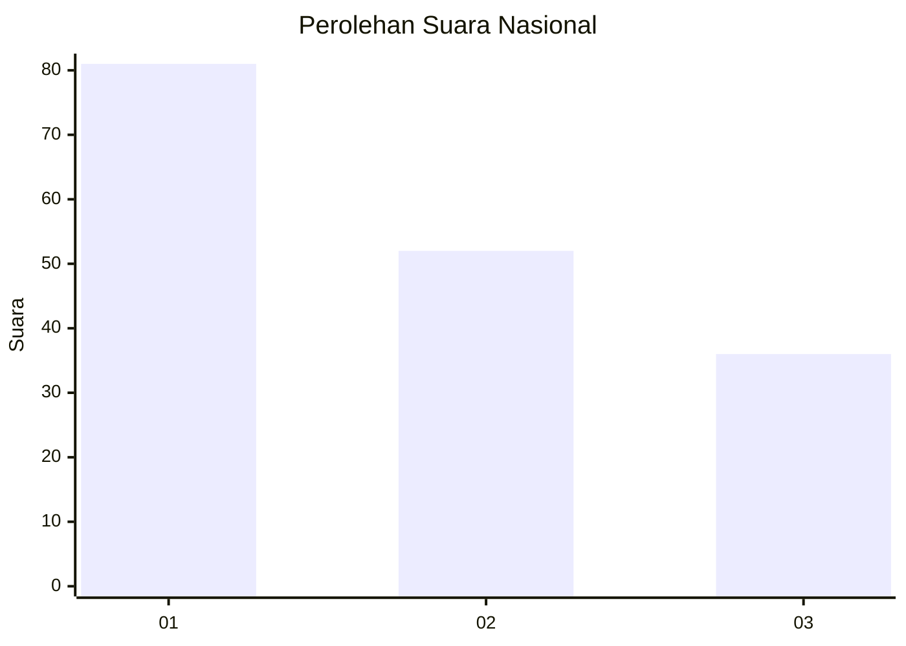
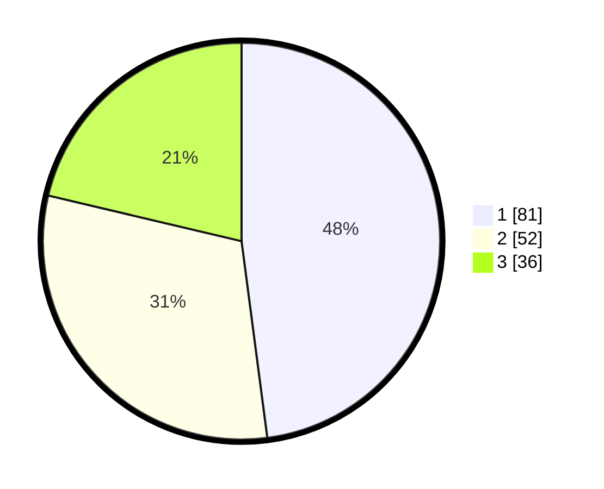

# Hasil

## Grafik

## Tabel

| No.    | Nama Paslon    | Suara | Suara (raw) | Persentase |
|:------ |:-------------- | -----:| -----------:| ----------:|
| 100025 | ANIES MUHAIMIN | 81    | [81][p-1]   | 47,93      |
| 100026 | PRABOWO GIBRAN | 52    | [52][p-2]   | 30,77      |
| 100027 | GANJAR MAHFUD  | 36    | [36][p-3]   | 21,30      |

[p-1]: https://github.com/gigit-pemilu/pemilu-2024/blob/main/pilpres/hitung-suara/sub/31-dki-jakarta/sub/74-jakarta-selatan/sub/06-cilandak/sub/1004-gandaria-selatan/sub/032-tps/sub/paslon-1.txt
[p-2]: https://github.com/gigit-pemilu/pemilu-2024/blob/main/pilpres/hitung-suara/sub/31-dki-jakarta/sub/74-jakarta-selatan/sub/06-cilandak/sub/1004-gandaria-selatan/sub/032-tps/sub/paslon-2.txt
[p-3]: https://github.com/gigit-pemilu/pemilu-2024/blob/main/pilpres/hitung-suara/sub/31-dki-jakarta/sub/74-jakarta-selatan/sub/06-cilandak/sub/1004-gandaria-selatan/sub/032-tps/sub/paslon-3.txt

## Foto C Plano

https://sirekap-obj-formc.kpu.go.id/c043/pemilu/ppwp/31/74/06/10/04/3174061004032-20240217-114307--12fad7b4-754c-41be-aea5-0cdfcd39685a.jpg

https://sirekap-obj-formc.kpu.go.id/c043/pemilu/ppwp/31/74/06/10/04/3174061004032-20240217-114357--c2070552-0abc-4052-bfc1-0d84486f0d78.jpg

https://sirekap-obj-formc.kpu.go.id/c043/pemilu/ppwp/31/74/06/10/04/3174061004032-20240217-114425--0226c666-b628-4a2d-b200-028ec4a24d04.jpg

## Metadata

| Key        | Value               |
| ---------- | ------------------- |
| Time Stamp | 2024-02-24 22:31:28 |

