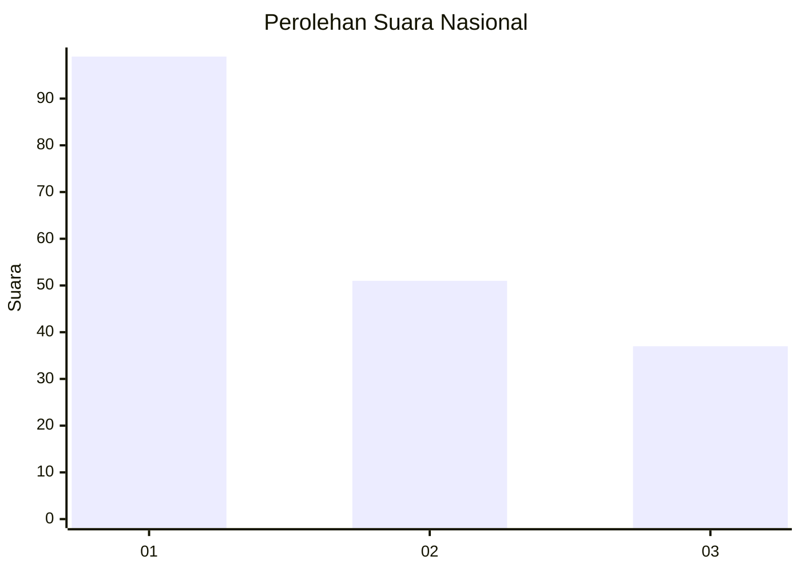
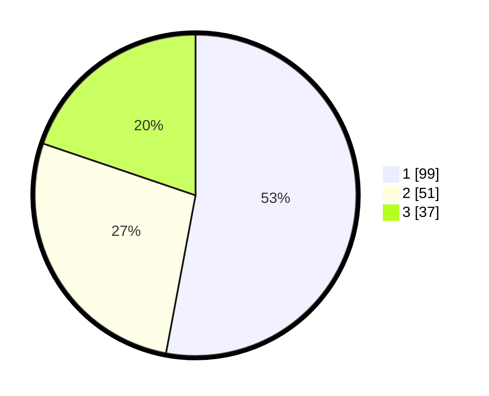

# Hasil

## Grafik

## Tabel

| No.    | Nama Paslon    | Suara | Suara (raw) | Persentase |
|:------ |:-------------- | -----:| -----------:| ----------:|
| 100025 | ANIES MUHAIMIN | 99    | [99][p-1]   | 52,94      |
| 100026 | PRABOWO GIBRAN | 51    | [51][p-2]   | 27,27      |
| 100027 | GANJAR MAHFUD  | 37    | [37][p-3]   | 19,79      |

[p-1]: https://github.com/gigit-pemilu/pemilu-2024/blob/main/pilpres/hitung-suara/sub/31-dki-jakarta/sub/74-jakarta-selatan/sub/06-cilandak/sub/1004-gandaria-selatan/sub/043-tps/sub/paslon-1.txt
[p-2]: https://github.com/gigit-pemilu/pemilu-2024/blob/main/pilpres/hitung-suara/sub/31-dki-jakarta/sub/74-jakarta-selatan/sub/06-cilandak/sub/1004-gandaria-selatan/sub/043-tps/sub/paslon-2.txt
[p-3]: https://github.com/gigit-pemilu/pemilu-2024/blob/main/pilpres/hitung-suara/sub/31-dki-jakarta/sub/74-jakarta-selatan/sub/06-cilandak/sub/1004-gandaria-selatan/sub/043-tps/sub/paslon-3.txt

## Foto C Plano

https://sirekap-obj-formc.kpu.go.id/7fcd/pemilu/ppwp/31/74/06/10/04/3174061004043-20240217-134619--80744193-f998-401c-8a78-408b97a11ddf.jpg

https://sirekap-obj-formc.kpu.go.id/7fcd/pemilu/ppwp/31/74/06/10/04/3174061004043-20240217-134646--bf0a4e89-8e2c-44b0-bb96-2d49f1f0e071.jpg

https://sirekap-obj-formc.kpu.go.id/7fcd/pemilu/ppwp/31/74/06/10/04/3174061004043-20240217-134733--86300f0c-98bb-447f-ac38-fdcb03e37b14.jpg

## Metadata

| Key        | Value               |
| ---------- | ------------------- |
| Time Stamp | 2024-02-24 22:31:28 |

