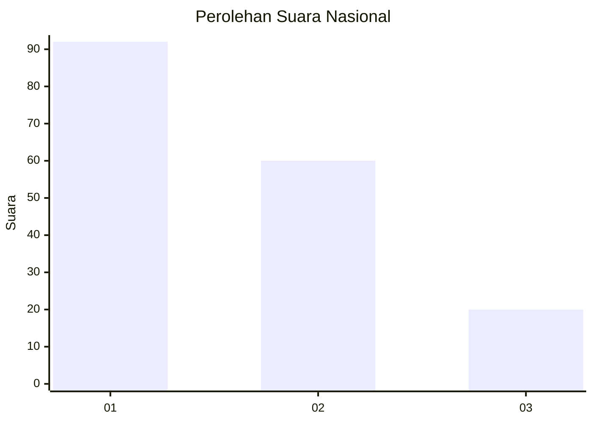
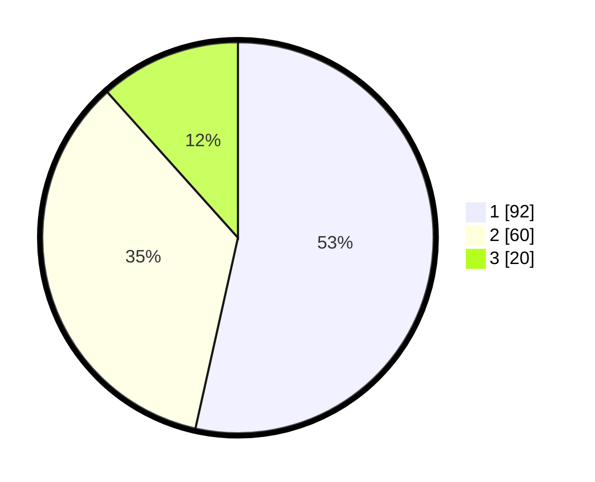

# Hasil

## Grafik

## Tabel

| No.    | Nama Paslon    | Suara | Suara (raw) | Persentase |
|:------ |:-------------- | -----:| -----------:| ----------:|
| 100025 | ANIES MUHAIMIN | 92    | [92][p-1]   | 53,49      |
| 100026 | PRABOWO GIBRAN | 60    | [60][p-2]   | 34,88      |
| 100027 | GANJAR MAHFUD  | 20    | [20][p-3]   | 11,63      |

[p-1]: https://github.com/gigit-pemilu/pemilu-2024/blob/main/pilpres/hitung-suara/sub/31-dki-jakarta/sub/74-jakarta-selatan/sub/06-cilandak/sub/1004-gandaria-selatan/sub/046-tps/sub/paslon-1.txt
[p-2]: https://github.com/gigit-pemilu/pemilu-2024/blob/main/pilpres/hitung-suara/sub/31-dki-jakarta/sub/74-jakarta-selatan/sub/06-cilandak/sub/1004-gandaria-selatan/sub/046-tps/sub/paslon-2.txt
[p-3]: https://github.com/gigit-pemilu/pemilu-2024/blob/main/pilpres/hitung-suara/sub/31-dki-jakarta/sub/74-jakarta-selatan/sub/06-cilandak/sub/1004-gandaria-selatan/sub/046-tps/sub/paslon-3.txt

## Foto C Plano

https://sirekap-obj-formc.kpu.go.id/ba12/pemilu/ppwp/31/74/06/10/04/3174061004046-20240217-135442--1a87500d-7ff4-44df-a578-3e850732eb8b.jpg

https://sirekap-obj-formc.kpu.go.id/ba12/pemilu/ppwp/31/74/06/10/04/3174061004046-20240217-135542--a202ed15-b0d5-478d-b488-fa7b6ec8a8b0.jpg

https://sirekap-obj-formc.kpu.go.id/ba12/pemilu/ppwp/31/74/06/10/04/3174061004046-20240217-135605--16b05b51-89eb-4409-9f6c-0e88e685c28a.jpg

## Metadata

| Key        | Value               |
| ---------- | ------------------- |
| Time Stamp | 2024-02-25 16:00:00 |

