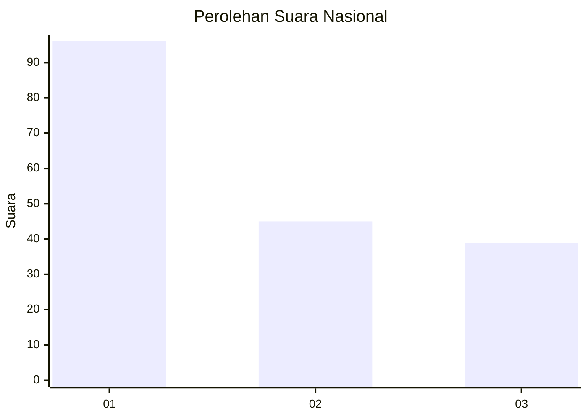
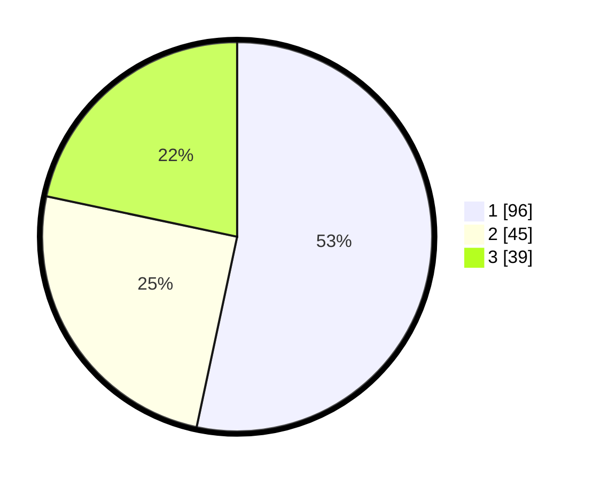

# Hasil

## Grafik

## Tabel

| No.    | Nama Paslon    | Suara | Suara (raw) | Persentase |
|:------ |:-------------- | -----:| -----------:| ----------:|
| 100025 | ANIES MUHAIMIN | 96    | [96][p-1]   | 53,33      |
| 100026 | PRABOWO GIBRAN | 45    | [45][p-2]   | 25,00      |
| 100027 | GANJAR MAHFUD  | 39    | [39][p-3]   | 21,67      |

[p-1]: https://github.com/gigit-pemilu/pemilu-2024/blob/main/pilpres/hitung-suara/sub/31-dki-jakarta/sub/74-jakarta-selatan/sub/06-cilandak/sub/1004-gandaria-selatan/sub/048-tps/sub/paslon-1.txt
[p-2]: https://github.com/gigit-pemilu/pemilu-2024/blob/main/pilpres/hitung-suara/sub/31-dki-jakarta/sub/74-jakarta-selatan/sub/06-cilandak/sub/1004-gandaria-selatan/sub/048-tps/sub/paslon-2.txt
[p-3]: https://github.com/gigit-pemilu/pemilu-2024/blob/main/pilpres/hitung-suara/sub/31-dki-jakarta/sub/74-jakarta-selatan/sub/06-cilandak/sub/1004-gandaria-selatan/sub/048-tps/sub/paslon-3.txt

## Foto C Plano

https://sirekap-obj-formc.kpu.go.id/83fa/pemilu/ppwp/31/74/06/10/04/3174061004048-20240217-140051--d4eb4395-d01b-46a3-b5fa-9f1e51eb5a92.jpg

https://sirekap-obj-formc.kpu.go.id/83fa/pemilu/ppwp/31/74/06/10/04/3174061004048-20240217-140108--f9873fc3-3ccf-4cf0-964d-14e78c570762.jpg

https://sirekap-obj-formc.kpu.go.id/83fa/pemilu/ppwp/31/74/06/10/04/3174061004048-20240217-140133--5617fa4a-c258-4ae9-a0ea-7775d4af0254.jpg

## Metadata

| Key        | Value               |
| ---------- | ------------------- |
| Time Stamp | 2024-02-24 22:31:28 |

