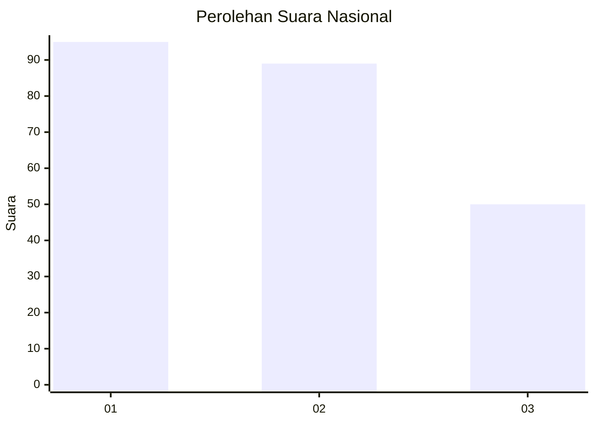
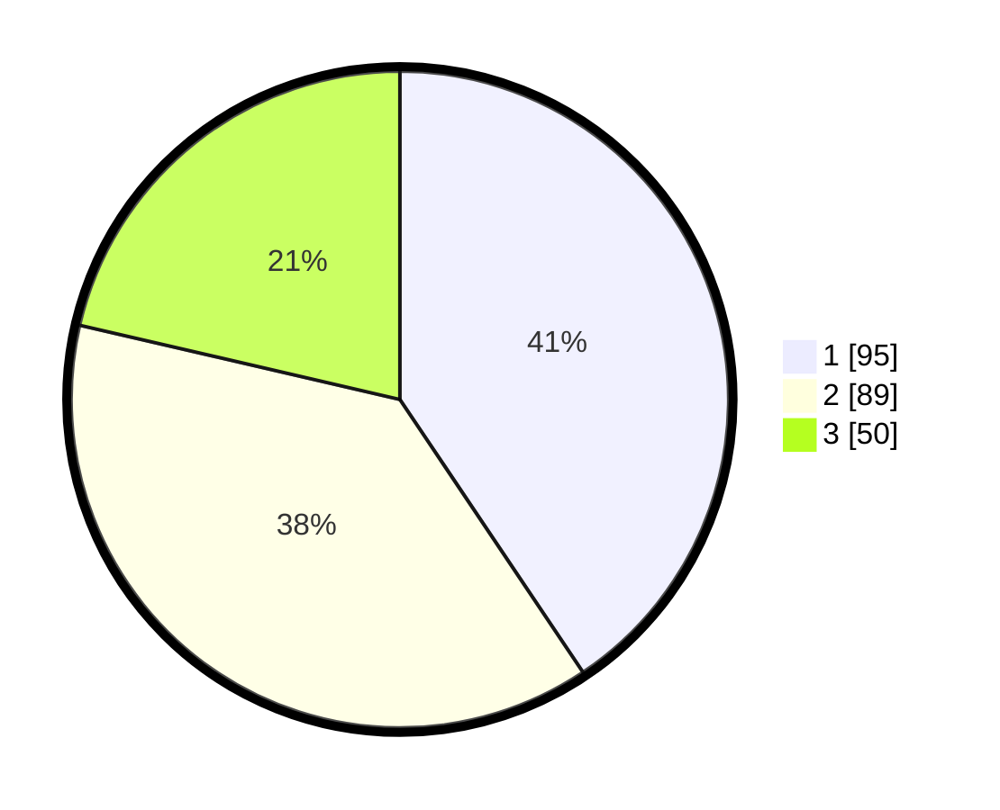

# Hasil

## Grafik

## Tabel

| No.    | Nama Paslon    | Suara | Suara (raw) | Persentase |
|:------ |:-------------- | -----:| -----------:| ----------:|
| 100025 | ANIES MUHAIMIN | 95    | [95][p-1]   | 40,60      |
| 100026 | PRABOWO GIBRAN | 89    | [89][p-2]   | 38,03      |
| 100027 | GANJAR MAHFUD  | 50    | [50][p-3]   | 21,37      |

[p-1]: https://github.com/gigit-pemilu/pemilu-2024/blob/main/pilpres/hitung-suara/sub/31-dki-jakarta/sub/74-jakarta-selatan/sub/06-cilandak/sub/1004-gandaria-selatan/sub/050-tps/sub/paslon-1.txt
[p-2]: https://github.com/gigit-pemilu/pemilu-2024/blob/main/pilpres/hitung-suara/sub/31-dki-jakarta/sub/74-jakarta-selatan/sub/06-cilandak/sub/1004-gandaria-selatan/sub/050-tps/sub/paslon-2.txt
[p-3]: https://github.com/gigit-pemilu/pemilu-2024/blob/main/pilpres/hitung-suara/sub/31-dki-jakarta/sub/74-jakarta-selatan/sub/06-cilandak/sub/1004-gandaria-selatan/sub/050-tps/sub/paslon-3.txt

## Foto C Plano

https://sirekap-obj-formc.kpu.go.id/0c1c/pemilu/ppwp/31/74/06/10/04/3174061004050-20240217-140603--a19807b2-72b6-473b-ab72-e9a87c001ce0.jpg

https://sirekap-obj-formc.kpu.go.id/0c1c/pemilu/ppwp/31/74/06/10/04/3174061004050-20240217-140625--b467f433-169d-493e-96cf-f2ac7096ec94.jpg

https://sirekap-obj-formc.kpu.go.id/0c1c/pemilu/ppwp/31/74/06/10/04/3174061004050-20240217-140649--990085a5-6366-4c09-9b20-d7aeb2c067d8.jpg

## Metadata

| Key        | Value               |
| ---------- | ------------------- |
| Time Stamp | 2024-02-24 22:31:28 |

