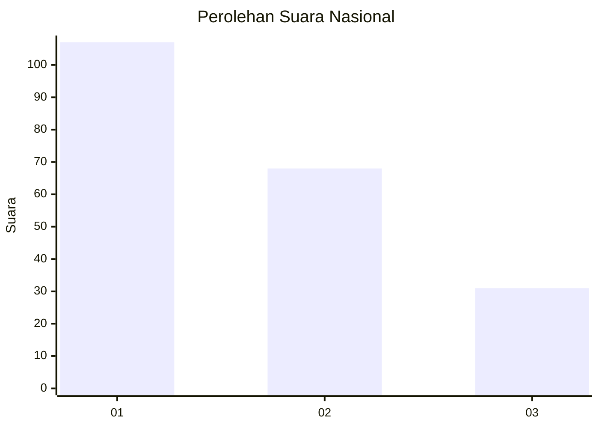
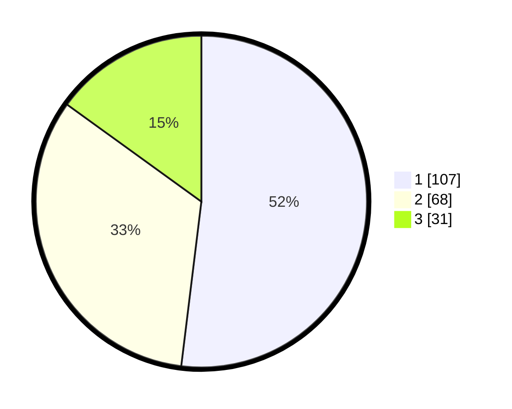

# Hasil

## Grafik

## Tabel

| No.    | Nama Paslon    | Suara | Suara (raw) | Persentase |
|:------ |:-------------- | -----:| -----------:| ----------:|
| 100025 | ANIES MUHAIMIN | 107   | [107][p-1]  | 51,94      |
| 100026 | PRABOWO GIBRAN | 68    | [68][p-2]   | 33,01      |
| 100027 | GANJAR MAHFUD  | 31    | [31][p-3]   | 15,05      |

[p-1]: https://github.com/gigit-pemilu/pemilu-2024/blob/main/pilpres/hitung-suara/sub/31-dki-jakarta/sub/74-jakarta-selatan/sub/06-cilandak/sub/1004-gandaria-selatan/sub/054-tps/sub/paslon-1.txt
[p-2]: https://github.com/gigit-pemilu/pemilu-2024/blob/main/pilpres/hitung-suara/sub/31-dki-jakarta/sub/74-jakarta-selatan/sub/06-cilandak/sub/1004-gandaria-selatan/sub/054-tps/sub/paslon-2.txt
[p-3]: https://github.com/gigit-pemilu/pemilu-2024/blob/main/pilpres/hitung-suara/sub/31-dki-jakarta/sub/74-jakarta-selatan/sub/06-cilandak/sub/1004-gandaria-selatan/sub/054-tps/sub/paslon-3.txt

## Foto C Plano

https://sirekap-obj-formc.kpu.go.id/4a5c/pemilu/ppwp/31/74/06/10/04/3174061004054-20240218-135315--a6aa32c8-60bc-43b9-8871-35dea6ef6390.jpg

https://sirekap-obj-formc.kpu.go.id/4a5c/pemilu/ppwp/31/74/06/10/04/3174061004054-20240218-135340--2fe34bd0-dfd0-4460-b39a-63f8d653eaea.jpg

https://sirekap-obj-formc.kpu.go.id/4a5c/pemilu/ppwp/31/74/06/10/04/3174061004054-20240218-135407--22a0f534-587d-4bf4-a469-36efc3808092.jpg

## Metadata

| Key        | Value               |
| ---------- | ------------------- |
| Time Stamp | 2024-02-25 15:00:00 |

