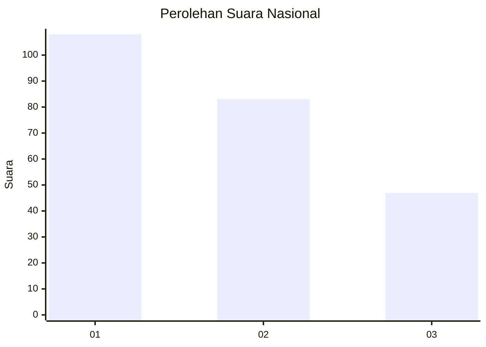
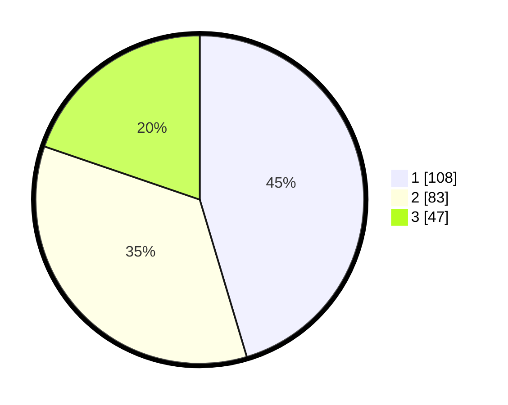

# Hasil

## Grafik

## Tabel

| No.    | Nama Paslon    | Suara | Suara (raw) | Persentase |
|:------ |:-------------- | -----:| -----------:| ----------:|
| 100025 | ANIES MUHAIMIN | 108   | [108][p-1]  | 45,38      |
| 100026 | PRABOWO GIBRAN | 83    | [83][p-2]   | 34,87      |
| 100027 | GANJAR MAHFUD  | 47    | [47][p-3]   | 19,75      |

[p-1]: https://github.com/gigit-pemilu/pemilu-2024/blob/main/pilpres/hitung-suara/sub/31-dki-jakarta/sub/74-jakarta-selatan/sub/06-cilandak/sub/1004-gandaria-selatan/sub/057-tps/sub/paslon-1.txt
[p-2]: https://github.com/gigit-pemilu/pemilu-2024/blob/main/pilpres/hitung-suara/sub/31-dki-jakarta/sub/74-jakarta-selatan/sub/06-cilandak/sub/1004-gandaria-selatan/sub/057-tps/sub/paslon-2.txt
[p-3]: https://github.com/gigit-pemilu/pemilu-2024/blob/main/pilpres/hitung-suara/sub/31-dki-jakarta/sub/74-jakarta-selatan/sub/06-cilandak/sub/1004-gandaria-selatan/sub/057-tps/sub/paslon-3.txt

## Foto C Plano

https://sirekap-obj-formc.kpu.go.id/907c/pemilu/ppwp/31/74/06/10/04/3174061004057-20240218-140257--54c8cc71-2b3c-4f47-b37e-7e20a6c86895.jpg

https://sirekap-obj-formc.kpu.go.id/907c/pemilu/ppwp/31/74/06/10/04/3174061004057-20240218-140330--c12edb18-2008-4a78-90a0-9d9d9925d24c.jpg

https://sirekap-obj-formc.kpu.go.id/907c/pemilu/ppwp/31/74/06/10/04/3174061004057-20240218-140403--ca555112-eaa9-4519-8035-817e9d6a50a2.jpg

## Metadata

| Key        | Value               |
| ---------- | ------------------- |
| Time Stamp | 2024-02-24 22:31:28 |

