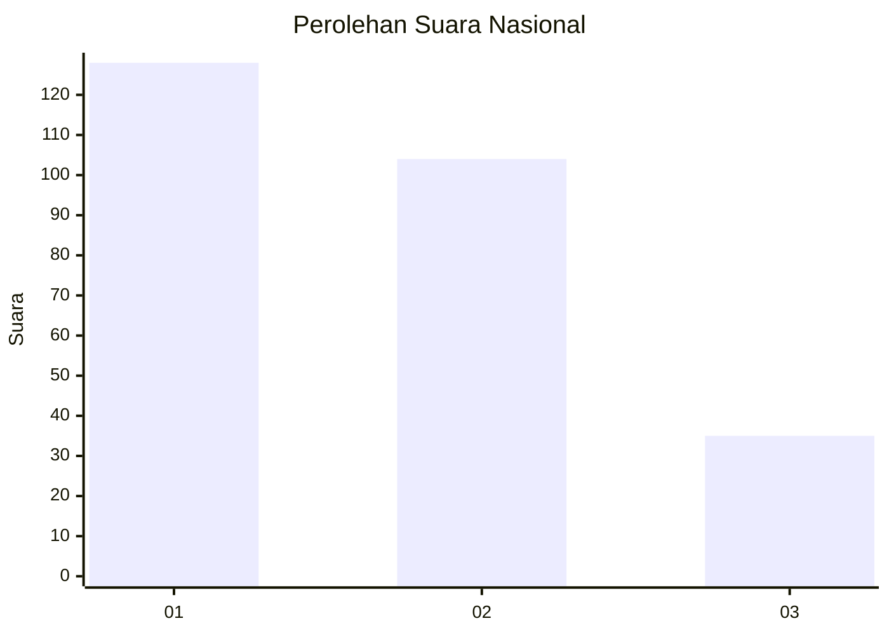
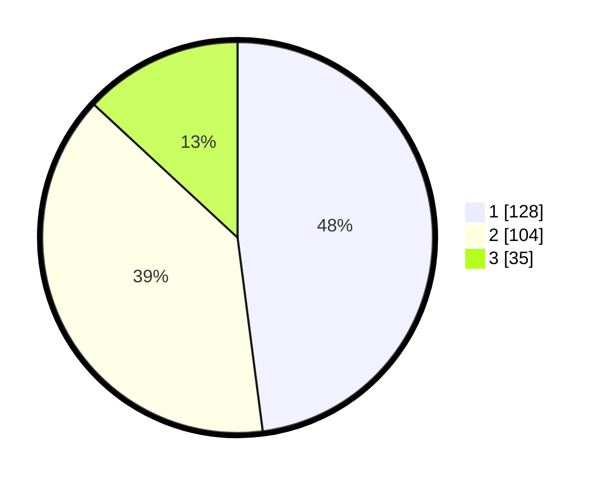

# Hasil

## Grafik

## Tabel

| No.    | Nama Paslon    | Suara | Suara (raw) | Persentase |
|:------ |:-------------- | -----:| -----------:| ----------:|
| 100025 | ANIES MUHAIMIN | 128   | [128][p-1]  | 47,94      |
| 100026 | PRABOWO GIBRAN | 104   | [104][p-2]  | 38,95      |
| 100027 | GANJAR MAHFUD  | 35    | [35][p-3]   | 13,11      |

[p-1]: https://github.com/gigit-pemilu/pemilu-2024/blob/main/pilpres/hitung-suara/sub/31-dki-jakarta/sub/74-jakarta-selatan/sub/06-cilandak/sub/1004-gandaria-selatan/sub/058-tps/sub/paslon-1.txt
[p-2]: https://github.com/gigit-pemilu/pemilu-2024/blob/main/pilpres/hitung-suara/sub/31-dki-jakarta/sub/74-jakarta-selatan/sub/06-cilandak/sub/1004-gandaria-selatan/sub/058-tps/sub/paslon-2.txt
[p-3]: https://github.com/gigit-pemilu/pemilu-2024/blob/main/pilpres/hitung-suara/sub/31-dki-jakarta/sub/74-jakarta-selatan/sub/06-cilandak/sub/1004-gandaria-selatan/sub/058-tps/sub/paslon-3.txt

## Foto C Plano

https://sirekap-obj-formc.kpu.go.id/3750/pemilu/ppwp/31/74/06/10/04/3174061004058-20240218-140515--7d1ce40d-972e-4f88-8926-ba4509ac4755.jpg

https://sirekap-obj-formc.kpu.go.id/3750/pemilu/ppwp/31/74/06/10/04/3174061004058-20240218-140541--11356729-e704-4448-82bb-75eb364af86f.jpg

https://sirekap-obj-formc.kpu.go.id/3750/pemilu/ppwp/31/74/06/10/04/3174061004058-20240218-140611--d9fc06e2-60c0-4646-a162-06d6626c0d3a.jpg

## Metadata

| Key        | Value               |
| ---------- | ------------------- |
| Time Stamp | 2024-02-24 22:31:28 |

