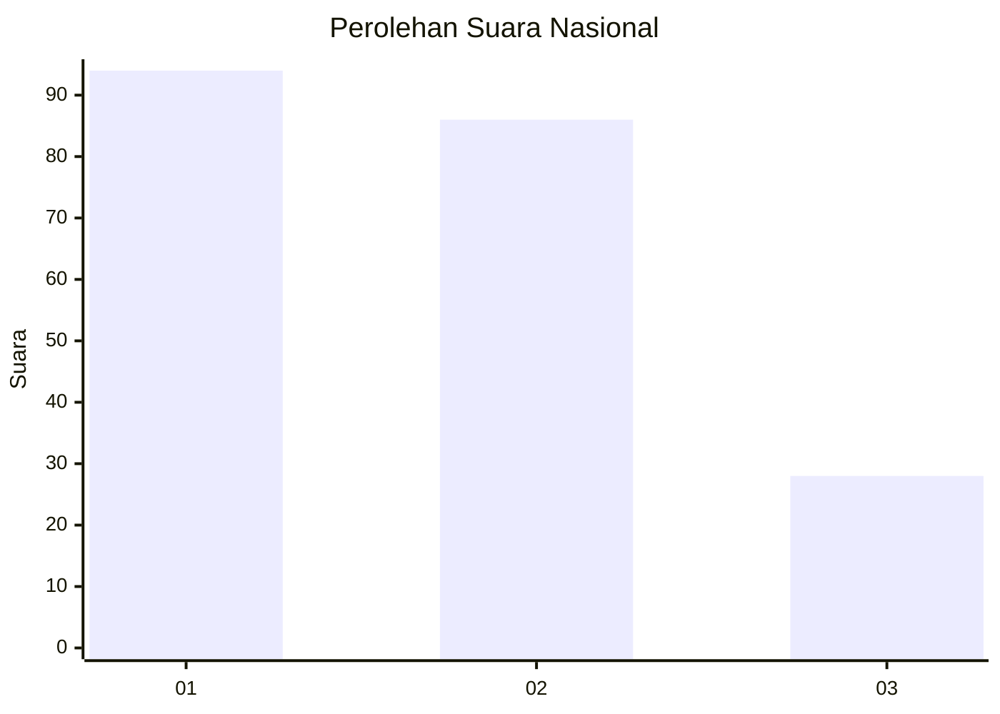
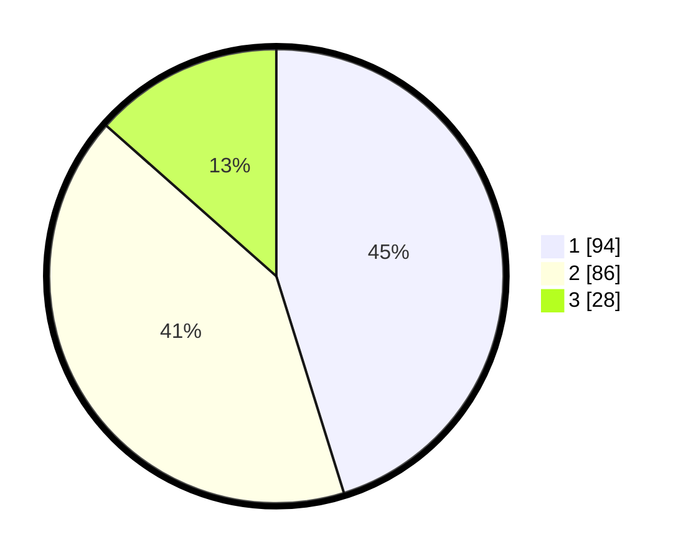

# Hasil

## Grafik

## Tabel

| No.    | Nama Paslon    | Suara | Suara (raw) | Persentase |
|:------ |:-------------- | -----:| -----------:| ----------:|
| 100025 | ANIES MUHAIMIN | 94    | [94][p-1]   | 45,19      |
| 100026 | PRABOWO GIBRAN | 86    | [86][p-2]   | 41,35      |
| 100027 | GANJAR MAHFUD  | 28    | [28][p-3]   | 13,46      |

[p-1]: https://github.com/gigit-pemilu/pemilu-2024/blob/main/pilpres/hitung-suara/sub/31-dki-jakarta/sub/74-jakarta-selatan/sub/06-cilandak/sub/1004-gandaria-selatan/sub/059-tps/sub/paslon-1.txt
[p-2]: https://github.com/gigit-pemilu/pemilu-2024/blob/main/pilpres/hitung-suara/sub/31-dki-jakarta/sub/74-jakarta-selatan/sub/06-cilandak/sub/1004-gandaria-selatan/sub/059-tps/sub/paslon-2.txt
[p-3]: https://github.com/gigit-pemilu/pemilu-2024/blob/main/pilpres/hitung-suara/sub/31-dki-jakarta/sub/74-jakarta-selatan/sub/06-cilandak/sub/1004-gandaria-selatan/sub/059-tps/sub/paslon-3.txt

## Foto C Plano

https://sirekap-obj-formc.kpu.go.id/8f7c/pemilu/ppwp/31/74/06/10/04/3174061004059-20240218-140756--03324b62-688c-4406-9b0a-bac979d62602.jpg

https://sirekap-obj-formc.kpu.go.id/8f7c/pemilu/ppwp/31/74/06/10/04/3174061004059-20240218-140835--925d36c5-6f96-4480-b259-67ec93f80856.jpg

https://sirekap-obj-formc.kpu.go.id/8f7c/pemilu/ppwp/31/74/06/10/04/3174061004059-20240218-140904--ac99ab55-97d5-44b8-a3c1-f05c1b19bb91.jpg

## Metadata

| Key        | Value               |
| ---------- | ------------------- |
| Time Stamp | 2024-02-24 22:31:28 |

