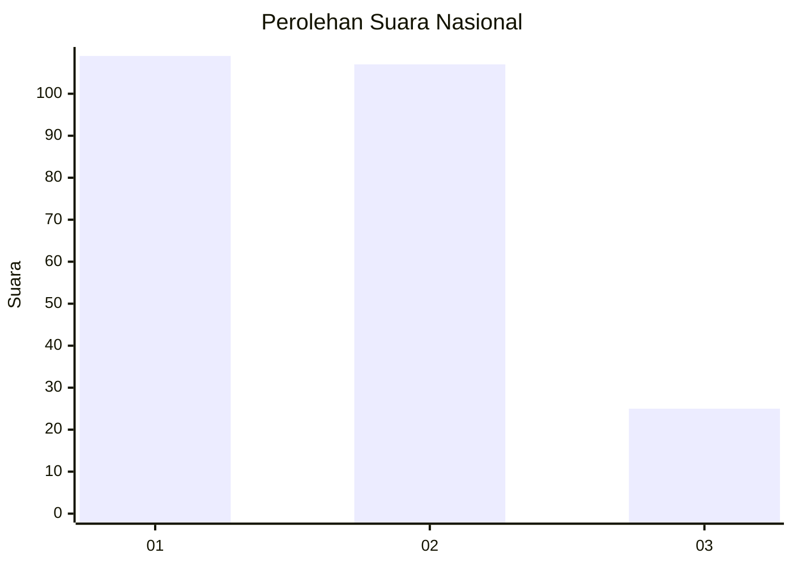
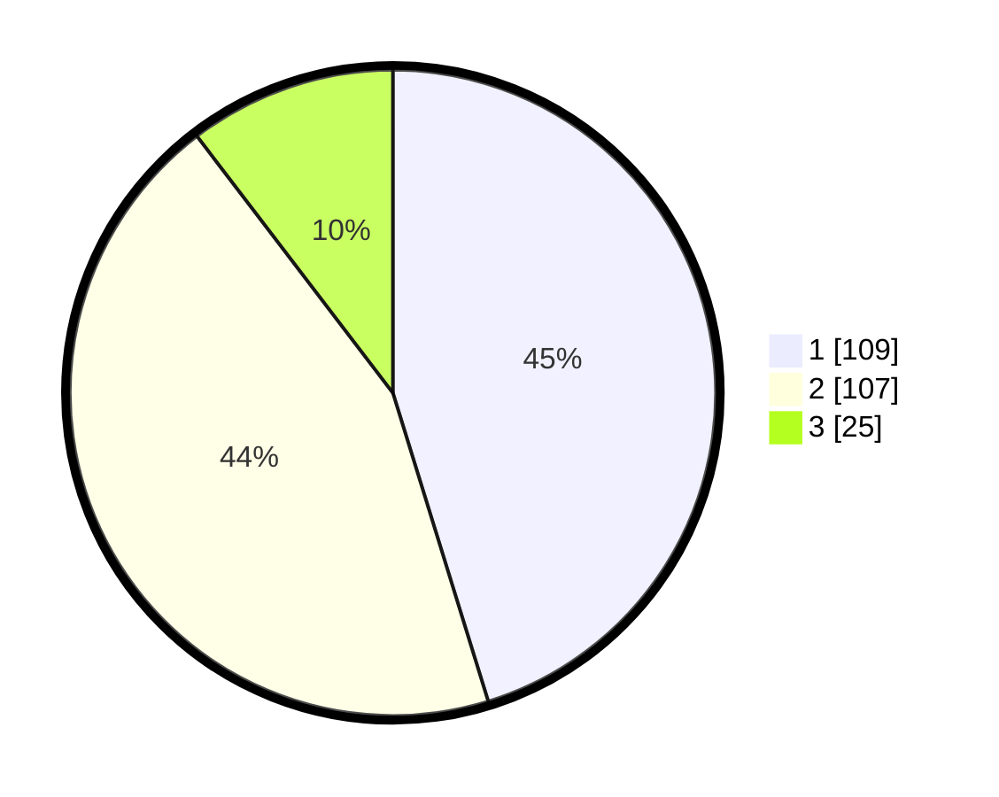

# Hasil

## Grafik

## Tabel

| No.    | Nama Paslon    | Suara | Suara (raw) | Persentase |
|:------ |:-------------- | -----:| -----------:| ----------:|
| 100025 | ANIES MUHAIMIN | 109   | [109][p-1]  | 45,23      |
| 100026 | PRABOWO GIBRAN | 107   | [107][p-2]  | 44,40      |
| 100027 | GANJAR MAHFUD  | 25    | [25][p-3]   | 10,37      |

[p-1]: https://github.com/gigit-pemilu/pemilu-2024/blob/main/pilpres/hitung-suara/sub/31-dki-jakarta/sub/74-jakarta-selatan/sub/06-cilandak/sub/1004-gandaria-selatan/sub/067-tps/sub/paslon-1.txt
[p-2]: https://github.com/gigit-pemilu/pemilu-2024/blob/main/pilpres/hitung-suara/sub/31-dki-jakarta/sub/74-jakarta-selatan/sub/06-cilandak/sub/1004-gandaria-selatan/sub/067-tps/sub/paslon-2.txt
[p-3]: https://github.com/gigit-pemilu/pemilu-2024/blob/main/pilpres/hitung-suara/sub/31-dki-jakarta/sub/74-jakarta-selatan/sub/06-cilandak/sub/1004-gandaria-selatan/sub/067-tps/sub/paslon-3.txt

## Foto C Plano

https://sirekap-obj-formc.kpu.go.id/b5c5/pemilu/ppwp/31/74/06/10/04/3174061004067-20240218-142927--d279a48a-2ac5-4b83-83aa-11e058ec3552.jpg

https://sirekap-obj-formc.kpu.go.id/b5c5/pemilu/ppwp/31/74/06/10/04/3174061004067-20240218-143002--5e3b7f67-654b-4d4b-b9cc-2b1bb2f5390a.jpg

https://sirekap-obj-formc.kpu.go.id/b5c5/pemilu/ppwp/31/74/06/10/04/3174061004067-20240218-143044--ab92eb2a-eac2-4015-babe-e9b8d70b1fcb.jpg

## Metadata

| Key        | Value               |
| ---------- | ------------------- |
| Time Stamp | 2024-02-25 19:00:00 |

