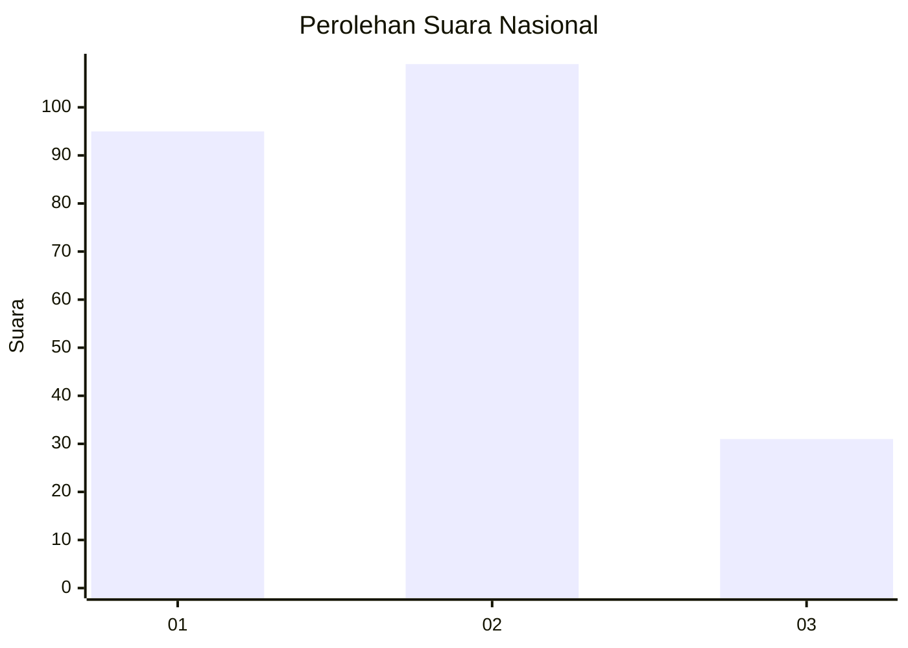
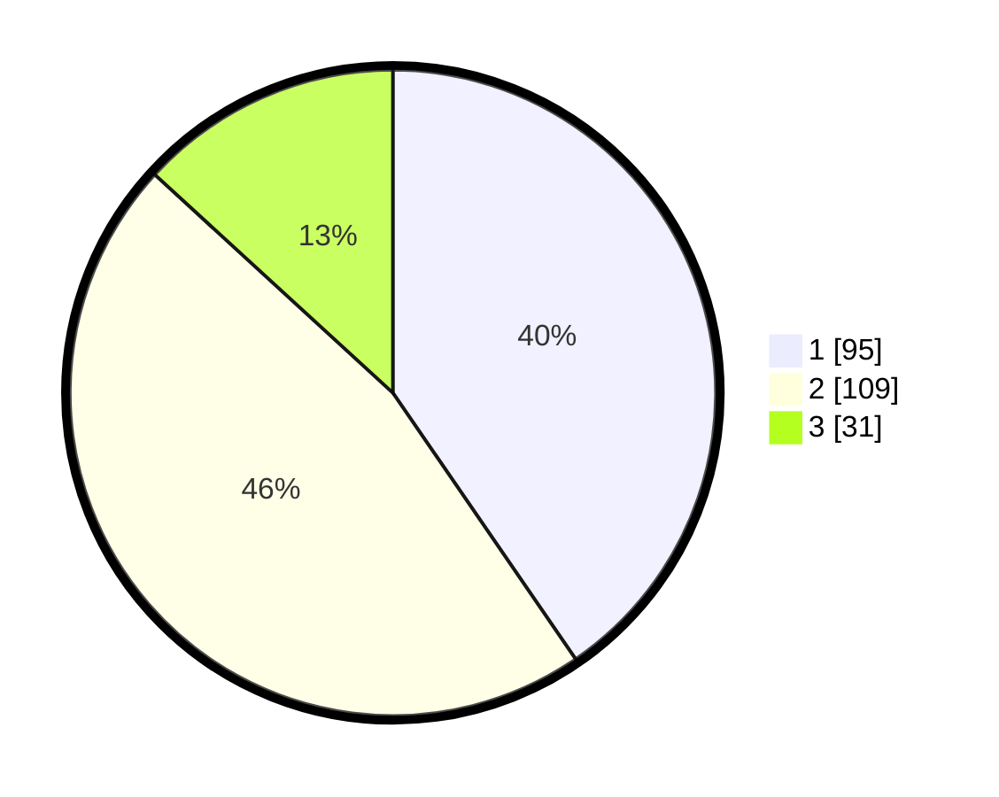

# Hasil

## Grafik

## Tabel

| No.    | Nama Paslon    | Suara | Suara (raw) | Persentase |
|:------ |:-------------- | -----:| -----------:| ----------:|
| 100025 | ANIES MUHAIMIN | 95    | [95][p-1]   | 40,43      |
| 100026 | PRABOWO GIBRAN | 109   | [109][p-2]  | 46,38      |
| 100027 | GANJAR MAHFUD  | 31    | [31][p-3]   | 13,19      |

[p-1]: https://github.com/gigit-pemilu/pemilu-2024/blob/main/pilpres/hitung-suara/sub/31-dki-jakarta/sub/74-jakarta-selatan/sub/06-cilandak/sub/1004-gandaria-selatan/sub/068-tps/sub/paslon-1.txt
[p-2]: https://github.com/gigit-pemilu/pemilu-2024/blob/main/pilpres/hitung-suara/sub/31-dki-jakarta/sub/74-jakarta-selatan/sub/06-cilandak/sub/1004-gandaria-selatan/sub/068-tps/sub/paslon-2.txt
[p-3]: https://github.com/gigit-pemilu/pemilu-2024/blob/main/pilpres/hitung-suara/sub/31-dki-jakarta/sub/74-jakarta-selatan/sub/06-cilandak/sub/1004-gandaria-selatan/sub/068-tps/sub/paslon-3.txt

## Foto C Plano

https://sirekap-obj-formc.kpu.go.id/51e1/pemilu/ppwp/31/74/06/10/04/3174061004068-20240218-143154--70e2ebd8-634c-47cb-bdd4-4a371bd65c90.jpg

https://sirekap-obj-formc.kpu.go.id/51e1/pemilu/ppwp/31/74/06/10/04/3174061004068-20240218-143220--6a4c66a8-bfca-4154-a014-45dc51c6ec5f.jpg

https://sirekap-obj-formc.kpu.go.id/51e1/pemilu/ppwp/31/74/06/10/04/3174061004068-20240218-143517--73a334fd-7dc3-42cb-9076-e105738c21fe.jpg

## Metadata

| Key        | Value               |
| ---------- | ------------------- |
| Time Stamp | 2024-02-25 11:00:00 |

