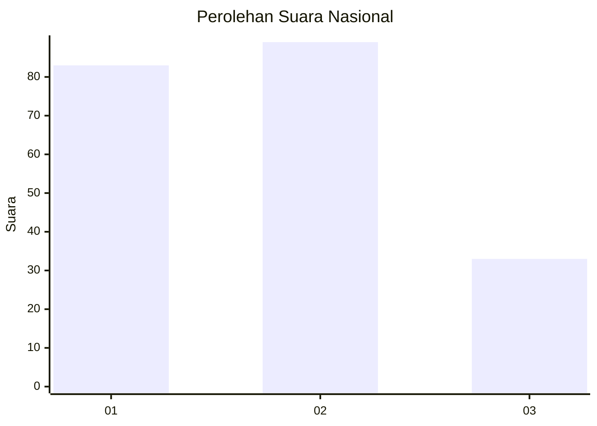
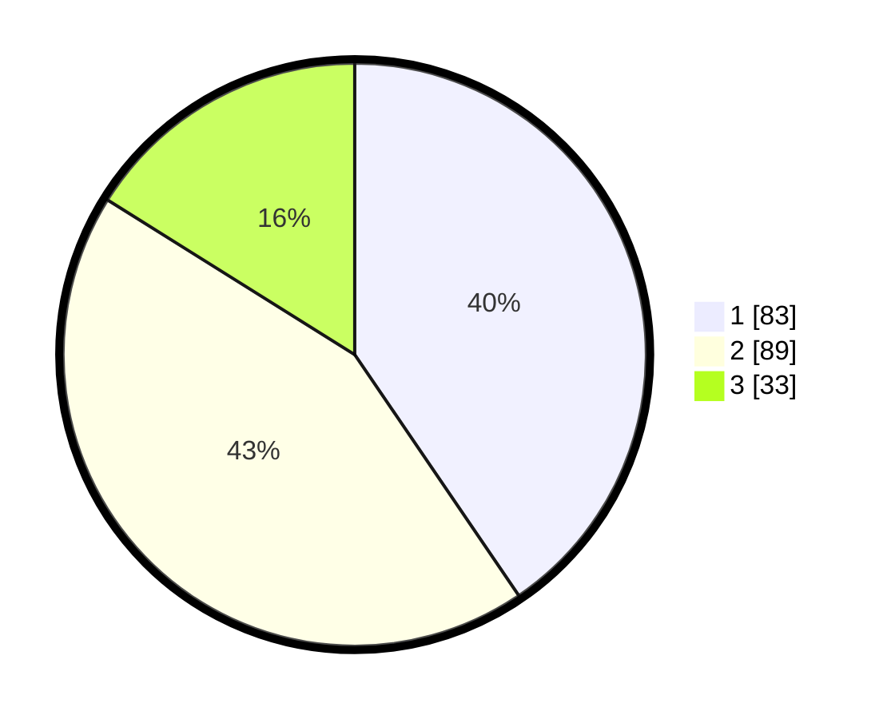

# Hasil

## Grafik

## Tabel

| No.    | Nama Paslon    | Suara | Suara (raw) | Persentase |
|:------ |:-------------- | -----:| -----------:| ----------:|
| 100025 | ANIES MUHAIMIN | 83    | [83][p-1]   | 40,49      |
| 100026 | PRABOWO GIBRAN | 89    | [89][p-2]   | 43,41      |
| 100027 | GANJAR MAHFUD  | 33    | [33][p-3]   | 16,10      |

[p-1]: https://github.com/gigit-pemilu/pemilu-2024/blob/main/pilpres/hitung-suara/sub/31-dki-jakarta/sub/74-jakarta-selatan/sub/06-cilandak/sub/1004-gandaria-selatan/sub/071-tps/sub/paslon-1.txt
[p-2]: https://github.com/gigit-pemilu/pemilu-2024/blob/main/pilpres/hitung-suara/sub/31-dki-jakarta/sub/74-jakarta-selatan/sub/06-cilandak/sub/1004-gandaria-selatan/sub/071-tps/sub/paslon-2.txt
[p-3]: https://github.com/gigit-pemilu/pemilu-2024/blob/main/pilpres/hitung-suara/sub/31-dki-jakarta/sub/74-jakarta-selatan/sub/06-cilandak/sub/1004-gandaria-selatan/sub/071-tps/sub/paslon-3.txt

## Foto C Plano

https://sirekap-obj-formc.kpu.go.id/60c3/pemilu/ppwp/31/74/06/10/04/3174061004071-20240218-144606--bbaf6a79-34a7-4bdc-b1e8-b992a8bce684.jpg

https://sirekap-obj-formc.kpu.go.id/60c3/pemilu/ppwp/31/74/06/10/04/3174061004071-20240218-144756--7a7270f7-bd79-41bc-b7df-460eb0b20799.jpg

https://sirekap-obj-formc.kpu.go.id/60c3/pemilu/ppwp/31/74/06/10/04/3174061004071-20240218-144731--9056b131-d1e8-400f-9220-e73589f77efe.jpg

## Metadata

| Key        | Value               |
| ---------- | ------------------- |
| Time Stamp | 2024-02-25 15:00:00 |

