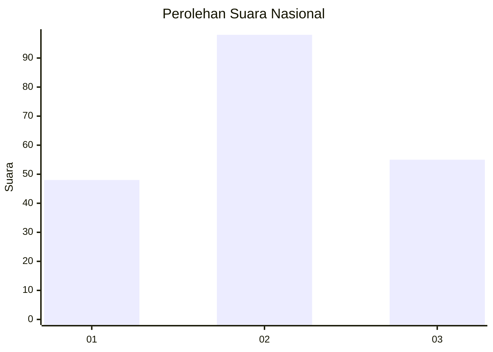
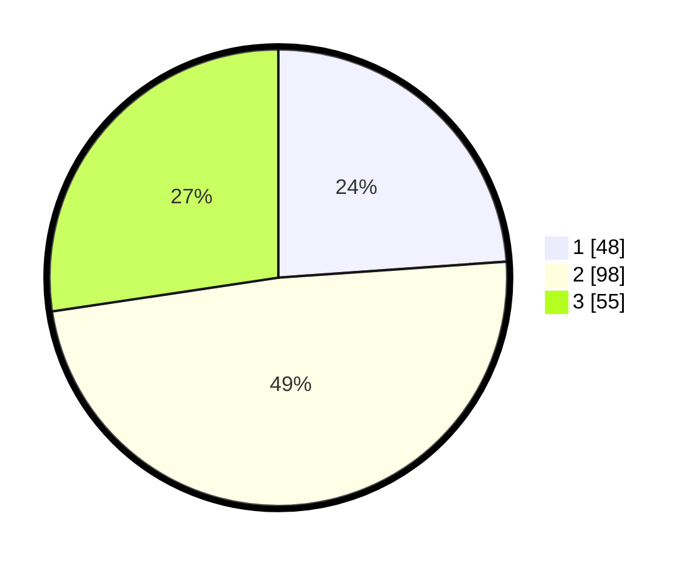

# Hasil

## Grafik

## Tabel

| No.    | Nama Paslon    | Suara | Suara (raw) | Persentase |
|:------ |:-------------- | -----:| -----------:| ----------:|
| 100025 | ANIES MUHAIMIN | 48    | [48][p-1]   | 23,88      |
| 100026 | PRABOWO GIBRAN | 98    | [98][p-2]   | 48,76      |
| 100027 | GANJAR MAHFUD  | 55    | [55][p-3]   | 27,36      |

[p-1]: https://github.com/gigit-pemilu/pemilu-2024/blob/main/pilpres/hitung-suara/sub/31-dki-jakarta/sub/74-jakarta-selatan/sub/06-cilandak/sub/1004-gandaria-selatan/sub/075-tps/sub/paslon-1.txt
[p-2]: https://github.com/gigit-pemilu/pemilu-2024/blob/main/pilpres/hitung-suara/sub/31-dki-jakarta/sub/74-jakarta-selatan/sub/06-cilandak/sub/1004-gandaria-selatan/sub/075-tps/sub/paslon-2.txt
[p-3]: https://github.com/gigit-pemilu/pemilu-2024/blob/main/pilpres/hitung-suara/sub/31-dki-jakarta/sub/74-jakarta-selatan/sub/06-cilandak/sub/1004-gandaria-selatan/sub/075-tps/sub/paslon-3.txt

## Foto C Plano

https://sirekap-obj-formc.kpu.go.id/63df/pemilu/ppwp/31/74/06/10/04/3174061004075-20240218-150116--4e7fd1f5-99db-4335-ab71-ba7bf5decaf6.jpg

https://sirekap-obj-formc.kpu.go.id/63df/pemilu/ppwp/31/74/06/10/04/3174061004075-20240218-150139--93ce7cd0-a27b-4855-a340-d08ef798b688.jpg

https://sirekap-obj-formc.kpu.go.id/63df/pemilu/ppwp/31/74/06/10/04/3174061004075-20240218-150215--3553b199-4103-42f5-a021-0d7febca8046.jpg

## Metadata

| Key        | Value               |
| ---------- | ------------------- |
| Time Stamp | 2024-02-24 22:31:28 |

