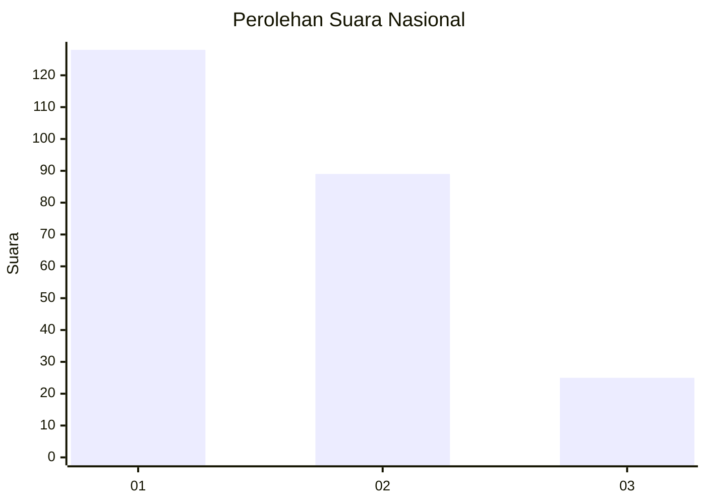
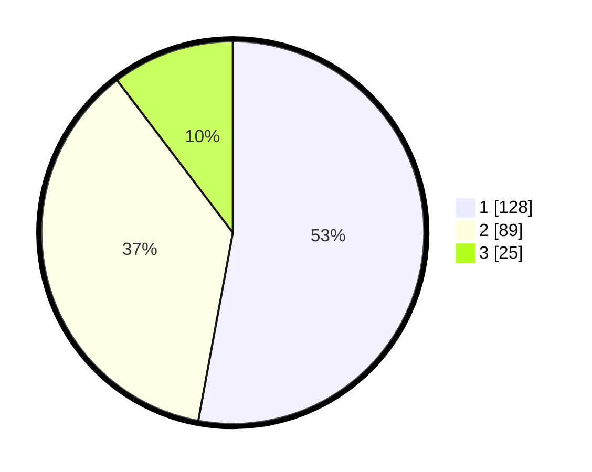

# Hasil

## Grafik

## Tabel

| No.    | Nama Paslon    | Suara | Suara (raw) | Persentase |
|:------ |:-------------- | -----:| -----------:| ----------:|
| 100025 | ANIES MUHAIMIN | 128   | [128][p-1]  | 52,89      |
| 100026 | PRABOWO GIBRAN | 89    | [89][p-2]   | 36,78      |
| 100027 | GANJAR MAHFUD  | 25    | [25][p-3]   | 10,33      |

[p-1]: https://github.com/gigit-pemilu/pemilu-2024/blob/main/pilpres/hitung-suara/sub/31-dki-jakarta/sub/74-jakarta-selatan/sub/06-cilandak/sub/1004-gandaria-selatan/sub/077-tps/sub/paslon-1.txt
[p-2]: https://github.com/gigit-pemilu/pemilu-2024/blob/main/pilpres/hitung-suara/sub/31-dki-jakarta/sub/74-jakarta-selatan/sub/06-cilandak/sub/1004-gandaria-selatan/sub/077-tps/sub/paslon-2.txt
[p-3]: https://github.com/gigit-pemilu/pemilu-2024/blob/main/pilpres/hitung-suara/sub/31-dki-jakarta/sub/74-jakarta-selatan/sub/06-cilandak/sub/1004-gandaria-selatan/sub/077-tps/sub/paslon-3.txt

## Foto C Plano

https://sirekap-obj-formc.kpu.go.id/d390/pemilu/ppwp/31/74/06/10/04/3174061004077-20240218-150636--e4ecc192-e042-4144-8128-1678c3b3393e.jpg

https://sirekap-obj-formc.kpu.go.id/d390/pemilu/ppwp/31/74/06/10/04/3174061004077-20240218-150659--b9421c04-cd92-40b2-bd41-93298e73b9a0.jpg

https://sirekap-obj-formc.kpu.go.id/d390/pemilu/ppwp/31/74/06/10/04/3174061004077-20240218-150719--90d96302-d67d-4e8f-b2fc-947f67ec4d3c.jpg

## Metadata

| Key        | Value               |
| ---------- | ------------------- |
| Time Stamp | 2024-02-24 22:31:28 |

