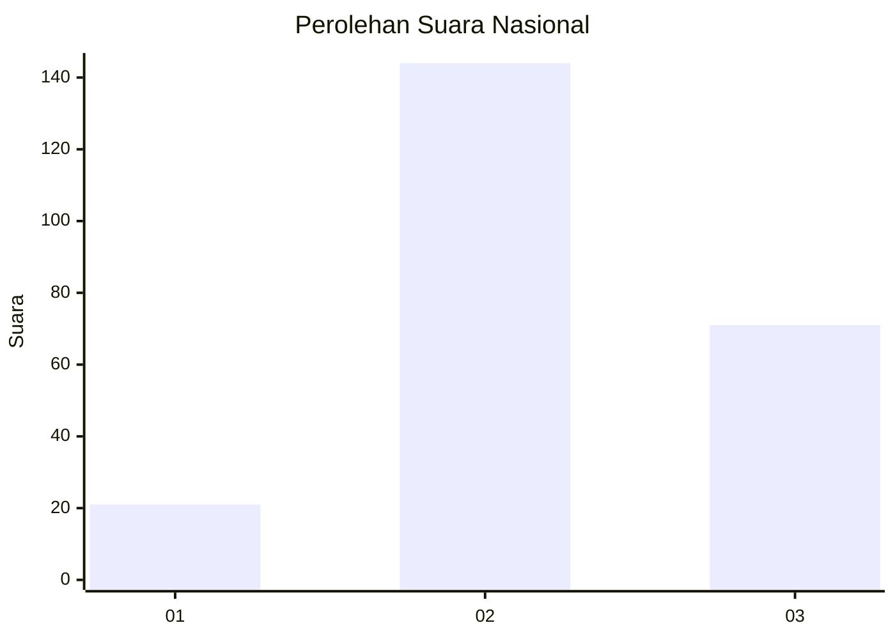
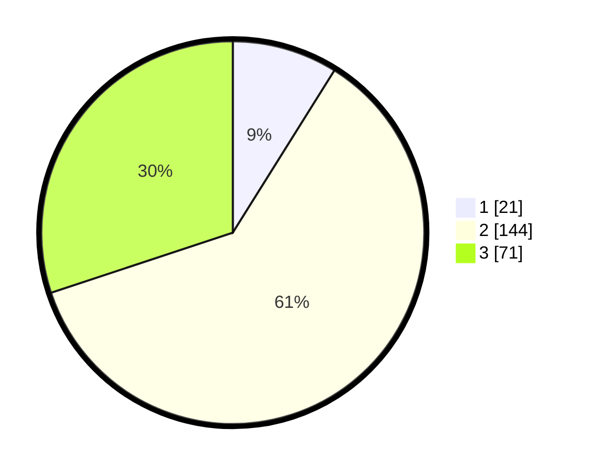

# Hasil

## Grafik

## Tabel

| No.    | Nama Paslon    | Suara | Suara (raw) | Persentase |
|:------ |:-------------- | -----:| -----------:| ----------:|
| 100025 | ANIES MUHAIMIN | 21    | [21][p-1]   | 8,90       |
| 100026 | PRABOWO GIBRAN | 144   | [144][p-2]  | 61,02      |
| 100027 | GANJAR MAHFUD  | 71    | [71][p-3]   | 30,08      |

[p-1]: https://github.com/gigit-pemilu/pemilu-2024/blob/main/pilpres/hitung-suara/sub/31-dki-jakarta/sub/74-jakarta-selatan/sub/06-cilandak/sub/1004-gandaria-selatan/sub/081-tps/sub/paslon-1.txt
[p-2]: https://github.com/gigit-pemilu/pemilu-2024/blob/main/pilpres/hitung-suara/sub/31-dki-jakarta/sub/74-jakarta-selatan/sub/06-cilandak/sub/1004-gandaria-selatan/sub/081-tps/sub/paslon-2.txt
[p-3]: https://github.com/gigit-pemilu/pemilu-2024/blob/main/pilpres/hitung-suara/sub/31-dki-jakarta/sub/74-jakarta-selatan/sub/06-cilandak/sub/1004-gandaria-selatan/sub/081-tps/sub/paslon-3.txt

## Foto C Plano

https://sirekap-obj-formc.kpu.go.id/7e49/pemilu/ppwp/31/74/06/10/04/3174061004081-20240218-152041--5e98d9c8-83c0-4e0b-84e9-884bbbf20fb3.jpg

https://sirekap-obj-formc.kpu.go.id/7e49/pemilu/ppwp/31/74/06/10/04/3174061004081-20240218-152128--3a666a92-37ea-4877-aaed-06e34c822f49.jpg

https://sirekap-obj-formc.kpu.go.id/7e49/pemilu/ppwp/31/74/06/10/04/3174061004081-20240218-152149--e248394c-11c0-45f3-8968-a73a3349c690.jpg

## Metadata

| Key        | Value               |
| ---------- | ------------------- |
| Time Stamp | 2024-02-25 12:00:00 |

