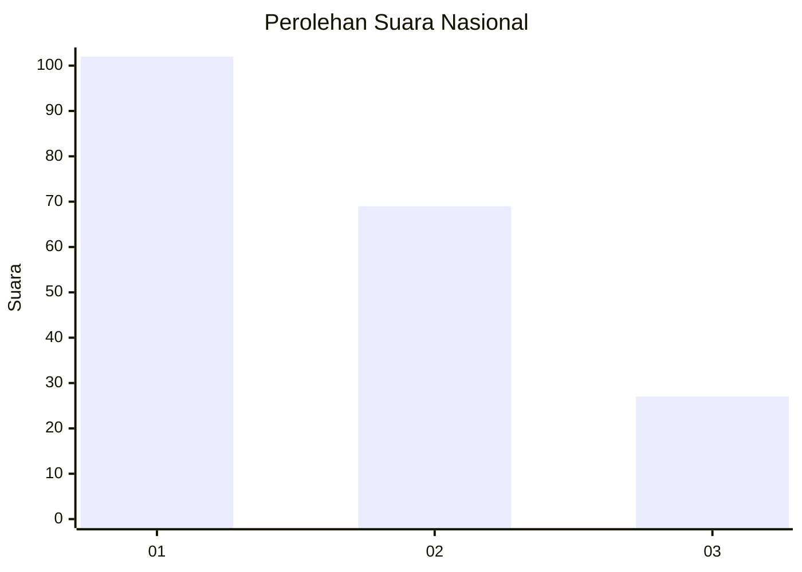
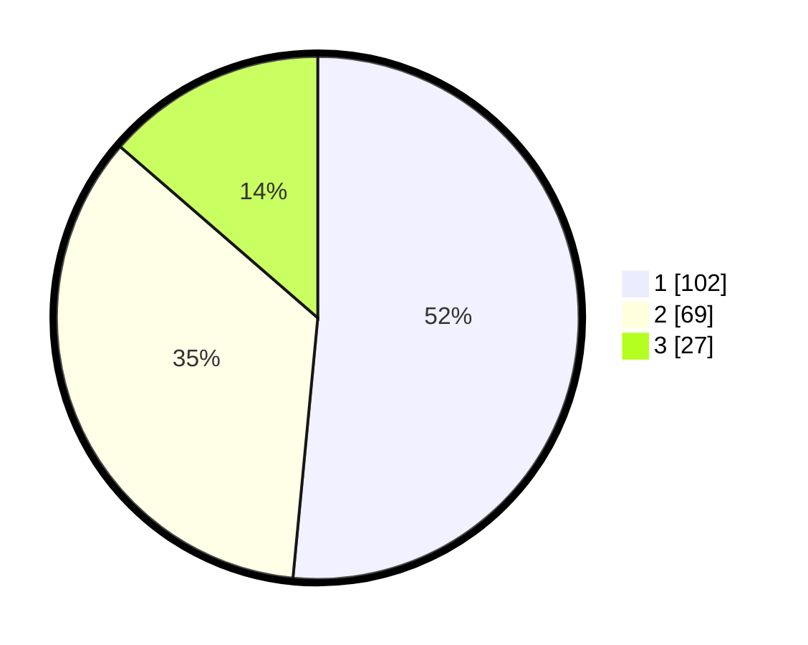

# Hasil

## Grafik

## Tabel

| No.    | Nama Paslon    | Suara | Suara (raw) | Persentase |
|:------ |:-------------- | -----:| -----------:| ----------:|
| 100025 | ANIES MUHAIMIN | 102   | [102][p-1]  | 51,52      |
| 100026 | PRABOWO GIBRAN | 69    | [69][p-2]   | 34,85      |
| 100027 | GANJAR MAHFUD  | 27    | [27][p-3]   | 13,64      |

[p-1]: https://github.com/gigit-pemilu/pemilu-2024/blob/main/pilpres/hitung-suara/sub/31-dki-jakarta/sub/74-jakarta-selatan/sub/06-cilandak/sub/1005-cipete-selatan/sub/008-tps/sub/paslon-1.txt
[p-2]: https://github.com/gigit-pemilu/pemilu-2024/blob/main/pilpres/hitung-suara/sub/31-dki-jakarta/sub/74-jakarta-selatan/sub/06-cilandak/sub/1005-cipete-selatan/sub/008-tps/sub/paslon-2.txt
[p-3]: https://github.com/gigit-pemilu/pemilu-2024/blob/main/pilpres/hitung-suara/sub/31-dki-jakarta/sub/74-jakarta-selatan/sub/06-cilandak/sub/1005-cipete-selatan/sub/008-tps/sub/paslon-3.txt

## Foto C Plano

https://sirekap-obj-formc.kpu.go.id/993b/pemilu/ppwp/31/74/06/10/05/3174061005008-20240216-165043--7481c010-42aa-452d-ac36-6446f97d7542.jpg

https://sirekap-obj-formc.kpu.go.id/993b/pemilu/ppwp/31/74/06/10/05/3174061005008-20240216-165145--28fa9e54-de8f-43cf-8092-5720da80bfb5.jpg

https://sirekap-obj-formc.kpu.go.id/993b/pemilu/ppwp/31/74/06/10/05/3174061005008-20240216-165217--ee23c48a-32f8-43e7-910f-4db948a8ebfc.jpg

## Metadata

| Key        | Value               |
| ---------- | ------------------- |
| Time Stamp | 2024-02-19 12:00:00 |

